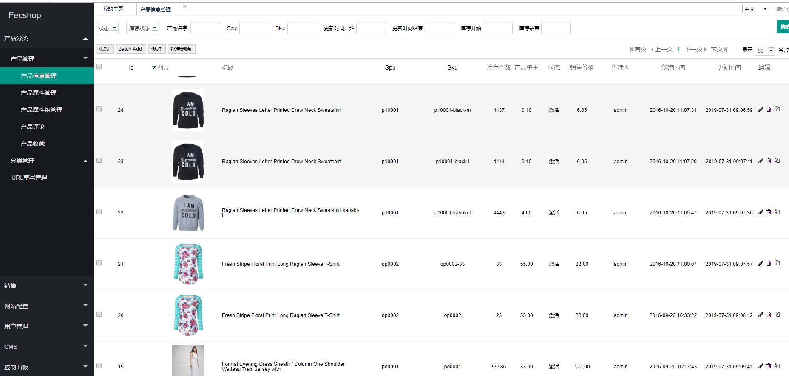
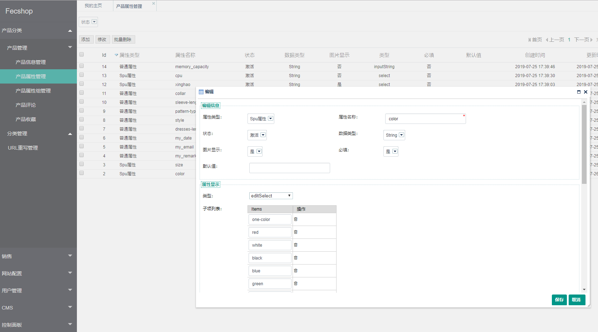
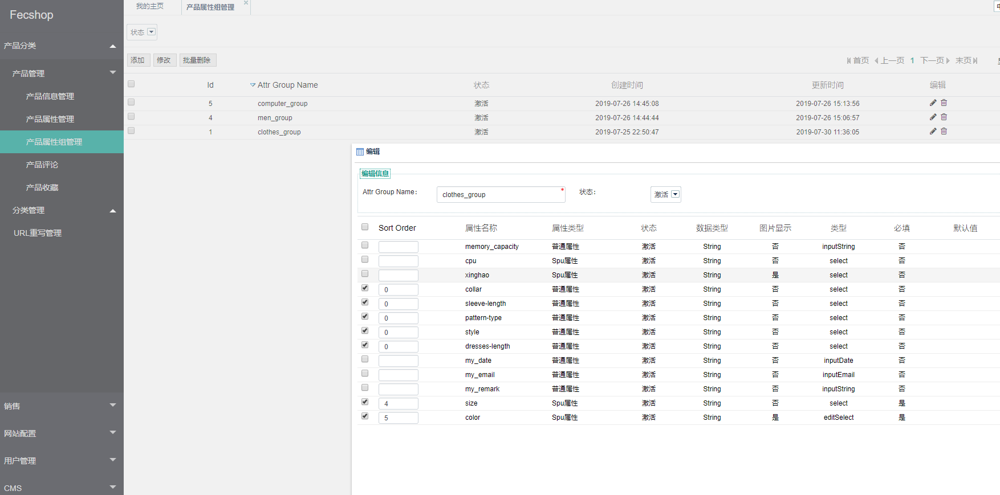
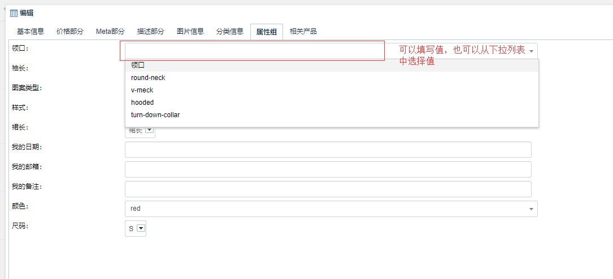

Fecshop-2.x 介绍
============

> Fecshop 2.x 版本，是在1版本上面，进行了一系列的底层重构和优化，大幅度的进行整改的版本

### 后台界面优化

后台界面进行了一系列的优化

### Mysql Services支持全部

> 1版本，必须安装`mongodb`，`redis`，`xunsearch`，`mysql`等，Fecshop-2.x版本，默认只需要`mysql`就可以了

1.Mongodb存储数据，产品，分类，等一系列的数据放到Mongodb里面，添加了`Mysql Services`支持，默认使用Mysql

2.如果您想使用`Mongodb`作为底层存储，可以在后台更改配置，然后通过脚本将产品分类数据，从`Mysql`同步到`Mongodb`中即可

3.Fecshop-1.x的`session`和`cache`默认使用`redis`，Fecshop-2.x默认使用文件的方式存储，如果您想使用`redis`，可以在配置文件中更改配置即可

4.搜索默认使用`mysql搜索`，您可以通过配置更改使用其他的`搜索引擎`

### 文件配置改成后台配置

Fecshop-1.x版本很多`配置`都是在配置文件里面，2版本将这些配置转移到后台配置，保存到数据库中

在后台可以看到这些配置选项，目前只做了一部分的配置，后面会逐步完善后台的配置

### 缓存优化

1.后台无法刷新`局部缓存`的问题，等缓存问题进行了优化处理

2.各个缓存选项的开启和关闭，在后台进行配置。

### AppServer端口的优化，UUID的去除

对于Fecshop-1版本，Appserver为了进行游客购物车的支持，加入了`UUID`的机制，对游客用户进行身份识别，有点类似于session，

Fecshop-2版本对游客购物车进行了去除，用户登陆后，才能执行添加购物车的操作，因此去除了uuid，
这样做的好处是可以无状态api，`并发数`会提升，配置分布式更加容易。

> 只有验证码部分保留了uuid

### 产品部分的优化

1.产品的属性组的优化

`产品属性组`，原来是在配置文件里面进行配置，对于非技术人员非常的不友好，现在改成了在后台数据库中配置`属性`，
然后创建`属性组`，添加相应的属性，完成后，创建产品的时候就可以选择相应的`产品属性组`了

为属性组，添加相应的属性，设置排序，保存即可

2.产品属性添加`editSelect`类型

如果选择该类型，那么在产品编辑的时候，您可以直接从select下拉列表中选择，也可以
填写自定义的值。

3.淘宝模式custom option的去除

对于`规格属性`（自定义属性），譬如 颜色尺码等，Fecshop-1.x有两种实现方式，淘宝模式使用了`custom_option`， 以及JD模式
，由于淘宝模式在处理数据等很多使用方面不友好，对这个模式进行了去除，只保留`jd`模式

4.批量添加产品工具

对于`jd`模式，可以在后台产品编辑页面，通过点击批量添加产品按钮，对于规格属性产品（同一个spu下的不同的sku），进行一次性添加，

5.对于产品数据，默认使用的`Mysql`，对于多语言等数组类型的数据，都是通过序列化的方式存储到mysql表中，
而不是和`mongodb`多维数组的方式存储，因此，对于`mysql`数据，属性组属性的存储，是以序列化的方式存储到product_flat表的字段`attr_group_info`
中，因此，在分类侧栏，mysql的方式是无法进行属性过滤的，
如果您在分类侧栏需要使用属性过滤，那么需要切换成`mongodb`。

6.加入`Spu属性`验证

同一款产品的不同规格，spu相同sku不同，各个sku规格产品的所有`spu属性`不能全部相同

譬如： 一款连衣裙，spu属性为颜色，尺码，对于spu相同，sku不同的规格产品，如果填写的颜色尺码全部相同，那么保存的时候会报错。

### 购物车的优化

1.appserver，对于`游客购物车`进行了去除

2.购物车如果存在的产品，`不存在`或者`下架`，购物车的产品也会进行更改。（出现过购物车中的产品总数，在某些产品下架后，购物车中还存在的问题）

### 图片部分的优化

Fecshop-1.x版本，图片域名好几个，搞的安装很费劲，Fecshop-2版本就一个图片域名，所有的访问都经过这个域名，
进行精简。

