Fecmall-2.x WAMP环境安装 - 手把手系列
================

> Windows下面，使用WAMP环境本地安装fecshop教程，相信有经验的程序员看一下linux
下安装fecmall，就可以在wamp下面，安装，下面的安装教程是给小白用的，
比较详细，配图比较多。


**有一些截图太大，如果看起来不够清晰，可以放大浏览器查看截图**

**手把手再WAMP上面配置fecmall，满足小白用户的win环境安装**

下载WAMP
--------------

### 1.下载

1.1官网下载
wamp官网：http://www.wampserver.com/en/#download-wrapper

下载地址：https://sourceforge.net/projects/wampserver/files/

1.2Fecmall Q群下载


Q群文件中可以看到：wampserver3.1.9_x64.exe
，这个是win64位使用的安装程序，安装即可

### 2.安装

我的安装路径是：`D:\wamp64`

安装完成后，启动`wamp`，启动成功后，`右下角`图标为`绿色`，不是绿色可以`重启`（restart all services）试试


打开浏览器访问：http://127.0.0.1/ ， 出来wamp就代表安装，并启动wamp成功了


配置域名指向
----------

### 1.打开win host文件

C:\Windows\System32\drivers\etc\hosts

将下面的添加到hosts文件中


```
127.0.0.1 appfront.fecshoptest.com
127.0.0.1 appadmin.fecshoptest.com
127.0.0.1 img.fecshoptest.com
127.0.0.1 apphtml5.fecshoptest.com
127.0.0.1 appserver.fecshoptest.com
127.0.0.1 appapi.fecshoptest.com
```

添加完成后截图


下载fecmall文件
-----------------

### 一.推荐使用composer安装

1.下载composer： https://getcomposer.org/download/


鼠标左键点击右下角的wamp图标，可以看到当前启动的php的版本`7.2.18`


安装composer，需要选择相应的`php`(**注意，这个一定要和wamp默认启动的php版本一致，否则将会出现
web的php和命令行的php，不是同一个的问题，这个一定要注意**)


剩下的都是一路next即可。

安装完成后， window + r ，cmd进入命令行模式


2.进入web目录

我的目录是： D:\wamp64\www


更改阿里云composer镜像源

```
composer config -g repo.packagist composer https://mirrors.aliyun.com/composer/
```

执行下载：

> 请将2.1.6 改成最近的fecmall版本，这里查看最新的版本号： https://github.com/fecshop/yii2_fecshop/releases

```
composer create-project fancyecommerce/fecshop-app-advanced  fecshop 2.1.6
```
然后就可以看到文件下载：


下载的log日志如下：


下载完成后，可以看到：D:\wamp64\www\fecshop
，打开这个文件夹，可以看到如下


这就代表下载成功了

2.直接下载完整压缩包

2.1百度网盘 下载地址，https://pan.baidu.com/s/1hs1iC2C ， 下载fecshop-2.x.x.zip （请下载最高的版本）

2.2QQ群文件下载，官方Q群文件里面有相应的文件,Fecmall QQ群(新)：782387676，入群验证：fecmall

Fecmall初始化
---------------

### 1.执行fecmall  init

进入fecshop的目录，执行`init.bat`,如下图，选择develop模式


### 2.初始化mysql数据库

鼠标左键点击wamp的右下角图标，如图所示，点击mysql console


点击后，弹框内容`root`即可，点击ok，然后出来mysql控制台，直接点回车


```
use mysql

update mysql.user set authentication_string=password('123456') where user='root' ;

flush privileges;

```

执行log如图：


这样初始化完成了  mysql账户密码为：`root  123456`

打开phpmyadmin


浏览器打开后，用创建好的mysql用户名密码登陆，创建数据库 `fecmall`


点击创建，成功可以看到fecmall数据库

### 3.填写数据库配置

打开文件 `D:\wamp64\www\fecshop\common\config\main-local.php`

设置数据库和密码，如图所示：


### 4.执行数据库初始化

```
cd D:\wamp64\www\fecshop
yii migrate --interactive=0 --migrationPath=@fecshop/migrations/mysqldb
```

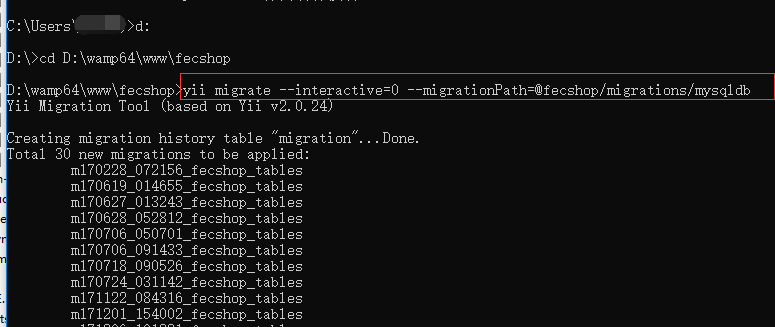

完成后显示：

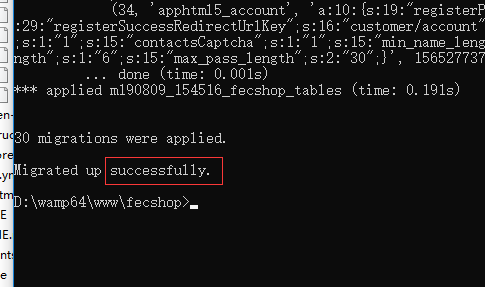

然后进入phpmyadmin，可以看到初始化的表


### 5.安装测试数据

5.1测试数据下载

5.1.1产品测试数据图片百度网盘下载地址：https://pan.baidu.com/s/1hs1iC2C ，下载：fecshop-2.x测试数据.zip 

5.1.2Q群文件下载fecshop-2.x测试数据.zip 

 下载下来的文件解压后，里面有`appimage`(测试产品图片) 和 `fecshop.sql`（测试sql文件）
 
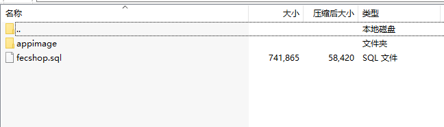
 
 5.2测试数据安装
 
 5.2.1图片文件复制
 
 将`appimage`文件夹覆盖到目录fecmall根目录下：`D:\wamp64\www\fecshop`
 
 5.2.2mysql测试数据导入
 
 可以通过phpmyadmin导入数据，鼠标左键点击右下角wamp的图片，弹出的菜单点击phpmyadmin
 ，打开phpmyadmin
 
`root`  `123456`  账户密码登陆后，点击左侧的fecmall数据库，刷新后出来数据库表的内容
 
 
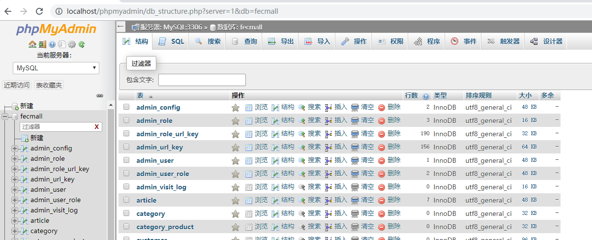
 
 
 点击导入按钮
 

 
 点击选择文件，然后找到刚才下载测试数据中的sql文件，然后点击`执行`按钮
 
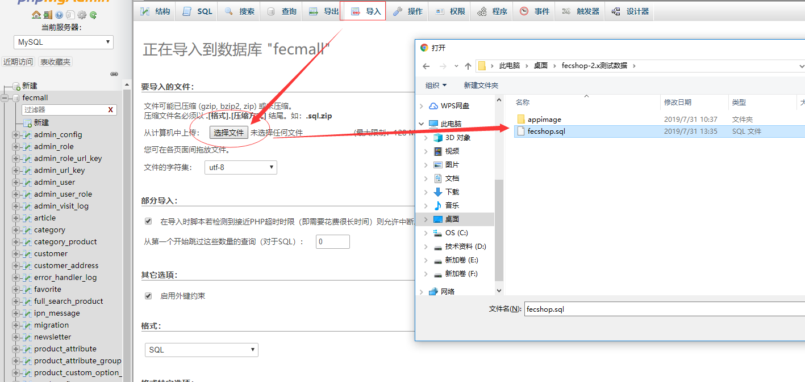
 
 等一段时间，测试sql数据导入完成了
 

 
 ### 6.配置apache
 
 上面再win hosts中我们添加了指向本地的域名
 

```
127.0.0.1 appfront.fecshoptest.com
127.0.0.1 appadmin.fecshoptest.com
127.0.0.1 img.fecshoptest.com
127.0.0.1 apphtml5.fecshoptest.com
127.0.0.1 appserver.fecshoptest.com
127.0.0.1 appapi.fecshoptest.com
```

下面我们在apache中做配置，打开apache配置文件


在这个配置文件后面追加如下的内容

> 新版本2.1.6以后的fecmall版本，@app/web/`.htaccess`默认已经添加，用于处理`url中去掉index.php`的问题, 您不需要自己手动添加了


```

<VirtualHost *:80>
  ServerName appadmin.fecshoptest.com
  ServerAlias fecshoptest
  DocumentRoot "${INSTALL_DIR}/www/fecshop/appadmin/web"
  <Directory "${INSTALL_DIR}/www/fecshop/appadmin/web">
    Options +Includes +FollowSymLinks +MultiViews
    AllowOverride All
    Require local
  </Directory>
</VirtualHost>


<VirtualHost *:80>
  ServerName appfront.fecshoptest.com
  ServerAlias fecshoptest
  DocumentRoot "${INSTALL_DIR}/www/fecshop/appfront/web"
  <Directory "${INSTALL_DIR}/www/fecshop/appfront/web">
    Options +Includes +FollowSymLinks +MultiViews
    AllowOverride All
    Require local
  </Directory>
</VirtualHost>


<VirtualHost *:80>
  ServerName apphtml5.fecshoptest.com
  ServerAlias fecshoptest
  DocumentRoot "${INSTALL_DIR}/www/fecshop/apphtml5/web"
  <Directory "${INSTALL_DIR}/www/fecshop/apphtml5/web">
    Options +Includes +FollowSymLinks +MultiViews
    AllowOverride All
    Require local
  </Directory>
</VirtualHost>

<VirtualHost *:80>
  ServerName img.fecshoptest.com
  ServerAlias fecshoptest
  DocumentRoot "${INSTALL_DIR}/www/fecshop/appimage/common"
  <Directory "${INSTALL_DIR}/www/fecshop/appimage/common">
    Options +Includes +FollowSymLinks +MultiViews
    AllowOverride All
    Require local
  </Directory>
</VirtualHost>

<VirtualHost *:80>
  ServerName appserver.fecshoptest.com
  ServerAlias fecshoptest
  DocumentRoot "${INSTALL_DIR}/www/fecshop/appserver/web"
  <Directory "${INSTALL_DIR}/www/fecshop/appserver/web">
    Options +Includes +FollowSymLinks +MultiViews
    AllowOverride All
    Require local
  </Directory>
</VirtualHost>


<VirtualHost *:80>
  ServerName appapi.fecshoptest.com
  ServerAlias fecshoptest
  DocumentRoot "${INSTALL_DIR}/www/fecshop/appapi/web"
  <Directory "${INSTALL_DIR}/www/fecshop/appapi/web">
    Options +Includes +FollowSymLinks +MultiViews
    AllowOverride All
    Require local
  </Directory>
</VirtualHost>
```

保存apche配置文件，然后重启apache


### 7.网站商城配置

7.1登陆后台

访问：http://appadmin.fecshoptest.com

用户名密码   `admin  admin123`

登陆成功后，右上角切换中文

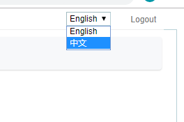

7.2重置密码

重置后的密码一定要记住，否则得去数据库重置了


7.3配置图片域名

填写：`//img.fecshoptest.com`，请按照这个格式填写图片域名

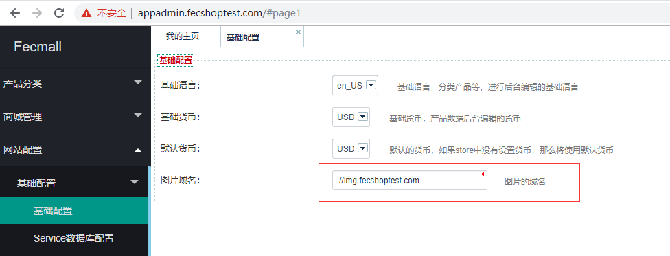


7.4配置appfront domain

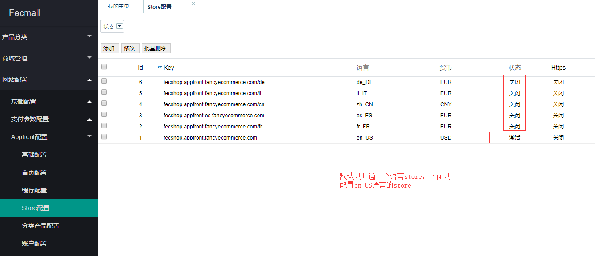


 
 按照如图所示进行编辑，保存后，访问： http://appfront.fecshoptest.com/
 
 就可以看到appfront入口的内容了
 

 
 可以访问，注册，下单测试等。
 
 7.5配置apphtml5 domain
 
 
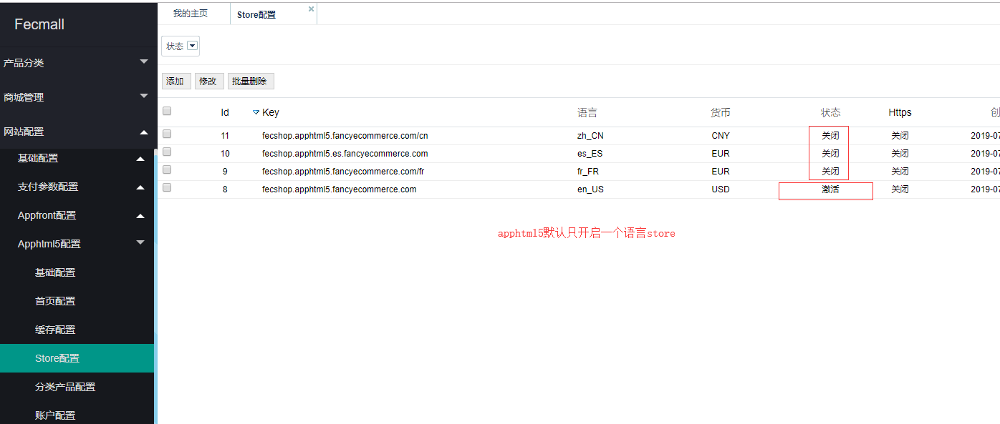
 


 
  按照如图所示进行编辑，保存后，访问： http://apphtml5.fecshoptest.com/
 
  就可以看到apphtml5入口的内容了
 

 
 可以访问，注册，下单测试等。
 
 因为appfront store的配置中设置了手机浏览器访问跳转，当手机浏览器访问
 http://appfront.fecshoptest.com/ ， 会跳转到 http://apphtml5.fecshoptest.com/
 ，您可以用chrome浏览器的手机模拟环境测试
 
 7.6配置appserver
 
> 如果您不想安装vue和微信小程序，那么可以忽视这个部分


如果您想安装vue，微信小程序等入口，那么需要配置appserver
 
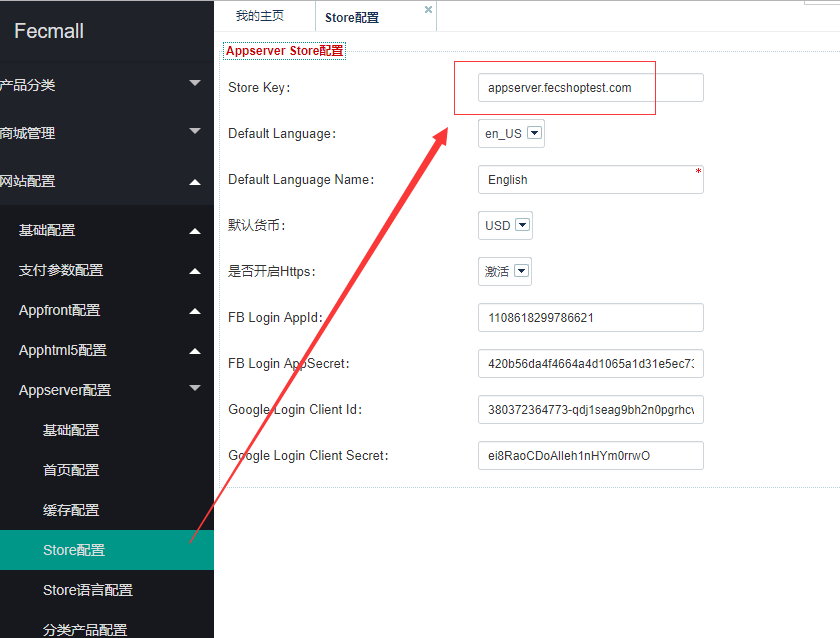
 
 保存编辑数据，然后访问： http://appserver.fecshoptest.com/
 ，如果出现json格式的数据，代表配置成功


 
 vue 和微信小程序的安装：（这里不做陈述，你可以参看github的readme）
 
`vue`: https://github.com/fecshop/vue_fecshop_appserver

`微信小程序`：https://github.com/fecshop/wx_micro_program
 
 7.7配置appapi
 
> 如果您不想和第三方系统进行交互，那么可以忽视这个部分
 
 
### 8.配置多语言
 
 appfront, apphtml5, appserver 入口都可以配置多语言store
 
8.1配置appfront的多语言，fecmall配置多语言store有两种方式：
 
8.1.1通过子目录的方式，譬如fr,cn,其他的语言可以复制fr文件夹
 
 打开文件夹：D:\wamp64\www\fecshop\appfront\web ， 可以看到
 
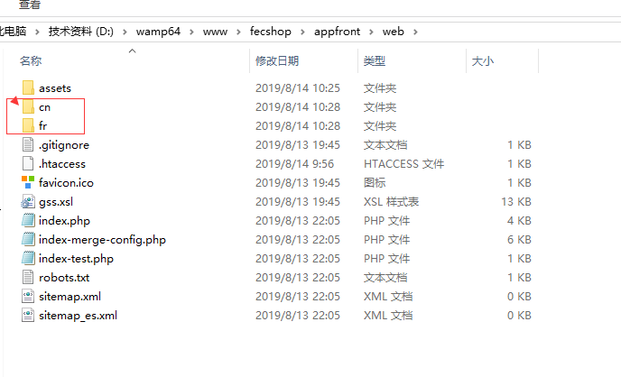
 
fr 和cn两个目录，
 

 
8.1.2通过子域名的方式，譬如 ： http://es.appfront.fecshoptest.com , http://de.appfront.fecshoptest.com
 
 下面我们都操作一下：
 
 
8.2window 本地添加域名子域名：es.appfront.fecshoptest.com

8.2.1和上面的操作一样，打开：C:\Windows\System32\drivers\etc\hosts，添加
 
 ```
 127.0.0.1 es.appfront.fecshoptest.com
 ```
 
8.2.2apache配置，添加配置：
 
```
 <VirtualHost *:80>
  ServerName es.appfront.fecshoptest.com
  ServerAlias fecshoptest
  DocumentRoot "${INSTALL_DIR}/www/fecshop/appfront/web"
  <Directory "${INSTALL_DIR}/www/fecshop/appfront/web">
    Options +Includes +FollowSymLinks +MultiViews
    AllowOverride All
    Require local
  </Directory>
</VirtualHost>
```
 
重启apache
 
8.3配置子目录方式的fr语言，打开后台appfront，进行配置（看不清，请放大浏览器查看）
 
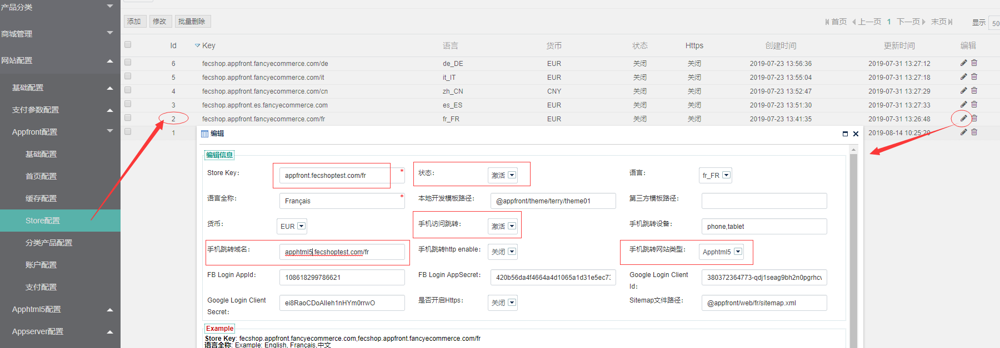
 
 保存，然后访问：http://appfront.fecshoptest.com/fr/ ， 就可以访问fr语言了

 8.4配置子路径方式的cn语言，打开后台appfront，进行配置
 
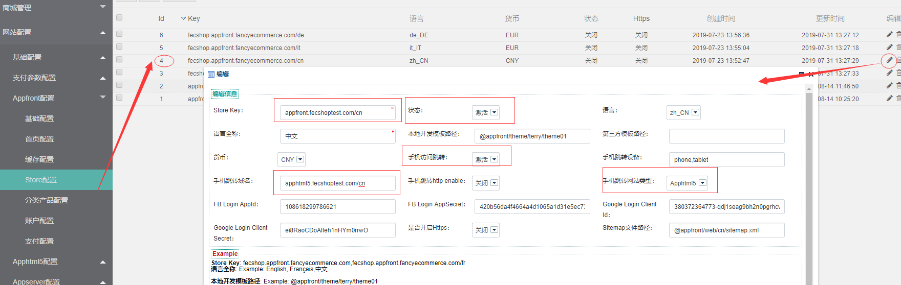
 
 保存，然后访问：http://appfront.fecshoptest.com/cn/ ， 就可以访问cn语言了
 
 
 8.5配置子域名方式的es语言，打开后台appfront，进行配置：es.appfront.fecshoptest.com
 
 > 上面，我们已经在hosts和apache中添加了子域名：es.appfront.fecshoptest.com，这里直接用就可以了
 

 
 
 保存，然后访问：http://es.appfront.fecshoptest.com ， 就可以访问es语言了
 
> es语言这种，不需要再web目录下面添加子文件夹
 

 
 8.6apphtml5的多语言配置和appfront类似，这里不做讲述
 
 8.7appserver多语言配置
 

 
 
添加多语言即可
 
 
 8.8添加其他语言，如果fecmall默认的语言不满足您的使用，您可以扩展其他的语言
 

   
   
 到此，我们配置fecmall就完成了，恭喜您进阶。
 
 
 
 