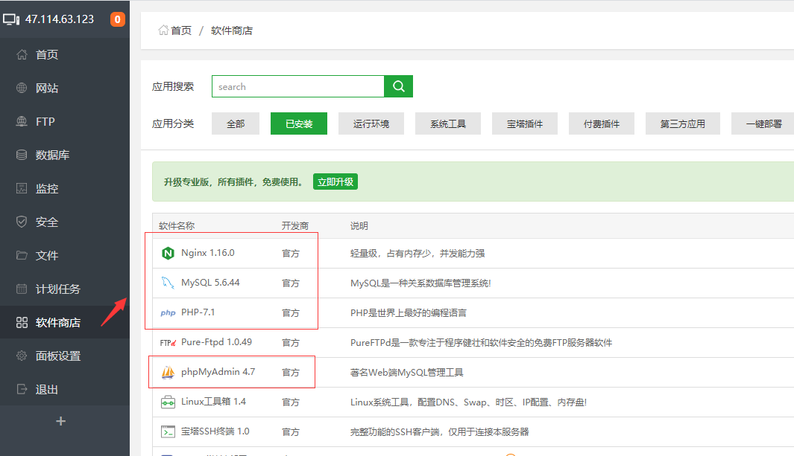
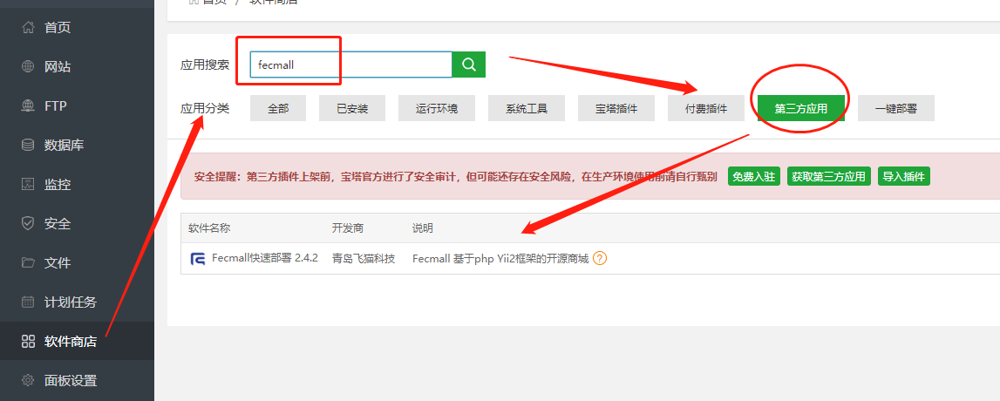
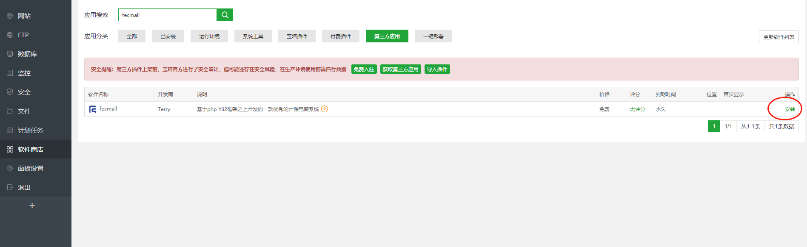
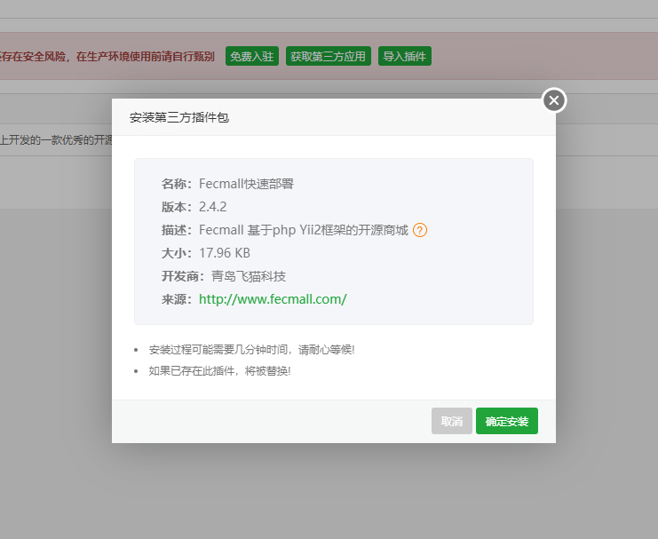
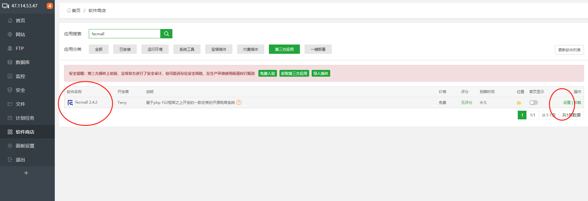
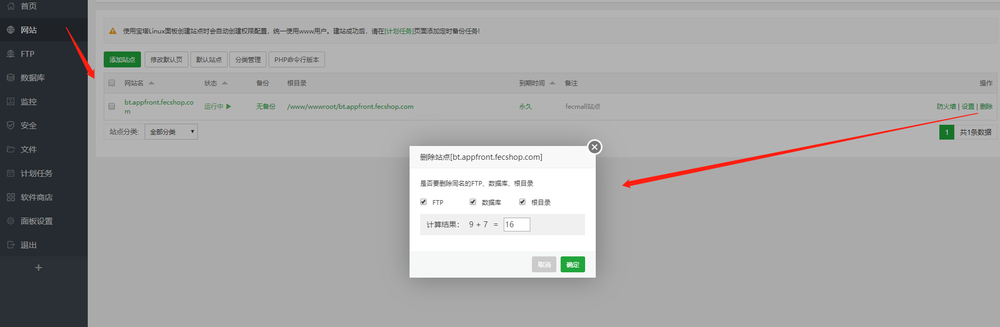
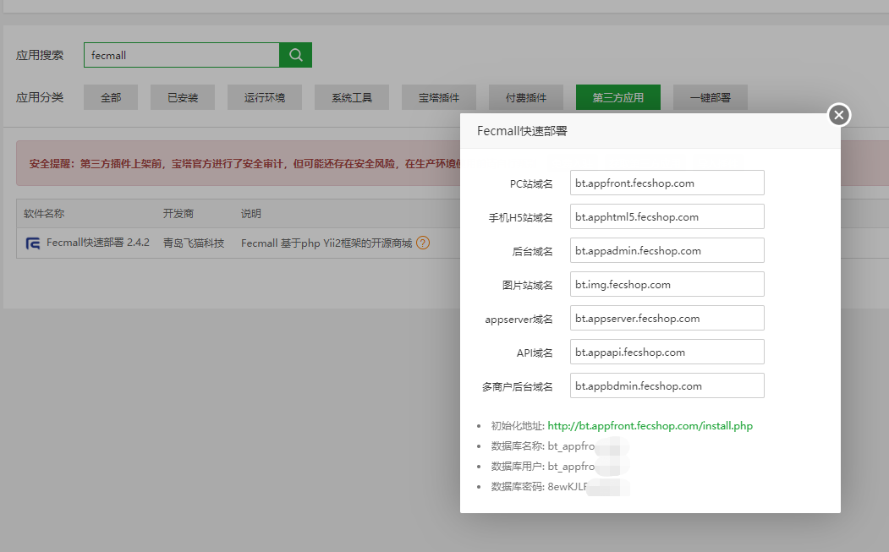

Fecmall-2.x 宝塔安装
=============

> 通过宝塔控制面板一键安装Fecmall

### 购买服务器，安装宝塔，部署LNMP环境

1.宝塔的安装教程：https://www.bt.cn/bbs/thread-19376-1-1.html

宝塔面板场用命名：https://www.bt.cn/btcode.html

仔细看教程安装，如果是阿里云，注意`开启端口`，否则无法访问（宝塔安装教程有教程）

通过命令行安装后，会出现访问`宝塔控制面板地址`，以及`用户名`，`密码`，这个保存好

2.登陆宝塔控制面板

安装php，mysql，nginx,各个版本为：

`nginx`:`1.16.0`

`mysql`: `5.6.44`

`php`:`7.1`

### 一键部署fecmall

1宝塔软件商店，点击`第三方应用`，搜索`fecmall`，找到应用安装, 

您搜索找到fecmall第三方应用，会看到有一个购买按钮，fecmall是免费的，您点击购买，登陆bt账户即可，不需要付费
，然后您会看到，如下的界面

点击安装

安装完bt fecmall插件后，就可以通通过bt fecmall插件来一键部署fecmall，

如果您想通过导入的方式自定义宝塔插件，可以参看帖子：http://www.fecmall.com/topic/2370

2.一键部署

因为fecmall是多入口电商系统，每个入口一个域名，因此，您需要将多个子域名解析到您的服务器ip
，或者直接用泛解析域名（比较省事）

您需要准备如下的子域名：

`PC站域名`：`www.fecshoptest.com`   // 电脑浏览器pc访问入口

`后台域名`：`appadmin.fecshoptest.com`  // 后台管理员访问入口

`图片域名`：`img.fecshoptest.com`  // 访问图片的入口域名
 
`手机H5站域名`：`m.fecshoptest.com`   //  手机浏览器html5访问入口

`appserver域名`：`appserver.fecshoptest.com`  //  微信小程序等访问入口

`API域名`：`appapi.fecshoptest.com`   //  第三方erp等系统的交互

`多商户后台域名`：`appbdmin.fecshoptest.com`  // 多商户fecbbc扩展的经销商后台

> 因为宝塔插件设置了强制写，因此 这些域名必须填写，如果您某些入口不用，可以先填写上去，以后用到的时候再做域名解析即可。

填写完成后，点击`一键部署`,此过程将会下载fecmall，初始化等操作

3.如果此过程中出现一些问题，您想重新部署，那么可以再`网站`管理部分，删除站点,然后重新安装。

4.安装完成后，可以看到如图的信息

把上述界面的mysql的信息保存起来，供下面的界面安装使用

### Fecmall界面安装

准备好这些后，就可以通过web浏览器界面安装fecmall了，http://bt.appfront.fecshop.com/install` （换成您自己的域名）

界面安装配置详细参看：[Fecmall-2.x 界面安装](fecshop-2-graphical-web-install.md)

