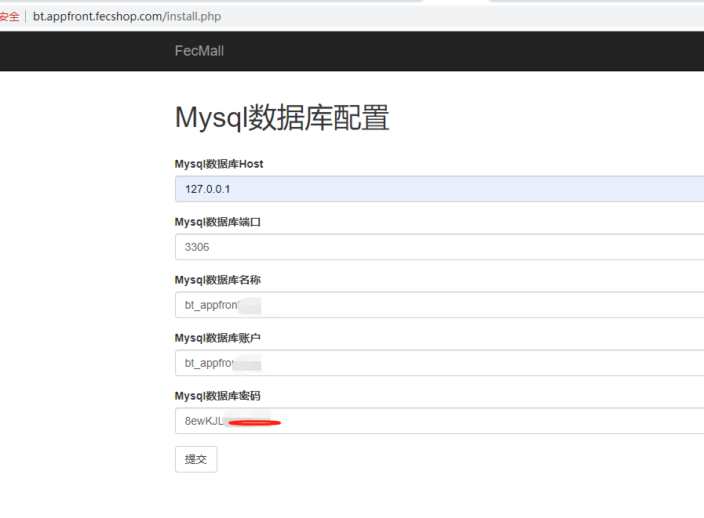
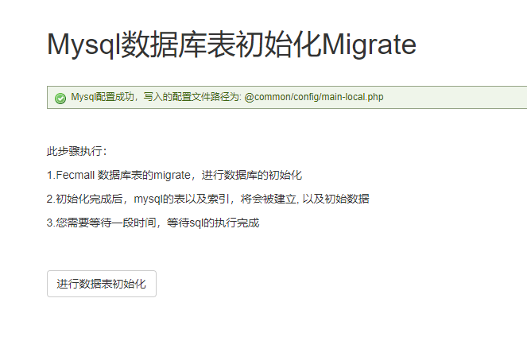
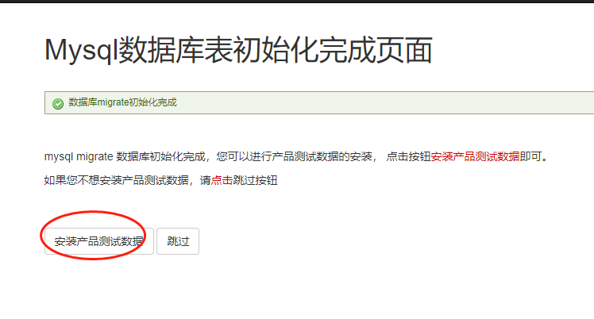
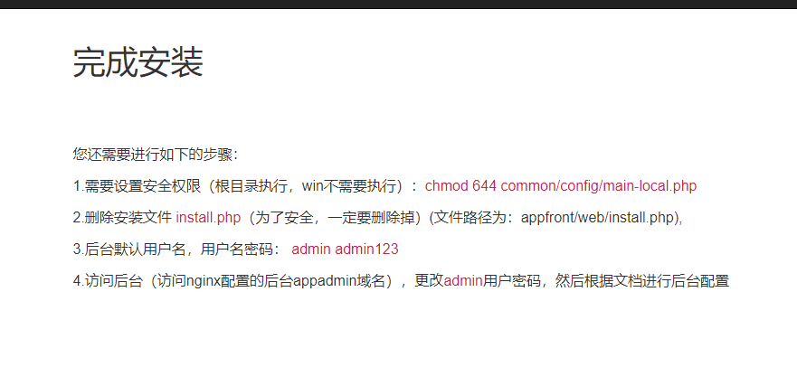
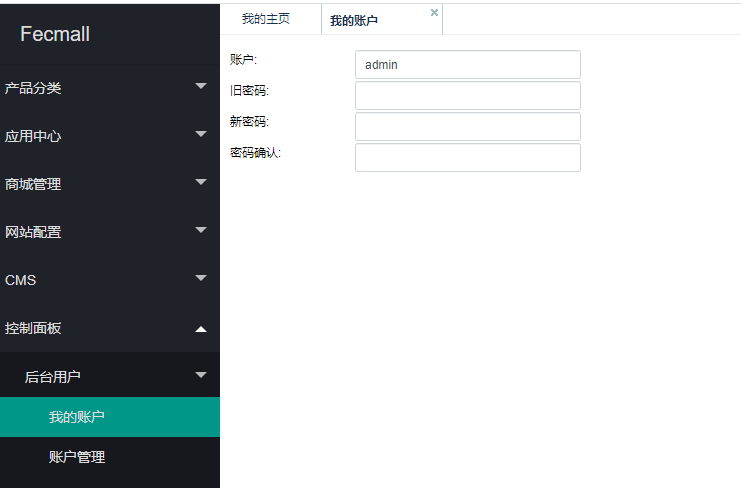

Fecmall-2.x 宝塔安装
=============

> 通过宝塔控制面板一键安装Fecmall


### 购买服务器，安装宝塔，部署LNMP环境

1.宝塔的安装教程：https://www.bt.cn/bbs/thread-19376-1-1.html

宝塔面板场用命名：https://www.bt.cn/btcode.html

仔细看教程安装，如果是阿里云，注意`开启端口`，否则无法访问（宝塔安装教程有教程）

通过命令行安装后，会出现访问`宝塔控制面板地址`，以及`用户名`，`密码`，这个保存好

2.登陆宝塔控制面板


安装php，mysql，nginx,各个版本为：

`nginx`:`1.16.0`

`mysql`: `5.6.44`

`php`:`7.1`


### 一键部署fecmall


1宝塔软件商店，点击`第三方应用`，搜索`fecmall`，找到应用安装, 


您搜索找到fecmall第三方应用，会看到有一个购买按钮，fecmall是免费的，您点击购买，登陆bt账户即可，不需要付费
，然后您会看到，如下的界面


点击安装


安装完bt fecmall插件后，就可以通通过bt fecmall插件来一键部署fecmall，


如果您想通过导入的方式自定义宝塔插件，可以参看帖子：http://www.fecmall.com/topic/2370


2.一键部署

因为fecmall是多入口电商系统，每个入口一个域名，因此，您需要将多个子域名解析到您的服务器ip
，或者直接用泛解析域名（比较省事）

您需要准备如下的子域名：

`PC站域名`：`bt.appfront.fecshop.com`

`手机H5站域名`：`bt.apphtml5.fecshop.com`

`后台域名`：`bt.appadmin.fecshop.com`

`图片站域名`：`bt.img.fecshop.com`

`appserver域名`：`bt.appserver.fecshop.com`

`API域名`：`bt.appapi.fecshop.com`

`多商户后台域名`：`bt.appbdmin.fecshop.com`

> 这些域名必须填写，如果您某些入口不用，可以先填写上去，以后用到的时候再做域名解析即可


填写完成后，点击`一键部署`,此过程将会下载fecmall，初始化等操作


3.如果此过程中出现一些问题，您想重新部署，那么可以再`网站`管理部分，删除站点,然后重新安装。


4.安装完成后，可以看到如图的信息


将这些信息保存起来，然后，再上面的弹出框，点击初始化地址：`初始化地址: http://bt.appfront.fecshop.com/install.php`,
进入页面安装部分，如图，填写数据库信息，点击`提交`按钮





5.数据库初始化部分




点击`进行数据表初始化`

6.点击`安装产品测试数据`





继续点击下一步，就进入了安装配置完成界面




7.安装收尾

通过上面的图的信息，可以看到，为了安全，需要设置一下文件权限，以及删除install.php
，我们通过ssh进入命令行操作

7.1进入fecmall安装的文件路径下：

```
cd /www/wwwroot/bt.appfront.fecshop.com
```

7.2设置文件权限

```
chmod 644 common/config/main-local.php
```

7.3删除install.php文件

```
rm -f appfront/web/install.php

```

8.访问你的后台域名，譬如我的后台域名为：bt.appadmin.fecshop.com

帐号密码：  `admin`,  `admin123`

8.1.登陆后台成功后，右上角切换成`中文语言`。

8.2.后台修改用户名密码





### 配置fecmall

> fecmall因为是多语言的电商系统，通过多store的模式实现，因此需要继续再后台配置


**首先配置图片域名** 

`网站配置`-->`基础配置`-->`基础配置`  找到`图片域名`，填写您的图片域名，譬如：`//bt.img.fecshop.com`
(前面不要加`http:`,这种方式http和https都可以调用图片url,将该域名替换成您自己的域名)


3.1后台添加`appfront`(PC)配置，添加`store`


`网站配置`-->`Appfront配置`-->`Store配置`

可以看到`store`列表，点击`id为1`的数据（激活状态），进行编辑，将域名更改成 `appfront.fecshoptest.com`(替换成您自己的域名)，保存

参数说明：

`Store Key`：`填写您的域名`,譬如：bt.appfront.fecshop.com

`状态`：`激活`

`手机访问跳转`：`激活`

`手机跳转网站类型`：`apphtml5`

`手机跳转域名`：`bt.apphtml5.fecshop.com`

`手机跳转http enable`：`关闭`

`是否开启Https`：`关闭`

然后就可以访问：`bt.appfront.fecshop.com` ，查看pc端了


fecmall是多语言store的电商系统，除了设置英文，您可以设置一下中文，找到语言为   `zh-CN` 的行，进行配置即可


3.2配置Apphtml5

`网站配置`-->`Apphtml5配置`-->`Store配置`

可以看到store列表，点击`id为8`的数据（激活状态），进行编辑，将域名更改成 `apphtml5.fecshoptest.com`(替换成您自己的域名)，保存

然后就可以访问：apphtml5.fecshoptest.com ，查看H5端了


3.3配置Appserver


> 这里是对`Appserver`端的配置，对应的域名为：`appserver.fecshoptest.com`(替换成您自己的域名) ,是对微信小程序，vue等客户端提供api的入口

`网站配置`-->`Appappserver配置`-->`Store配置`

将 `Store Key` 更改成 `appserver.fecshoptest.com` (替换成您自己的域名)即可。


Appserver 就可以为vue和微信小程序提供api了。

### 其他的配置


> 配置完`appserver.fecshoptest.com`，您可以安装vue和微信小程序等客户端

`vue`: https://github.com/fecshop/vue_fecshop_appserver

`微信小程序`：https://github.com/fecshop/wx_micro_program


