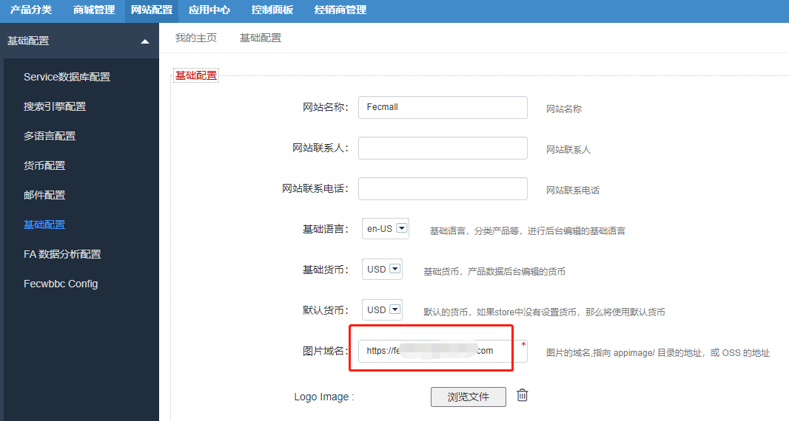
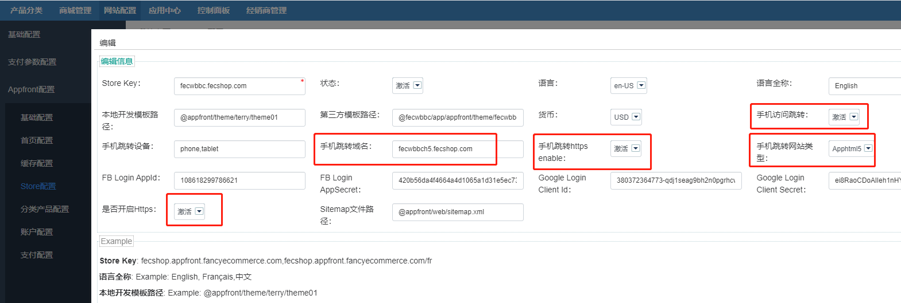
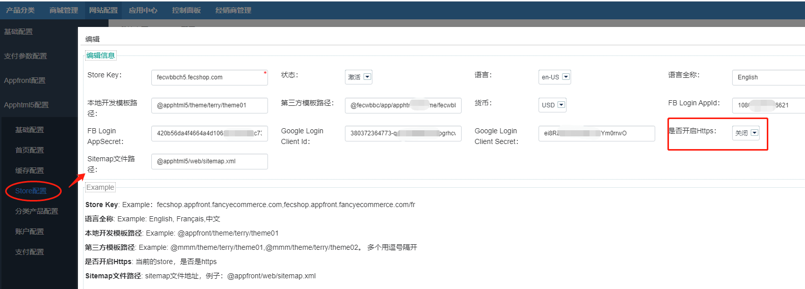
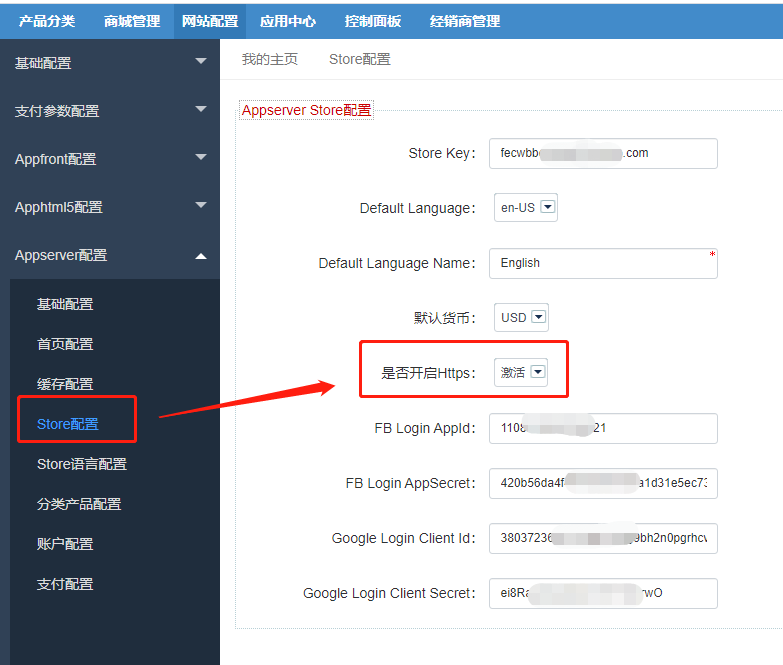

Fecmall-2.x SSL证书 - HTTPS
================

> 商城网站使用https，安装ssl证书

### 关于HTTPS

1.什么是https

HTTPS （全称：`Hyper Text Transfer Protocol over SecureSocket Layer`）：是以安全为目标的 HTTP 通道，在HTTP的基础上通过传输加密和身份认证保证了传输过程的安全性 [1]  。HTTPS 在HTTP 的基础下加入SSL，HTTPS 的安全基础是 SSL，因此加密的详细内容就需要 SSL。 HTTPS 存在不同于 HTTP 的默认端口及一个加密/身份验证层（在 HTTP与 TCP 之间）。这个系统提供了身份验证与加密通讯方法。它被广泛用于万维网上安全敏感的通讯，例如交易支付等方面

在fecmall系统中，支付方面，和一些系统对接方面，可能需要使用https, 譬如南非的
PayGate支付。

2.fecmall需要做https的入口

fecmall是多入口模式，
`pc`,`html5`,`image`,以及appserver的部分，
都是单独的子域名，对于免费的ssl证书，一般都需要对每个子域名单独做ssl认证（譬如阿里云的ssl证书，let's encrypt）。
，当然也有子域名通用的方式，譬如aws ssl证书

需要做https的入口

`appfront`：pc入口

`apphtml5`：wap入口

`appserver`：api入口（微信小程序等，如果您没有微信小程序，则不需要配置）

`appimage`：图片入口

对于后台等，可以不做https，当然有需要也可以做https（后台，可以通过限制ip，等一些限制手段确保安全）

### https SSL免费证书

1.letsencrypt 证书

letsencrypt 证书是免费的，可以做通用证书，也就是域名下的所有子域名，申请一次就可以了

过期时间为90天，您可以通过脚本更新证书

如何申请letsencrypt 证书，请参看文档：[letsencrypt 证书申请](https://www.fecmall.com/topic/7913)

2.使用amazon云领取免费ssl证书

`aws`的ssl证书，可以做通用证书，也就是域名下的所有子域名，申请一次就可以了

`aws`是通过代理的方式来实现的

详细参看最新整理的文档：[Fecmall 亚马逊云服务器aws配置ssl https证书](http://www.fecmall.com/topic/5496)

3.使用`阿里云`的免费ssl证书

阿里云的`免费证书`，是通用的，也就是说，您的域名在`godaddy`等域名商买的的域名，也是可以
在阿里云里面进行申请证书的，证书的期限是一年，到期后免费续费，详细请参看阿里云的说明。

每个阿里云账户，目前可以有`20`个域名（子域名）的免费额度，关于
阿里云免费领取ssl证书，详细参看：[阿里云 安装免费https ssl证书](http://www.fecmall.com/topic/4085)

如果您使用其他的一些免费的ssl证书，按照他们的说明配置即可

### Fecmall后台配置更改

当您配置好了https，需要后台进行一些配置更改

1.图片`https`设置

更改为https的图片域名：`https://img.xxxx.com`

2.appfront store配置

fecmall后台：`网站配置` --> `appfront配置` --> `store配置`

找到激活状态的store,打开编辑框

`手机跳转https enable`：设置成Yes

`是否开启Https`：设置成Yes

如果您的pc部分是多语言store，那么将其他的激活状态的store也需要进行编辑设置

3.apphtml5 store配置

fecmall后台：`网站配置` --> `apphtml5配置` --> `store配置`

找到激活状态的store,打开编辑框

4.appserver 配置（如果您没有微信小程序入口，则不需要配置）

到这里https就配置完成了。

