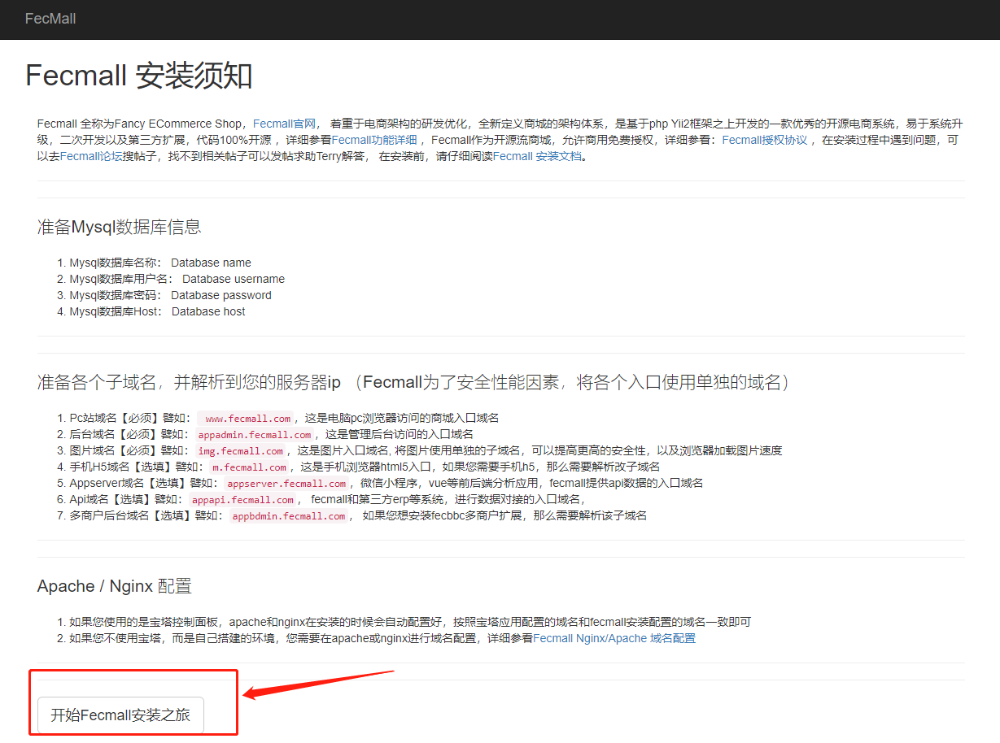
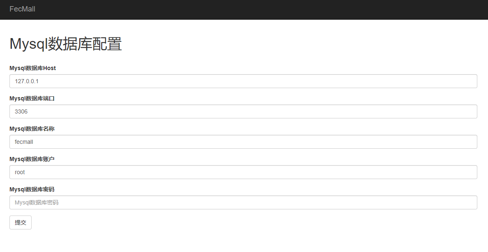
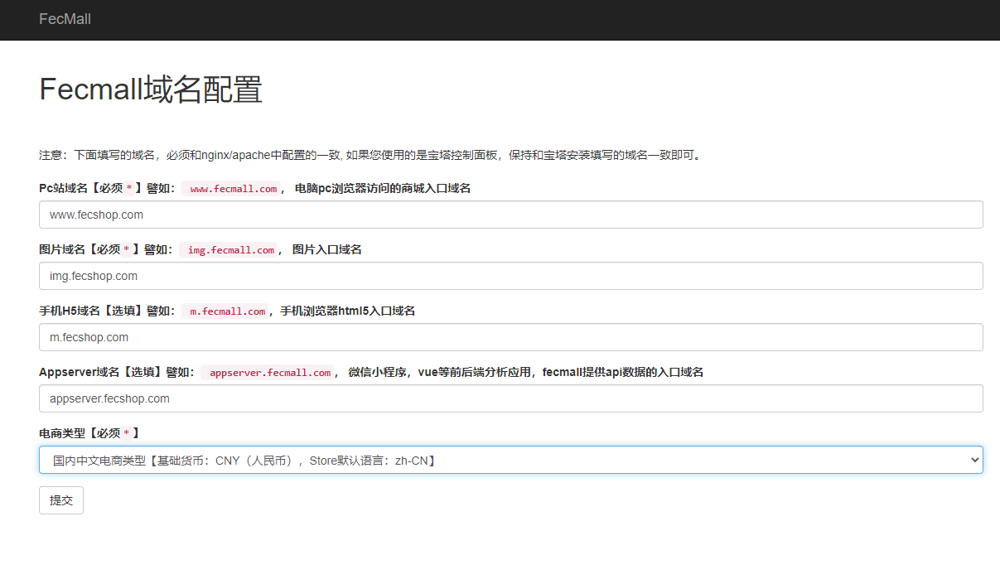
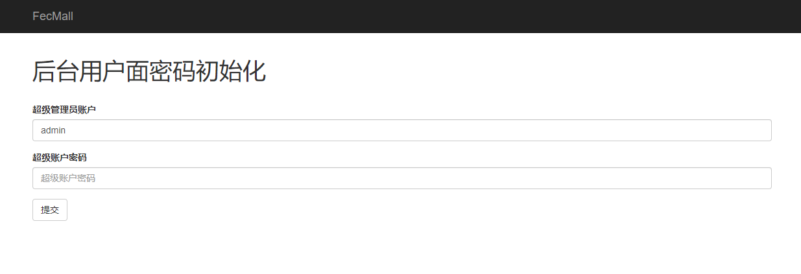
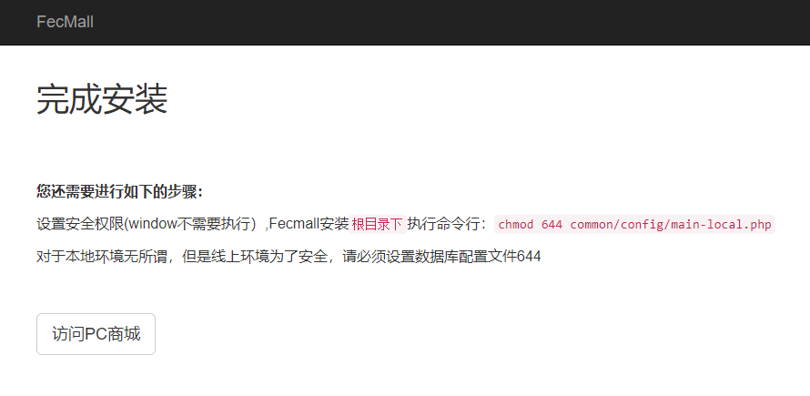

Fecmall界面安装
==========

> 当我们安装好操作环境，以及下载fecmall，配置apache/nginx, 命令行init初始化后，我们就可以通过浏览器的web界面来安装fecmall了
, 如果您没有操作这些，请点击这里参看文档：[Fecmall-2.x 安装](fecshop-2-graphical-install.md)

1.Fecmall界面安装入口文件为：`$webroot/appfront/web/install/index.php`

打开安装地址： http://appfront.fecshoptest.com/install （替换成您自己的域名），界面如下：

点击按钮，进入下一步，配置mysql数据库信息

2.填写mysql的配置，点击提交，提交后，如图：

mysql的配置写入了配置文件：`@common/config/main-local.php`

3.点击按钮： `进行数据表初始化`，需要一段时间执行（请耐心等待），执行完成后的界面如下：

4.点击`测试产品数据安装`，完成后界面（如果不想安装测试数据，可以点击`跳过`按钮）

5.进入域名配置界面

根据选项填写域名，以及根据自己的需求，选择商城类型，然后点击`下一步`（请仔细核对域名，不要有空格）

6.进入后台密码设置界面

填写后台admin账户的`密码`, 这个需要记录下来，用户登陆后台，填写完成后点击`下一步`

7.到这里，安装就全部完成了，您可以点击按钮，访问`PC商城`,查看你的pc端的商城

对于后台，html5等入口，您直接访问您在apache/nginx中设置的域名，即可访问

如果您是`线上环境`，为了安全，记得一定要设置一下数据库配置文件的读写权限：（根目录执行，win不需要执行）：`chmod 644 common/config/main-local.php`

### 其他的说明

1.如果您需要使用微信小程序，建议使用fecyo中文商城扩展，以及对应的微信小程序（fecmall默认对应的微信小程序是偏框架的，功能少）

Fecyo中文扩展商城：http://www.fecmall.com/fecyo

2.fecmall-2.7.0+版本，在安装步骤上做了优化，减少了很多步骤（譬如：还需要到后台进行的设置等），
如果您想要添加多语言store，可以上后台store配置，根据自己的需要

3.如果安装过程中出现报错，想重新安装，可以清空数据库的表，从第一步重新安装即可。

