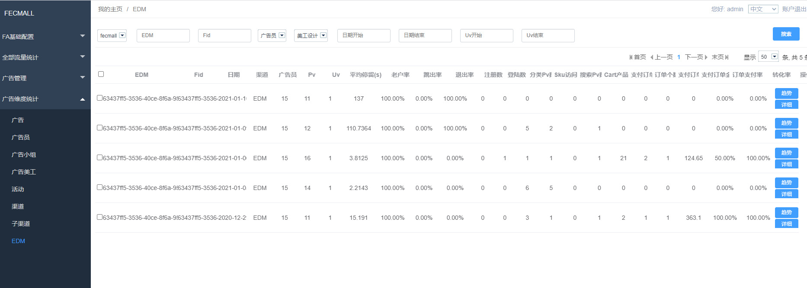

FAA EDM分析
========

> 对邮件部分的分析

### EDM广告生成

对于邮件，里面会有很多标题链接，产品链接，我们可以为每个链接打上不同的标签（通过广告活动参数），
进而标识各个链接进入网站的流量的情况

打开：[广告生成](fecmall-analysis-2-fecfaa-advertise-generate.md) ， 找到多链接广告部分，就是EDM广告生成

### EDM广告查看

如果您想查看邮件整体的情况，可以去广告部分，查看该FID对应的流量分析

如果您想查看邮件里面每一个链接的情况，那么在此处，搜索fid，下面即显示，通过各个链接进入fecmall商城的流量情况

