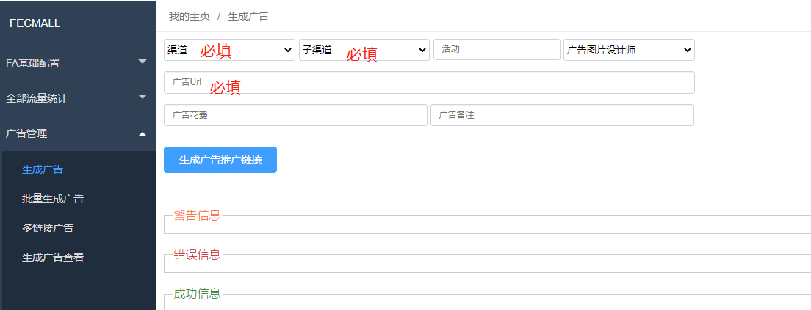
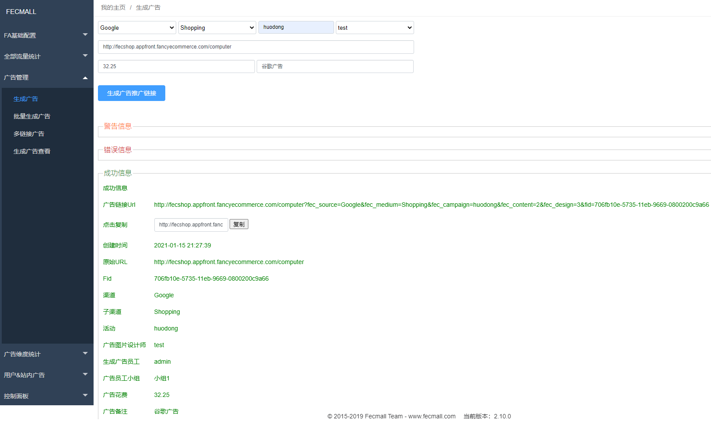
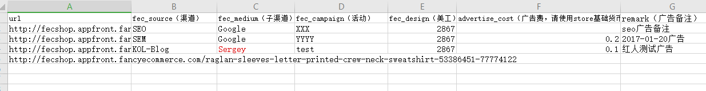
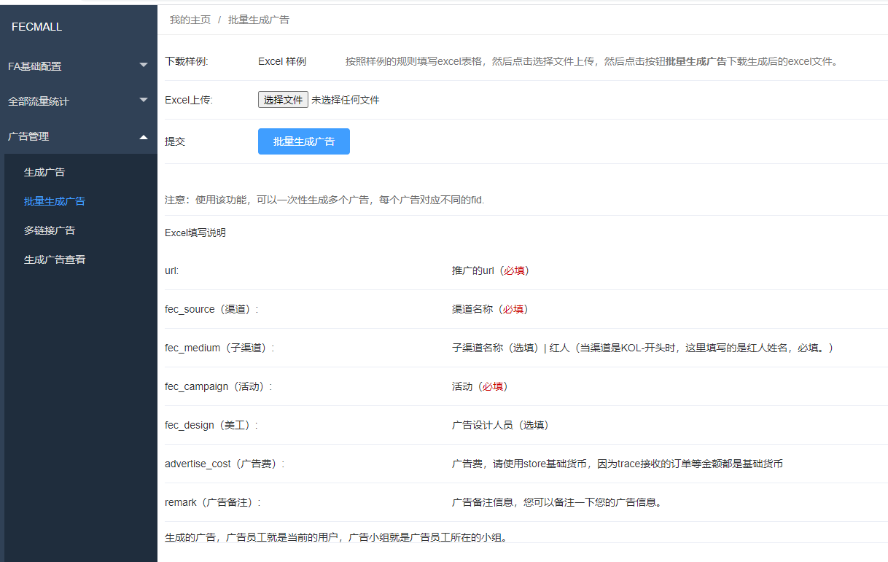
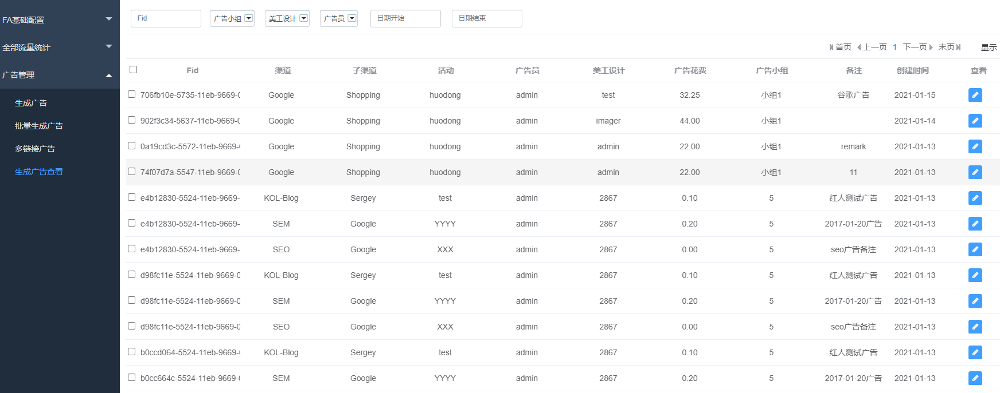

FAA 广告生成
=======

> 通过Fa的广告生成工具，生成带有广告参数的url链接

### 单个广告生成

一次只能生成一个广告url，如图：

`渠道【必填】`：广告的渠道，譬如google渠道，facebook渠道，EDM渠道，论坛渠道

`子渠道【必填】`：渠道下的细分，一个渠道下面可以有多个子渠道，譬如：google渠道下面有google adwords，google shopping等子渠道。

`活动【选填】`：广告活动，类似于广告标签，可以根据需要设置相同的活动标签，便于统计

`广告图片设计师【选填】`：某些带有图片的广告，譬如facebook图片广告，那么带有这个图片的广告，带来的流量，进行统计，
该功能是为了评判广告设计员的优劣

`广告url【必填】`：fecmall网站的url，可以是首页，分类，产品等任何一个url，必须填写。

`广告花费【选填】`：广告花费的金额，填写上去做一个记录

`广告备注【选填】`：广告的备注。

填写信息后，点击 `生成广告推广链接`，结果如下：

可以看到生成后，带有`营销参数`的url
：
`http://fecshop.appfront.fancyecommerce.com/computer?fec_source=Google&fec_medium=Shopping&fec_campaign=huodong&fec_content=2&fec_design=3&fid=706fb10e-5735-11eb-9669-0800200c9a66`

点击`复制`按钮，即可复制生成后的`广告url`。

如果生成url有报错，那么生成失败，错误信息显示在`错误信息`部分

### 批量生成广告

您可以通过excel表格，将广告信息以列表的形式填写进去，然后上传文件一次性生成

1.下载样例

2.填写excel内容，上传文件

3.点击`批量生成广告`，将会下载生成后的excel文件。

打开后，即可看到生成后的广告url

### 多链接广告

此处广告生成，针对的是一个广告有多个链接的情况，譬如邮件， 里面有多个产品，一封邮件是一个广告，
里面的所有产品的fid都是一样的。 对于广告里面的产品，在这里应该一次性生成，不能分多次，如果分多次会生成不同的fid

4.生成广告查看

