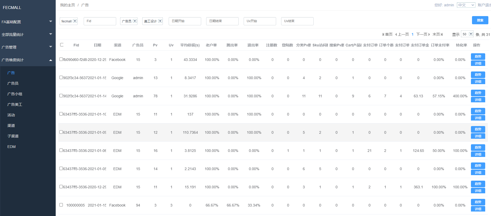
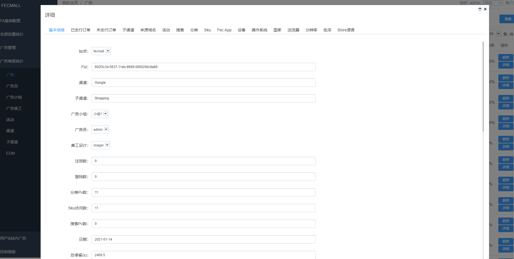
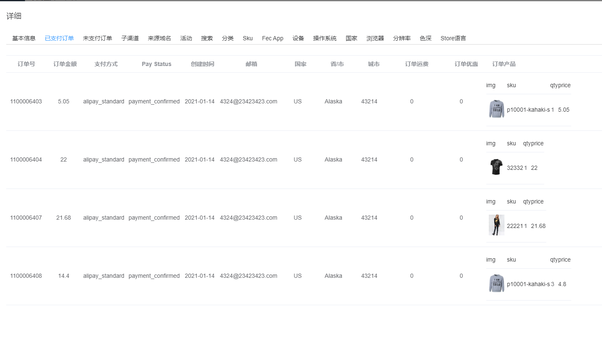
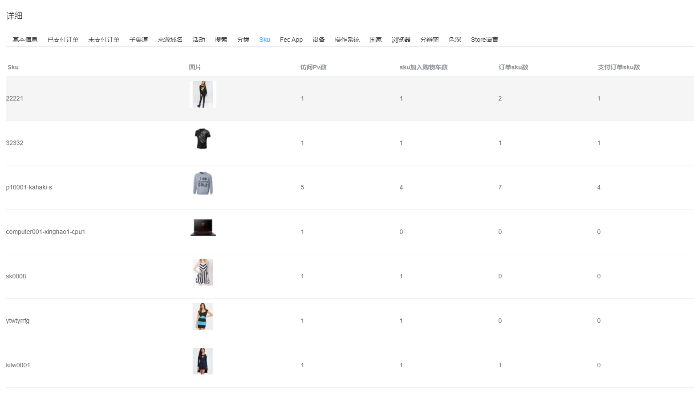
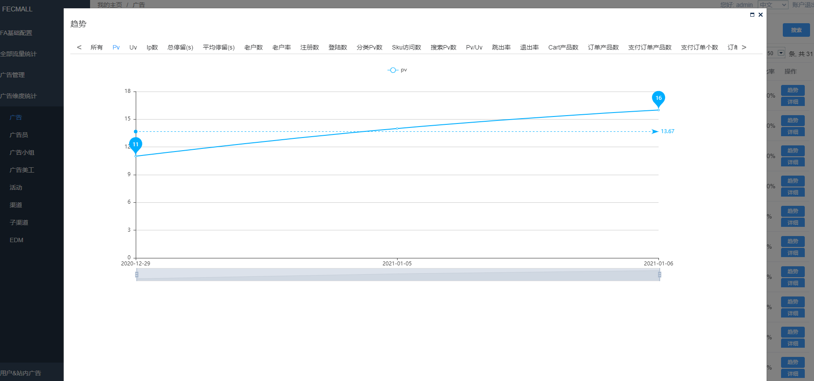

FAA 广告数据分析
==========

> 单个广告数据的分析

### 广告分析

当生成的广告url，带来流量后，我们对这一部分广告流量进行统计分析

查看广告分析列表：

### 广告详细

您可以点击详细按钮，查看广告的详细信息

1.您可以看到广告当日带来的订单列表

2.这些流量访问的sku，sku加入购物车，订单sku数，支付订单sku数列表：

等等一些其他的数据，您可以查看demo，或者自行搭建查看

### 广告趋势

您可以点击趋势按钮，查看广告在一个月内，某个维度的曲线变化

通过广告详细，和广告趋势，您可以更方便的了解广告带来的效果。

