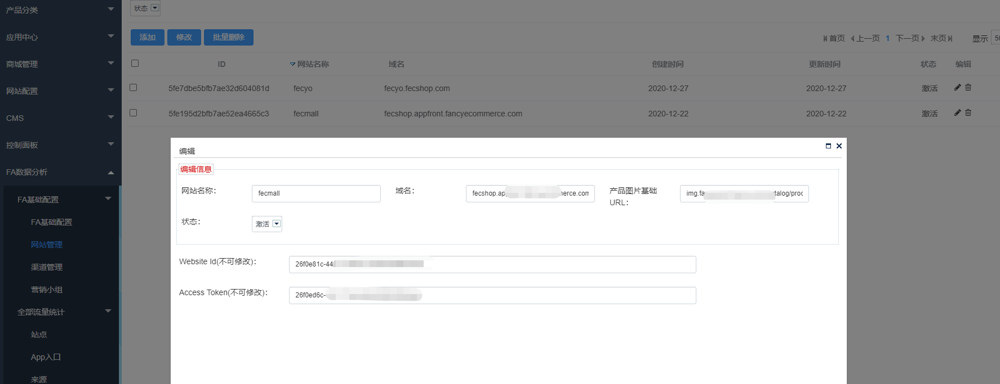
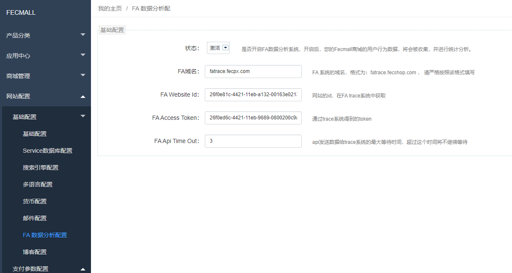
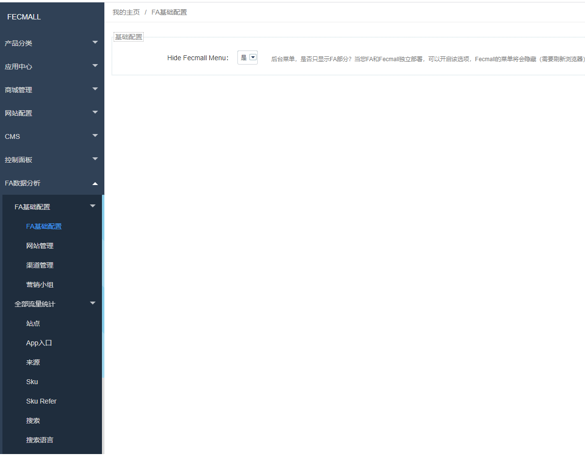
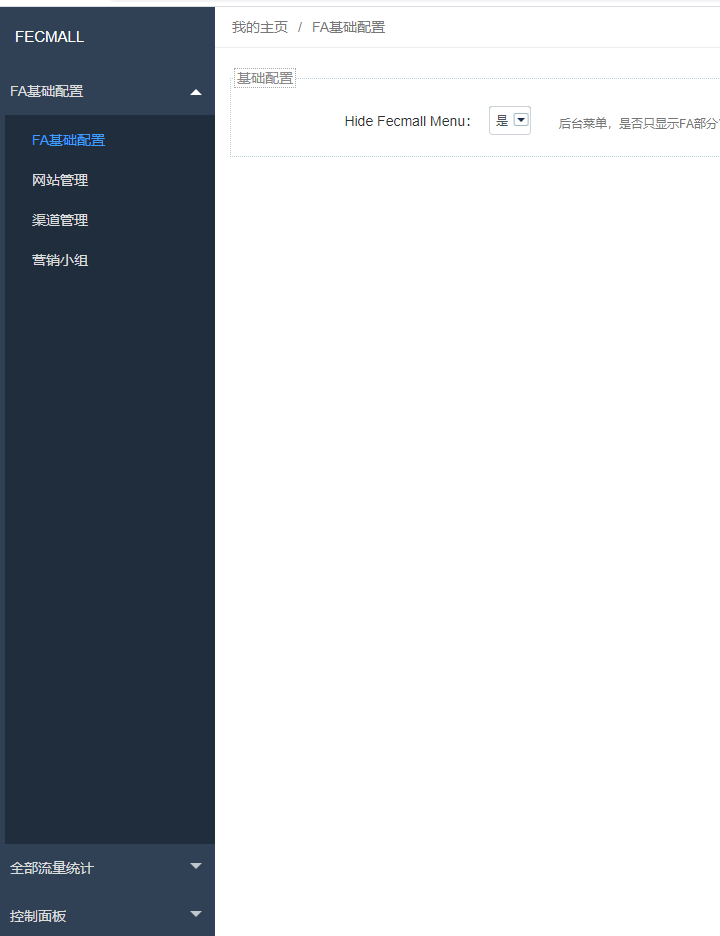

FA-2.0安装
=======

> FA(Fecmall Analysis) 是以扩展的方式开发，FA系统可以监控多个fecmall网站，统计查看各个网站的数据


### FA的部署方式

1.`FA扩展部署`方式

如果您只有一个fecmall网站，而且流量不大，那么可以直接在您的fecmall上面安装FA扩展，
FA和fecmall共享同一个后台

2.`FA独立部署`模式

下面的情况，建议FA单独部署:

2.1如果您有一个fecmall网站，而且流量很大可以单独部署FA

2.2如果您要多个fecmall网站，可以单独部署FA
，然后由FA监控多个fecmall电商网站。

### FA安装

虽然FA是以扩展的方式安装，但在架构层面是独立的，无论是扩展方式部署还是单独部署，逻辑都是相同的。

1.您需要先安装`fecmall`, 安装完成后，您需要安装`mongodb`

参看文档：[Fecmall-使用Mongodb](http://www.fecmall.com/doc/fecshop-guide/develop/cn-2.0/guide-fecshop-2-use-mongo.html)

**上述Fecmall-使用Mongodb文档，您只需要执行1-4步骤即可**

2.安装geoip2库包

详细参看：http://www.fecmall.com/topic/4785


3.安装FA扩展

FA应用市场地址：http://addons.fecmall.com/16262115

如何安装应用，您可以参看：http://www.fecmall.com/doc/fecshop-guide/addons/cn-2.0/guide-fecmall-addons-install.html


4.安装完成后，刷新缓存，就可以看到FA的后台菜单了。


5.配置FA域名

您需要nginx配置一个子域名，解析到 `appfa/web/` 目录，这个域名就是FA入口域名

fecmall加载的js，接收js发送数据的api，以及接收fecmall发送数据的api，都是通过这个域名。

6.拷贝Ip库文件

Ip库用的GeoLite2-City，这个在官网可以下载，您可以去官网下载，官网地址：https://www.maxmind.com/


Q群文件下载`GeoLite2-City_20201215.tar.gz`  （QQ群：782387676，入群验证：fecmall）


为什么插件没有默认集成这个库？因为这个库文件太大了，压缩包30MB+，因此您自己下载即可


下载完成后，文件路径 `./common/lib/GeoLite2-City/GeoLite2-City.mmdb` （需要您自己上传）


7.设置FA  fec_trace.js 发送数据接收的FA域名

在安装FA的fecmall跟目录，打开`appfa/web/fec_trace.js`（注意，是安装FA系统的根目录），在文件内容的最底部，可以看到

```
img.src = '//fatrace.fecpx.com/trace/js?' + args;
```

将`fatrace.fecpx.com` 改成上面4步骤的FA域名。


### FA配置网站


1.进入FA管理部分 `Fa基础配置`  --> `网站管理`




`网站名称`：名字随便取，建议用域名的中间部分，譬如`www.fecmall.com` 就命名 `fecmall`


`域名`：填写您的fecmall pc入口的域名即可，譬如：`fecyo.fecshop.com`

`产品图片基础url`: fecmall 商城图片地址，譬如：`img.fancyecommerce.com/catalog/product/image`, 您将`img.fancyecommerce.com`
换成您自己的域名即可，该值是为了在商城中显示产品图片。


`状态`：激活


`Website Id(不可修改)`：不需要填写，保存后自动生成

`Access Token(不可修改)`：不需要填写，保存后自动生成


2.fecmall配置FA信息




FA域名：在上面安装部分，配置的FA的域名，格式为：fatrace.fecshop.com ， 请严格按照该格式填写

FA Website Id：网站的id，在FA trace系统中获取，也就是上面1步骤添加网站后即可查看

FA Access Token：网站的Access Token，在FA trace系统中获取，也就是上面1步骤添加网站后即可查看


FA Api Time Out：api发送数据给trace系统的最大等待时间，超过这个时间将不继续等待，3代表curl发送数据最高等待3秒


3.如果您是单独部署的FA，那么，默认的后台菜单会对您由干扰，那么可以将其隐藏掉




保存后，刷新一下浏览器就可以了，如图：





可以看到fecmall默认的后台菜单都隐藏掉了，这样更加清爽，只有FA的菜单


4.监控多个fecmall系统

您可以在FA管理后台 `Fa基础配置`  --> `网站管理` ， 继续添加网站，配置多个fecmall即可


### 其他配置项


1.渠道管理 


2.营销小组


这2个配置项，都是FAA广告分析扩展部分要用到的基础编辑部分，如果您不安装FAA，那么不需要配置这2个部分

### 配置脚本


FA接收数据后，需要通过maoreduce进行数据统计，统计工作是通过离线脚本进行的，您可以配置cron定时任务
跑每天的脚本，一天跑一次即可。


建议凌晨1点之后进行，这个时间访问量少，服务器资源空闲一些


