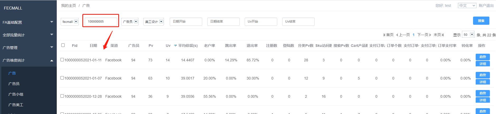
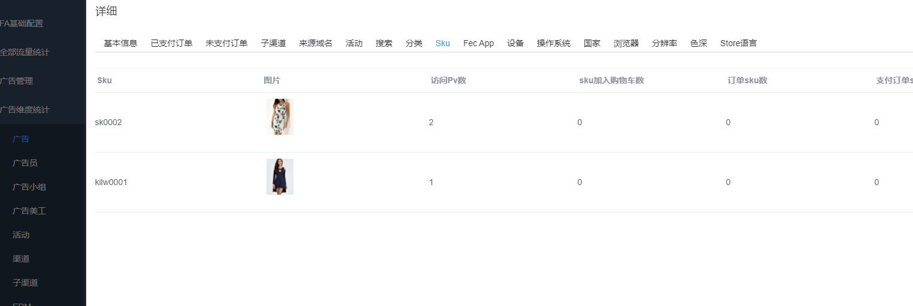
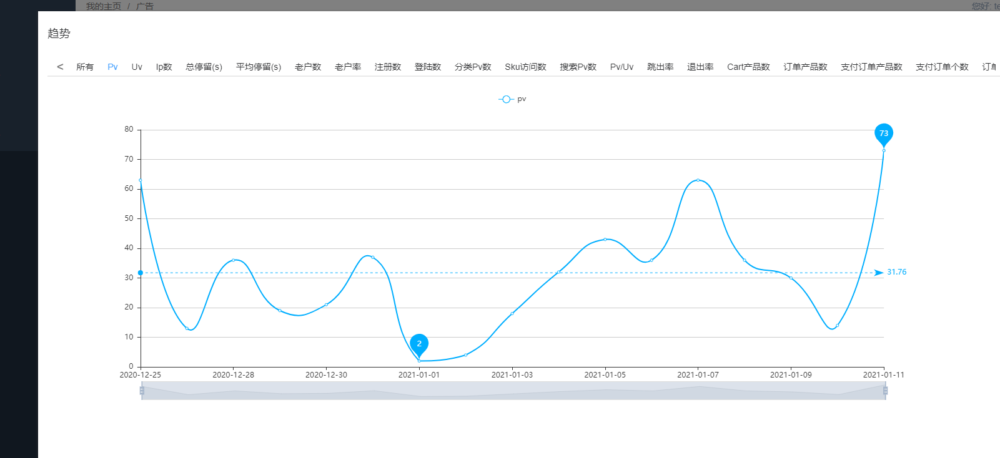
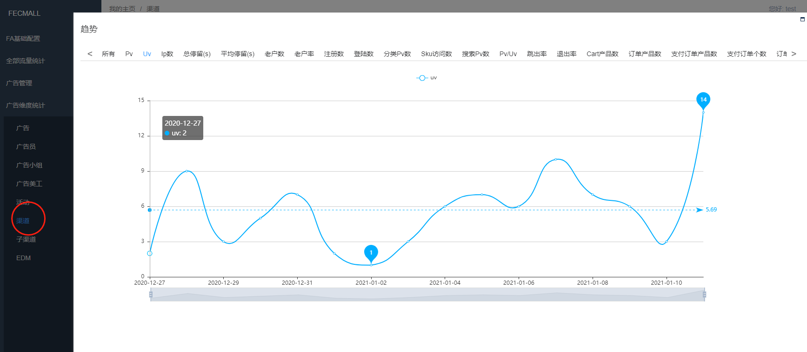
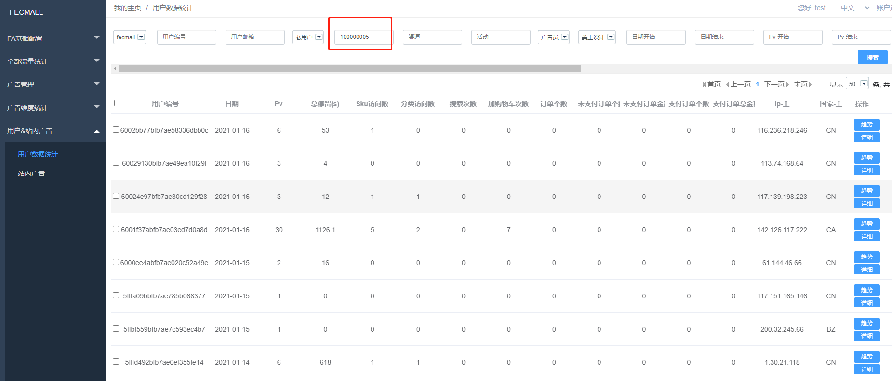
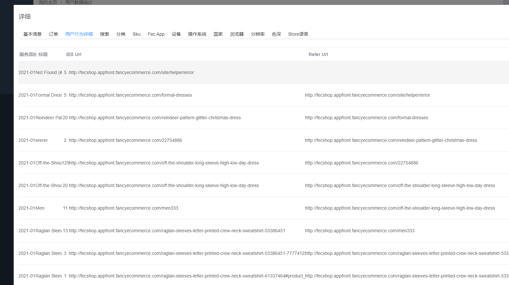
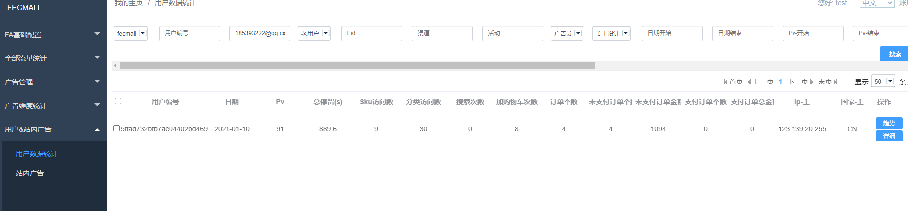
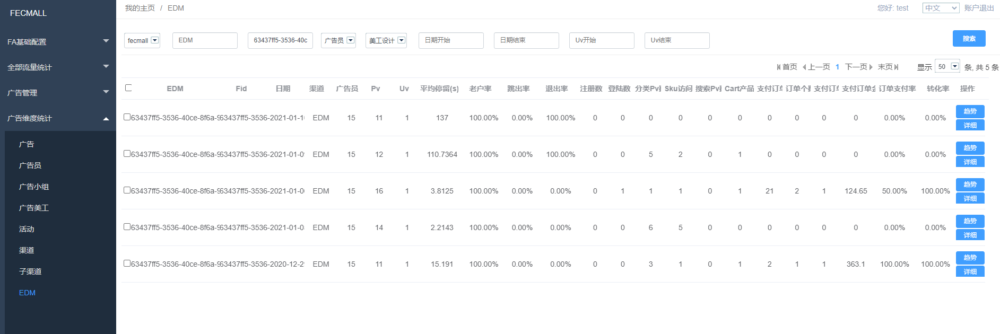

FAA有哪些用处？应用场景
=============

> FAA广告分析的应用场景

### FAA应用场景

**场景一：**业务员在`facebook`上面打了几个广告，过了几天，但是发现没有订单，我想知道这个广告过来的用户，干了些啥事？为什么没有订单？

答：首先，我们进入广告分析，通过`广告编号FID`，查看`汇总数据`

1.首先看`UV数`,pv数`，如果数量太低，说明广告本身带来的流量比较少。

2.查看`跳出率`，跳出率过高，说明过来的用户质量太差，点击进入商城后，直接将页面关掉了

3.查看`登陆`，`注册账户`的用户数，这个说明用户是否有下单意向

4.查看用户的产品`加入购物车数`，`订单个数`，`支付个数`等，如果加入购物车的数量太少，说明产品和流量用户`匹配比较差`，
可以考虑调整广告的受众群体

如果加入购物车的产品比较多，但是生成的订单比较少，可以考虑，网站是否在下单环节`不够通畅`，是否需要`优化下单流程`

如果下单很多，但是支付的订单比例很少，则查看`支付环节`是否存在问题

5.查看用户的`平均停留时间`，这个也是评判流量`用户质量`的一个维度

6.如果广告的某一天存在问题，可以点击`详细按钮`，查看这个广告在`当日`的详细数据

7.点击`详细按钮`，弹出详细弹框，在这里可以查看`sku`, 查看各个`sku的访问次数`，`加入购物车个数`，`下单个数`，
以及`支付订单个数`

8.点击`趋势按钮`，查看各个维度的趋势。

**场景二：**公司下面有很多`广告业务员`，每个业务员每天打很多的广告，作为老板，我想知道各个广告的质量，因为广告是花钱的
我想对`广告总体`有一个把控。

答：作为公司老板，对于广告员的广告费用，不怕花钱，就怕白花，但是，总是存在某些广告员的`广告受众群体`和fecmall商城
`产品匹配`不行，导致百花很多冤枉钱

但是广告太多，逐一查看也费劲，最好是从一个`整体维度缩放式`的排查

1.首先，可以先看一下`渠道统计`，譬如`google渠道`，`facebook渠道`，`EDM渠道`，等等，通过查看`pv`，`uv`，`订单`，等趋势图，
看到那几天数据不正常。

2.如果发现`某个渠道`有问题，那么去该渠道下面的子渠道，查看各个`子渠道`的问题

3.各个`子渠道`下面都有`广告员`，确定出问题的子渠道后，然后查看各个`广告员`的统计数据，可以查看`详细`以及查看`趋势`

4.确定出来有问题的`广告员`后，然后进入`广告统计`，查看这个广告员的哪些广告存在问题导致的

在广告分析中，查看详细的统计数据

5.如果您想继续深入，我发现`x1广告`有问题，
我想看看这个广告过来的所有`用户汇总`，您可以进入用户数据统计

在用户统计页面，填写`广告FID编号`，点击`搜索`，将把该广告过来的所有`用户列表`列出来，您可以通过排序查看各个维度列

如果您看到某些用户访问了很多页面，但是没有下单，那么，您可以点击`详细按钮`，查看详细

查看这个用户在网站访问的各个`url页面`，以及`停留的时间`

6.到此，我们完成了从`整理统计`，到`细粒维度`的一个缩放，就像`地图缩放`一样，就像`摄像头历史`数据一样，将历史的数据快速的
翻出来，进行问题定位，然后为将来`广告投放优化`提供更多的数据

**场景三：**对于网站的注册用户，我有用户的`邮箱地址`，我想通过`邮箱地址`，在FA里面将这个`用户`搜索出来，我想看看
这个用户在网站上面的历史数据

答：进入用户数据统计，通过邮箱地址进行搜索

即可显示这个用户的历史数据。

**场景四：** 我们公司通过`EDM邮件营销`，邮件里面有公司的`logo链接`，很多`产品链接`，以及`图片链接`，我想知道用户点击最多的是那个`链接`？
邮件中那个链接带来的订单最多，等等，也就是以邮件的各个`url`为维度的统计

答：EDM部分就可以完成，Fa系统通过`fec_edm`字段来标识各个url，进行数据统计

我们先写入`广告邮件编号`，将`邮件统计`信息搜索出来

列表中的行，就是该邮件里面，点击各个链接进入商城的用户，在网站行为的数据统计

**场景五：** 我们最近策划了一个`活动`，在很多渠道打广告，我想知道这个`活动`的一个总体情况

答：您可以通过`广告活动`字段，将广告都用同一个`广告标签`，然后就可以在广告活动中查看`统计数据`

**场景五：** 我们公司经常做图片广告，有几个`美工`，我想看一下那个`美工`的图片效果比较好

答：您可以在生成广告的时候，加上`图片设计师`，然后通过`广告美工统计`查看数据分析

