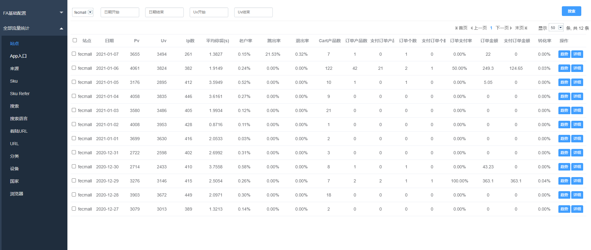
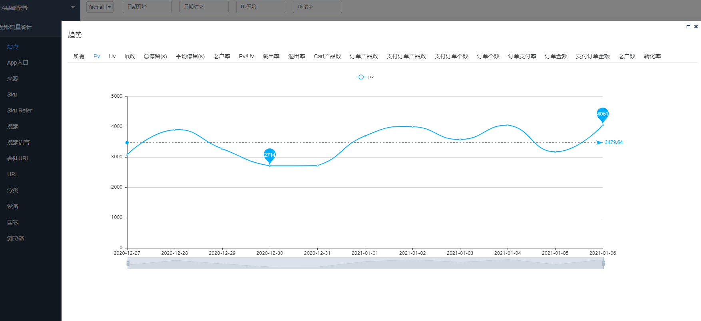
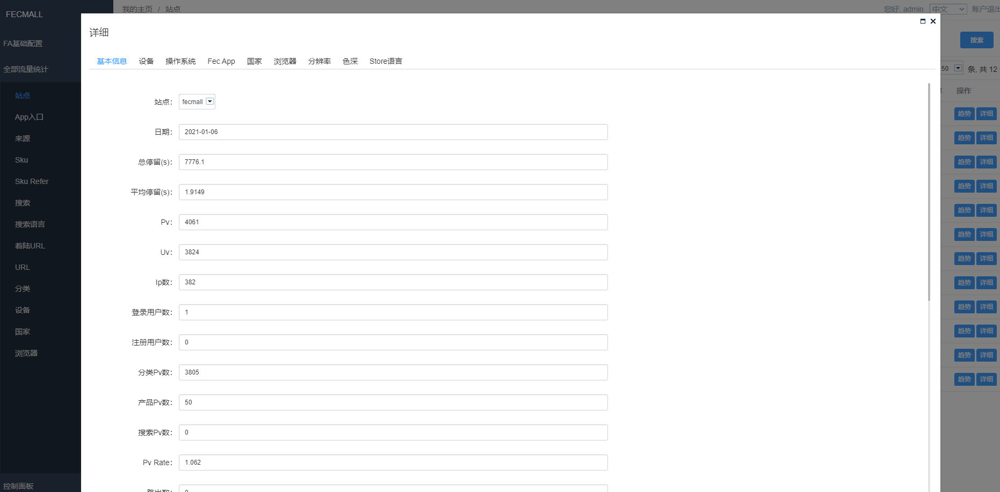
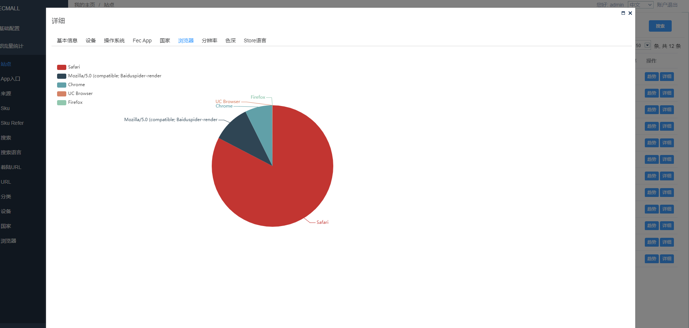

FA-2.0 流量统计说明
=========

> FA-2统计后的流量统计展示说明

### FA-2.0 查看流量统计

当我们对接好FA和Fecmall，配置cron定时脚本任务后，就会计算出来统计分析后的数据，
我们可以在FA后台产看

1.查看website站点整体的每日统计信息

2.您可以点击趋势按钮，查看某个维度，在一个时间段内的趋势图

3.您可以点击详细按钮，查看当日的数据详细情况

### 统计字段说明

`站点`：站点的名称

`pv`：用户访问一个url页面，访问一次，就是一个pv

`uv`：用户通过某个设备进行了一系列的访问，就是一个uv

`ip`：用户访问的ip，如果用户通过一个ip地址，使用多个浏览器进行访问，那么将是一个ip，多个uv

`平均停留（s）`：用户访问各个url的平均停留时间

`老户率`：`老用户比率` = `老用户个数` / `所有用户个数`

`跳出率`：跳出用户，指的是用户访问网站后，没有进行第二个url页面的访问，直接关闭，也就是用户进入网站只访问了一个页面，
此类用户叫做跳出用户，  `跳出率` = `跳出用户个数` / `所有用户个数`

`退出率`：用户进行了大于2个页面的访问后，然后关闭网站，叫做退出，访问的最后一个页面，是退出页面， 一般统计某个页面的退出率，
`退出率` = `退出用户` / `所有用户个数`

`Cart产品数`：将产品加入购物车的总数

`订单产品数`：将产品生成订单的总数

`支付订单产品数`：支付订单中产品的总数

`订单个数`：订单的总个数

`支付订单个数`：支付订单的总个数

`订单支付率`：`订单支付率` = `支付订单个数` / `所有订单个数`（包含未支付订单）

`订单金额`：订单的总金额

`支付订单金额`：支付订单的总金额

`转化率`：转化率 = `下单并支付的用户数` /  `所有用户数`

`登录用户数`：进行登陆操作的用户总数

`注册用户数`：进行账号注册的用户总数

`Pv Rate`：`pv / uv`

`分类Pv数`：分类url被访问的总次数

`产品Pv数`：产品url被访问的总次数

`搜索Pv数`：搜索的总次数

`着陆页数`：用户第一次访问的页面，成为着陆页。

`设备`：用户访问的设备，譬如：`pc` ， `Mobile：Ipone`

`操作系统`：用户访问的操作系统，譬如: `Mac OS` ， `Windows`

`Fec App`：fecmall商城的入口，譬如：pc入口appfront， h5入口apphtml5

`国家`：用户的国家

`浏览器`：用户访问fecmall所使用的浏览器名称

`分辨率`：用户设备屏幕的分辨率

`色深`：用户设备屏幕的色深

`Store语言`：用户访问fecmall的store语言简码

2.搜索统计部分的术语

`登陆用户搜索次数`：登陆的用户进行搜索的次数

`搜索sku结果sku点击次数`：用户进行搜索后，点击的sku的次数

`sku加购数`：用户进行搜索后，点击产品，然后将产品加入购物车的个数

`sku订单数`：用户进行搜索后，点击产品，然后进行下单的个数

`sku支付订单数`：用户进行搜索后，点击产品，然后进行下单并进行支付的个数

`sku点击率`：用户搜素后，sku被点击的比率

`sku转化率`：搜索点击后的sku，进行下单并支付的比率

