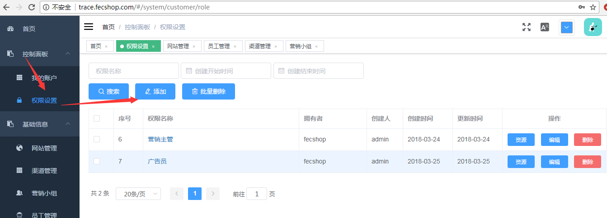
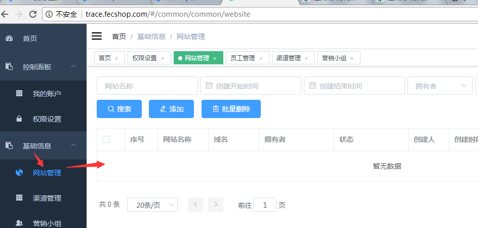
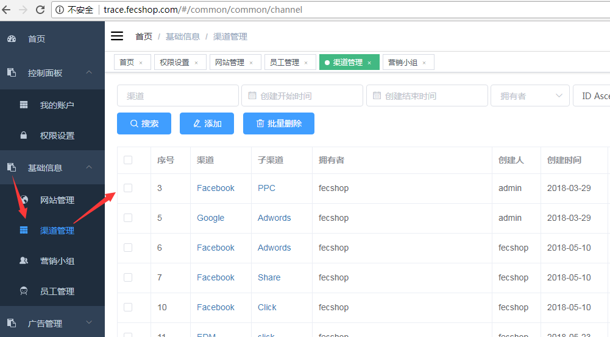
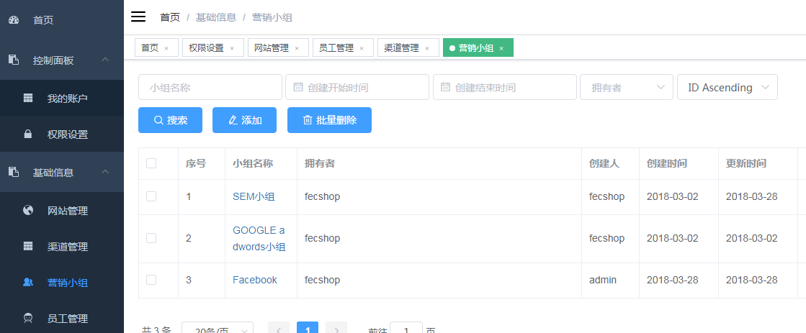
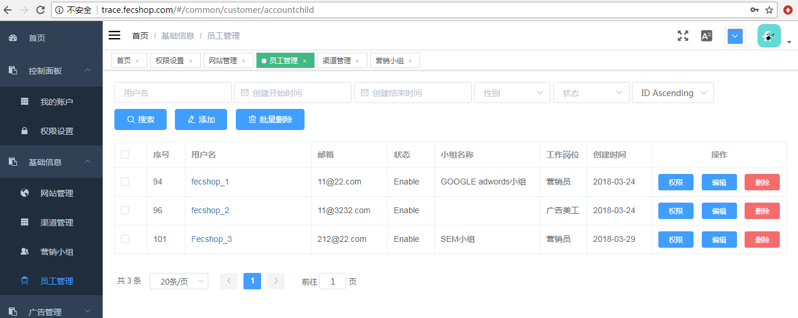
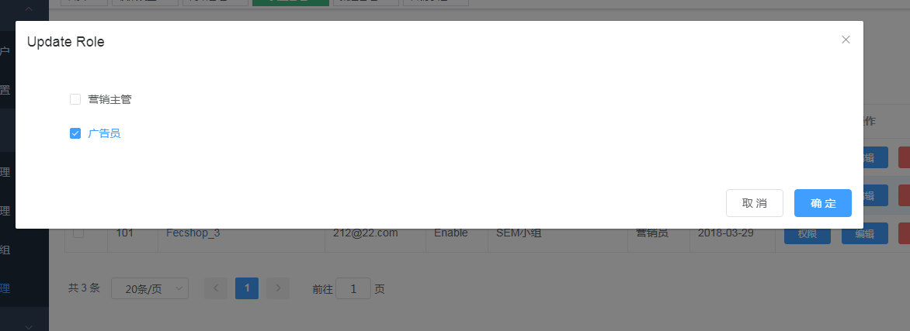

trace 配置基础信息
=================

配置完成后，您可以添加网站，设置 common admin账户，
当把这些设置完成后，common admin账户相当于您的后台账户，
然后就可以进行一系列的配置使用了

### 配置基础信息

1.登录您的common admin账户

2.设置权限组

2.1添加权限组，如图

保存成功后，点击**资源**按钮，弹出来一个详细资料列表，
您可以勾选全部的资源，代表该权限组可以访问这些资源，保存即可

您可以继续设置多个权限组

3.网站管理

如图：

网站的编辑，只有super admin账户才有权限操作

4.渠道管理

渠道管理，指的是营销渠道，譬如facebook是一个营销渠道，下面的ppc广告，
以及其他的广告方式，为一个子渠道，您可以根据自己的
业务类型，进行渠道的添加

编辑渠道管理，是为了生成广告部分，您在生成广告的部分可以选择广告的渠道和子渠道，
方便按照渠道，通过该渠道下的所有广告的数据

5.营销小组

> 这个部分也是为了广告统计的

每个员工都有一个营销小组，添加营销小组后，您在添加 `Child Account`
员工账户的时候，就可以为这个员工设置营销小组，
然后就可以按照营销小组，进行广告数据统计

6.员工管理

> common admin账户可以添加小组成员的账户，也就是通过该功能

操作如图

点击添加后，即可添加员工账户，为其选择营销小组

添加员工成功后，就可以为这个员工设置操作权限如图

点击`权限`按钮，即可为这个员工选择`权限组`

到这里，trace系统的基础编辑工作完成。

您可以把创建的员工账户，发送给相应的人，让其访问trace 系统。

