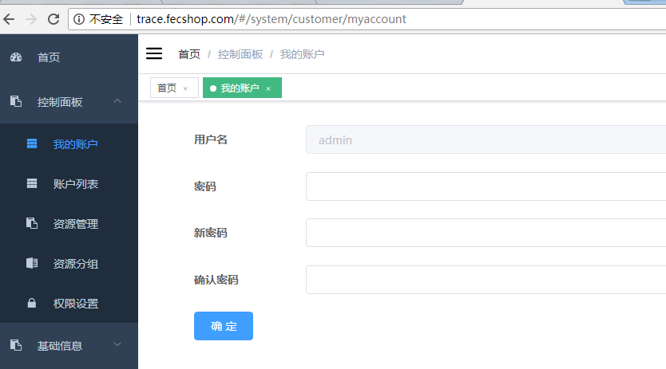
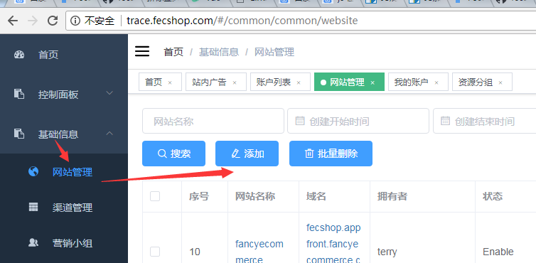
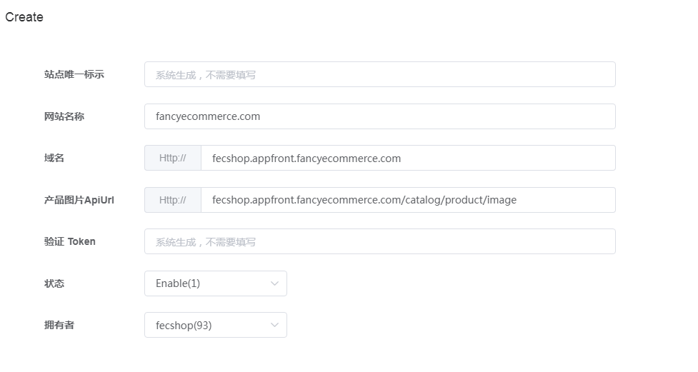
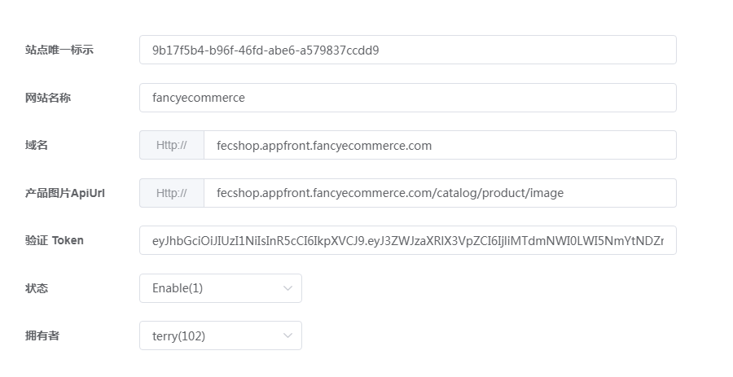

trace 如何添加网站
====================

关于Trace账户系统，参看:trace 后台账户介绍](trace-fecshop-account.md)

### 前序

登录您的admin 超级账户

1.更换语言

登录后，您可以通过右上角的`A`图标进行语言的切换，切换成中文

2.修改admin的密码

控制面板 -->  我的账户

默认账户是  `admin  fecshop1234` , 您修改成您自己的账户

### 添加网站

1.进入菜单，如图

2.填写信息，如图

下面是说明：

`站点唯一标示`：不需要填写

`网站名称`：填写你的名站的名称，自定义即可

`域名`：填写您的网站域名即可，如果您有多个，填写其中一个即可，fecshop.appfront.fancyecommerce.com
这里就是做一个记录

`产品图片ApiUrl`：通过sku获取图片文件的地址，这个就是fecshop的pc端地址，譬如：
fecshop.appfront.fancyecommerce.com/catalog/product/image，
您将 `fecshop.appfront.fancyecommerce.com` 切换成您的域名即可。

`验证 Token`： 系统生成，不需要填写

`状态`：设置成enable

填写完成后，保存即可完成

点击编辑，弹出编辑框，可以看到生成的
`验证token` 和网站唯一标示

