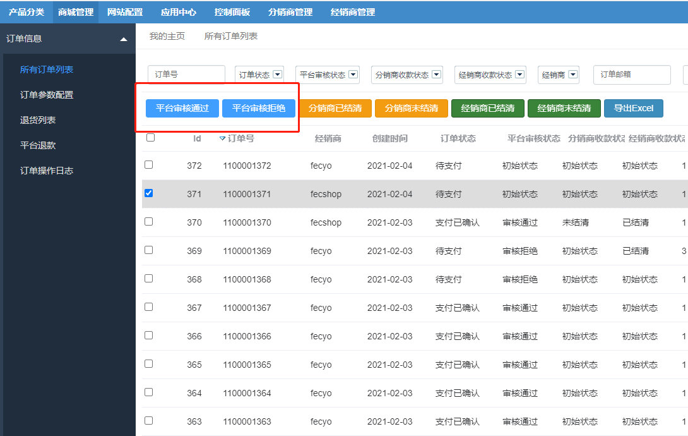
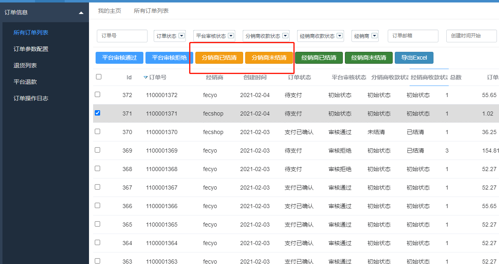
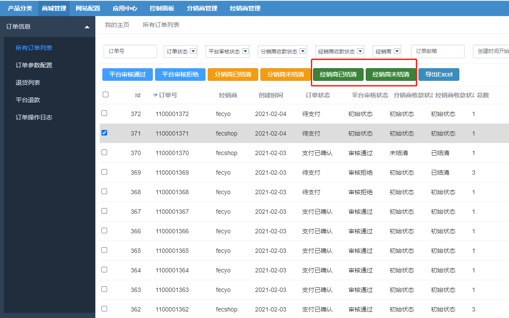
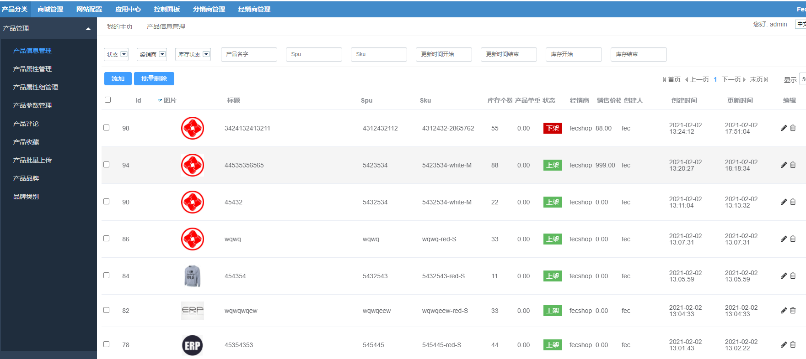
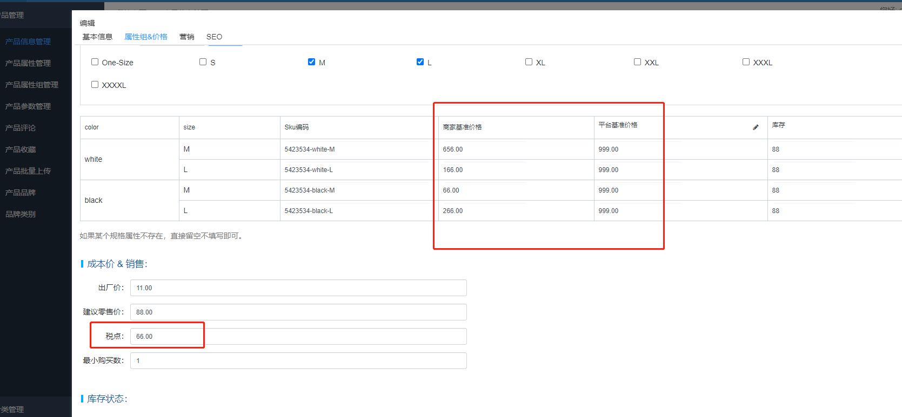
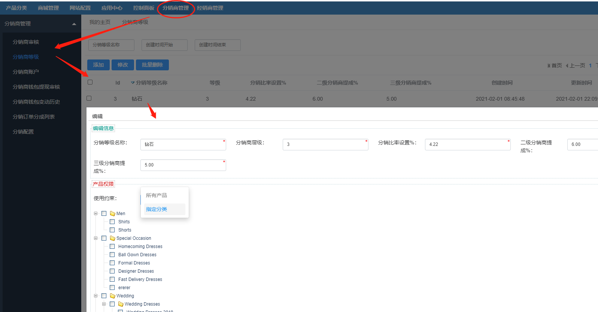
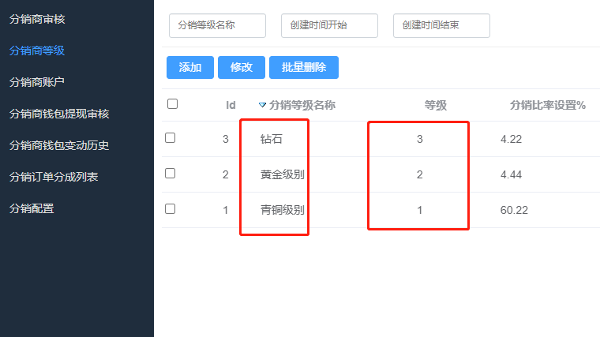

Fecbbb 功能操作-平台商
==========

### 平台商管理员审核订单

1.分销商订单，无论是否支付，都要经过平台商管理员的审核，只有审核通过的订单，才能进入经销商订单管理

2.该状态只能操作一次，操作后，系统无法进行更改。

### 分销商收款状态

1.任何分销商订单的收款，都要审核，无论 线下付款，还是线上支付

2.可以进行多次修改状态，类似于打标签，管理员核验后的确收款了，就改成已结清，如果发现搞错了，还可以改成未结清

3.该操作不受订单状态等其他因素的影响，可以随时进行操作，无论未支付订单还是已完成订单

### 经销商结算状态

1.经销商结算货款，是按照订单，一笔一笔的结算

2.可以进行多次修改状态，类似于打标签，管理员核验后的确收款了，就改成已结清，如果发现搞错了，还可以改成未结清

3.该操作不受订单状态等其他因素的影响，可以随时进行操作，无论未支付订单还是已完成订单

### 平台商审核产品上下架

对应经销商的商品，平台管理员需要重点审核价格变动以及税点

当 `商家基准价格`  和 `平台基准价格`  不一致的时候，根据自身需要更新

1.当经销商第一次创建商品的时候，填写`商家基准价格` ，`平台基准价格`会默认等于`商家基准价格` 

2.当经销商创建商品后，再进行更新商品的`商家基准价格`，`平台基准价格`不会进行更新，需要平台管理员手动更新

经销商产品价格 = `平台基准价格` * （1+ 经销商比率系数%），加入`平台基准价格`而不是直接使用`商家基准价格`，是为了更加的灵活
，让平台可以根据需要酌情更改设置

### 设置分销商等级

注意：分销商等级必须从1开始填写，逐渐递增，譬如：

`分销比率设置%`: 当前分销商用户组对应的分销比率，这个设置是为了计算分销商的商品价格
, 公式为：`分销商商品价格` = `平台商基准价格` * （1+ `分销比率设置`%）

譬如：填写`11`，代表加价 `11%`

`二级分销商提成%`：当分销商购买商品，他的`上级`分销商获得的提成， `提成` = `商品售价` * `二级分销商提成%`

`三级分销商提成%`：当分销商购买商品，他的`上上级`分销商获得的提成， `提成` = `商品售价` * `二级分销商提成%`

`产品权限`: 该分销商用户组对应的产品权限，分为`全部产品`和`指定分类`

新注册用户，默认的`分销商用户组`为：等级为`1`的`分销商用户组`

