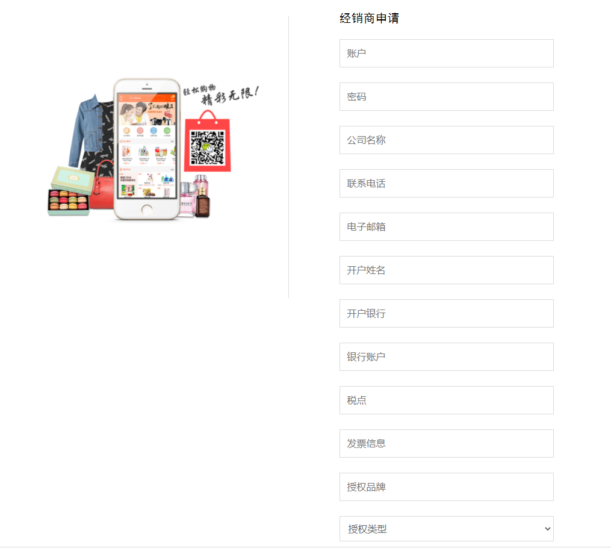
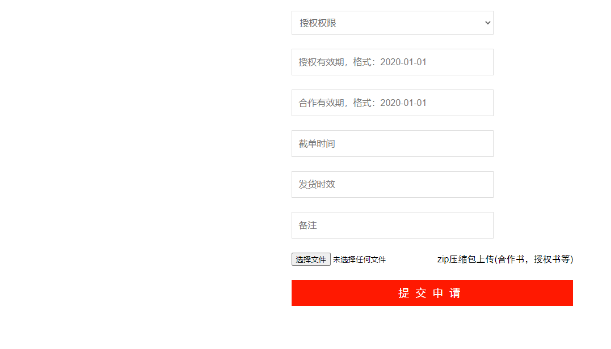
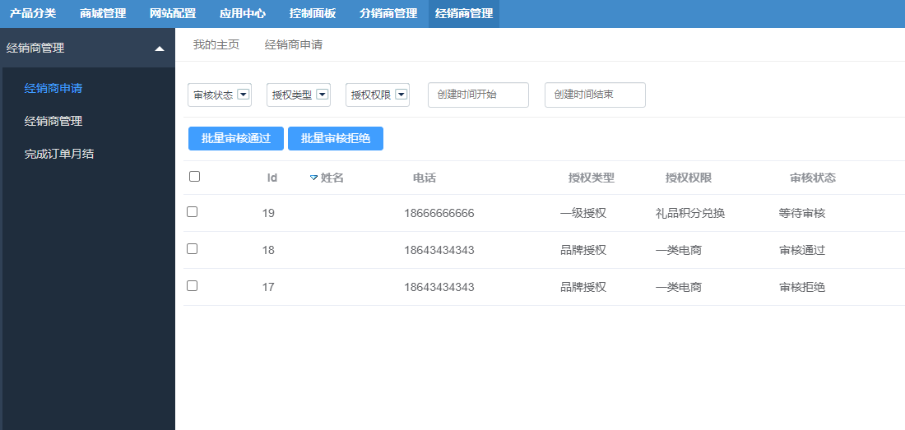
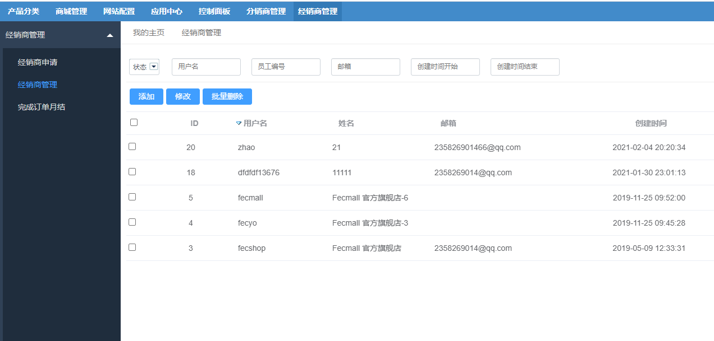
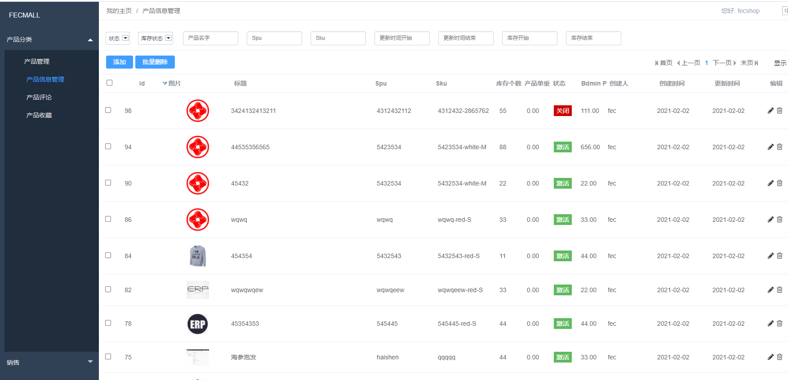
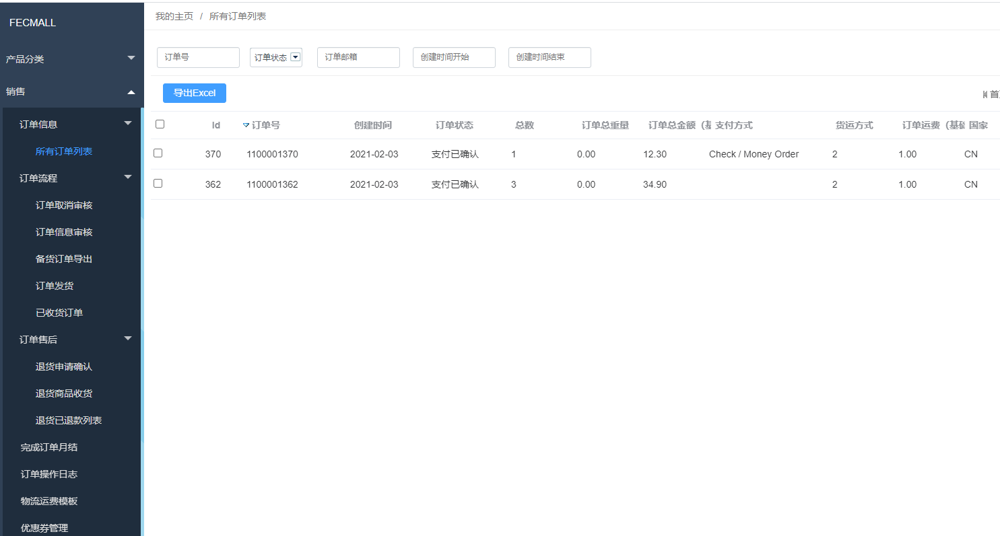
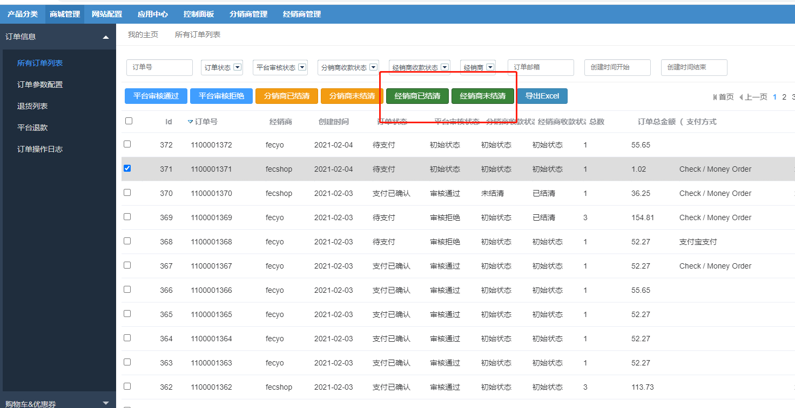

Fecbbb 功能操作流程
==========

> 截图的形式说明，如何使用Fecbbb多商户分销系统

### 申请成为经销商商

经销商提交信息，注册经销商账户, 经销商申请的url，如下，这个您需要发给你的经销商，商城没有做链接
,`http://www.domain.com/customer/account/bdmin`， 将 `http://www.domain.com`换成您的域名即可

注意的是，您的授权书，合作书等等其他的一些文件，请打包成zip文件格式进行上传。

填写信息，提交后，等待平台商客服审核

管理员审核完成后，经销商即可登陆账户

### 平台商后台，查看经销商列表

### 经销商后台

1.经销商管理商品

2.经销商管理订单

管理这个部分，是多商户fecbbc的范畴，这里不详细说明，您可以参看文档：

[订单处理流程](http://www.fecmall.com/doc/fecmall-guide/instructions/cn-1.0/guide-fecmall-order-process.html)

[订单退货流程](http://www.fecmall.com/doc/fecmall-guide/instructions/cn-1.0/guide-fecmall-order-aftersale-request.html)

### 经销商结算

目前需要，单笔订单进行结算，因为是面向b端的订单，单笔比较实用

