Fecbbb 功能操作-分销商
==========

> 截图的形式说明，如何使用Fecbbb多商户分销系统，分销商部分功能

### 关于Fecbbc多商户

Fecbbb是基于fecbbc开发的多商户分销系统，b2b2b，关于Fecbbc参看文档：
[Fecbbc多商户系统](http://www.fecmall.com/doc/fecmall-guide/instructions/cn-1.0/guide-README.html)

下面是Fecbbb里面的功能

### 注册用户，申请成为分销商

1.分销商如果没有注册账户，就会强制进入账户登陆页面，用户可以注册账户，登陆账户

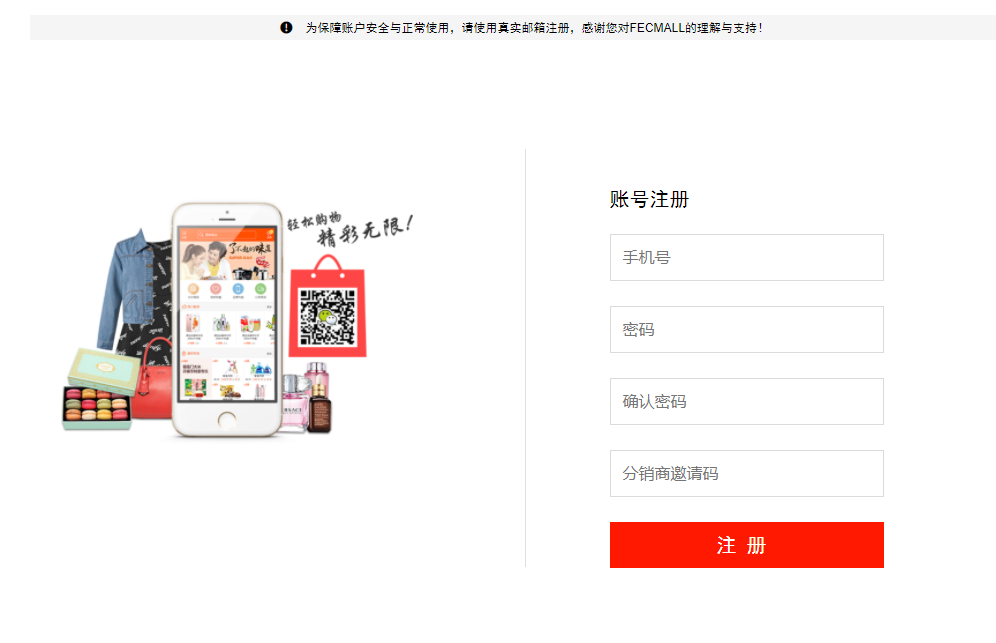

2.分销商登陆账户后，可以进入账户中心，如果查看其他的页面，就会进入分销商申请页面

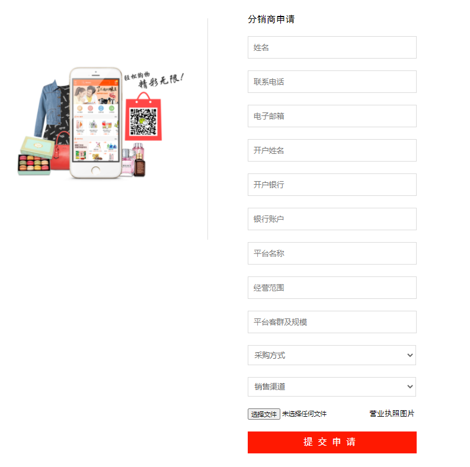

分销商填写信息，进行提交，等待平台商客服审核即可

3.平台商管理员进行审核

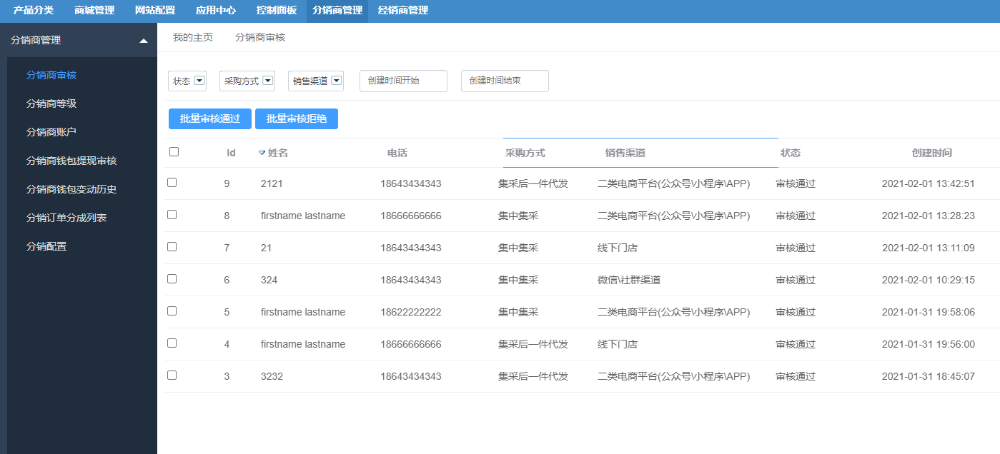

勾选列表中的申请行，可以多选，点击  `批量审核通过` 或者  `批量审核拒绝`

### 分销商邀请注册

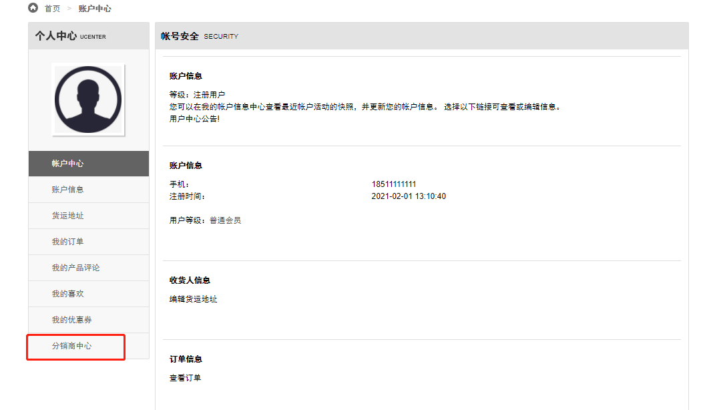

进入分销商账户中心

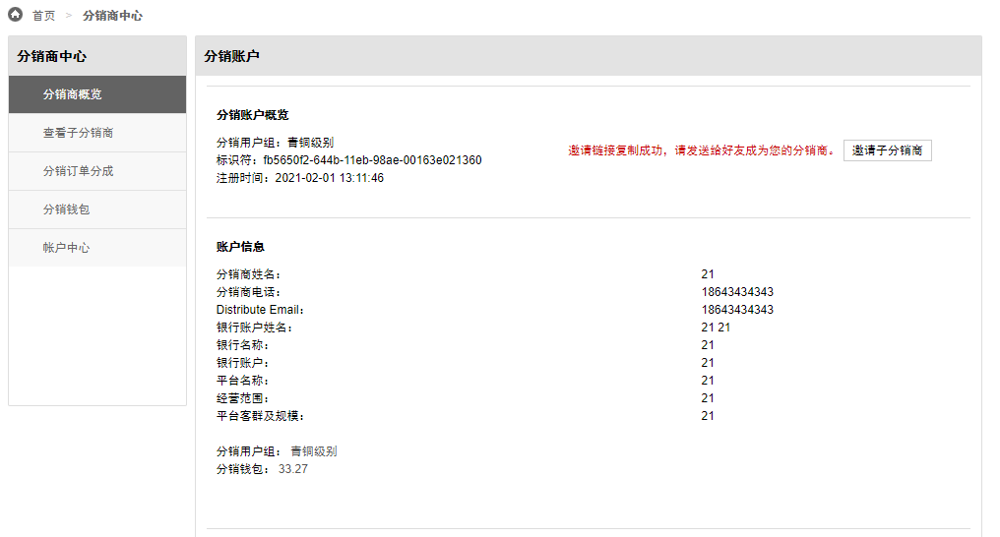

点击邀请子分销商，即可复制邀请链接，譬如：`http://fecbbc.fecshop.com/cn/customer/account/register?bid=fb5650f2-644b-11eb-98ae-00163e021360`

您可以另外打开一个浏览器，或者将当前账户退出，然后访问这个url测试

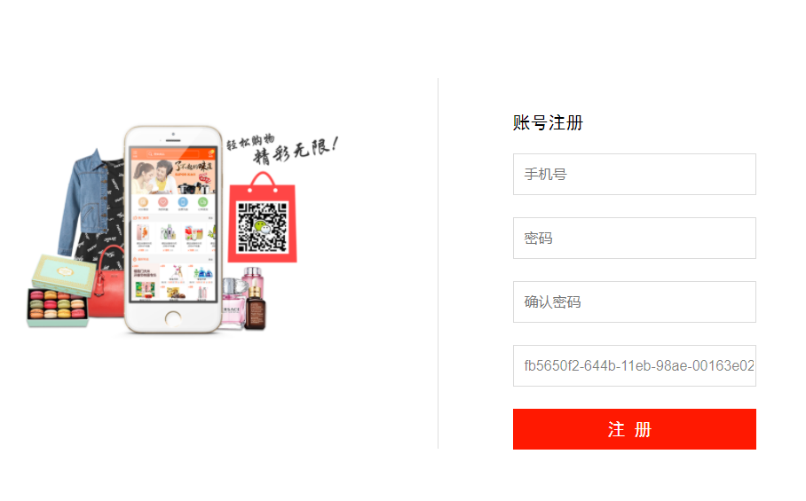

邀请码部分会自动填写上去，点击注册后，该账户就成了您的子分销商。

父级分销商可以查看子分销商列表

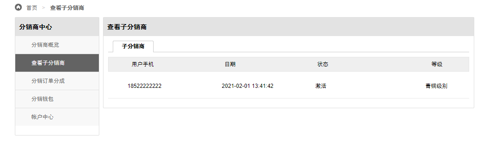

### 分销商邀请注册子分销商，查看订单分成

当子分销商下单后，父分销商就可以获得分成收益

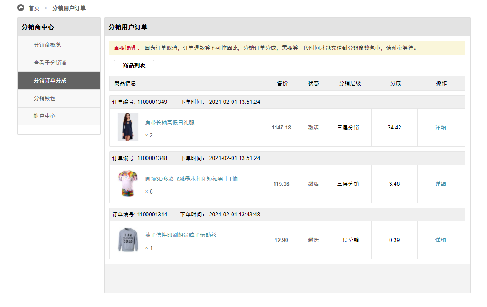

点击查看详细：

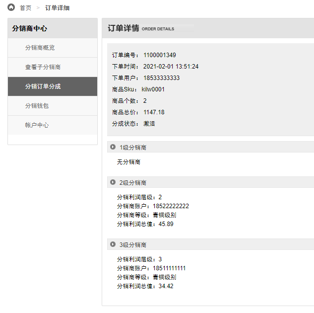

### 分销钱包

分销商钱包收支详细

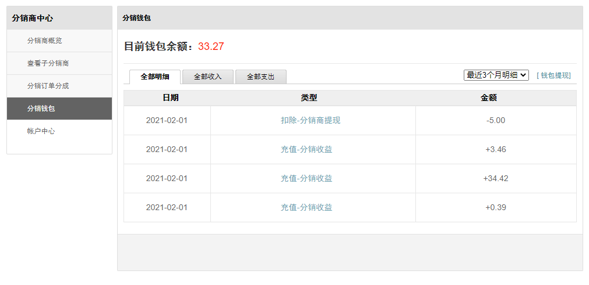

分销商钱包提现申请

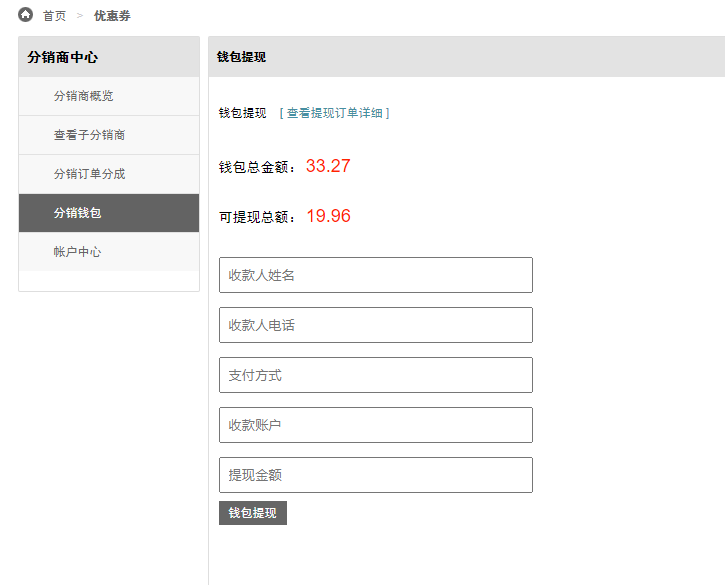

分销商提现历史

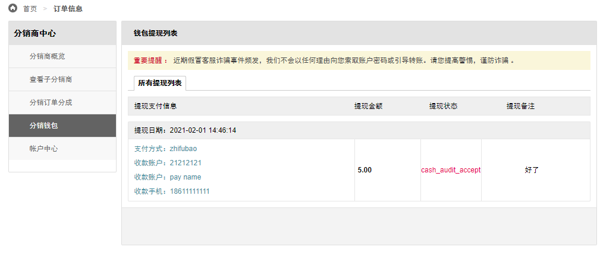

当分销商申请提现后，平台管理员后台进行审核，线下打款。

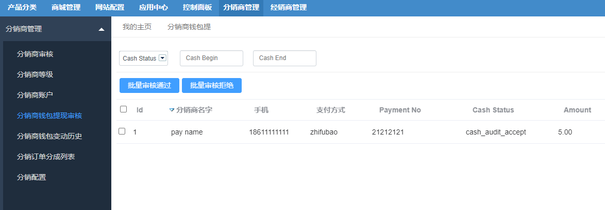

### 其他分销商功能

1.分销商账户列表

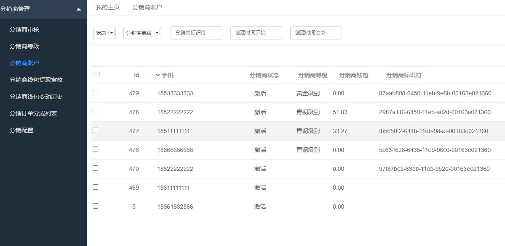

2.分销钱包变动历史

3.分销订单分成列表

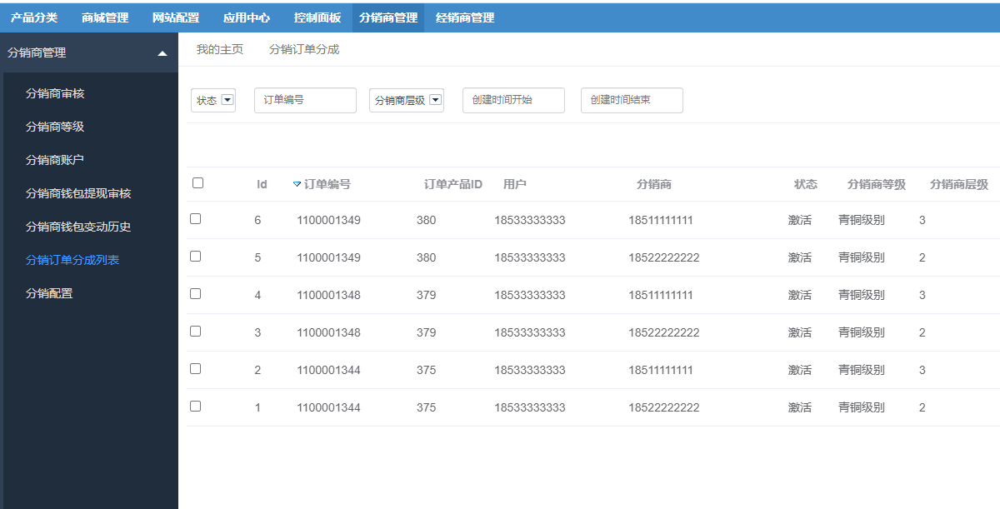

4.分销配置

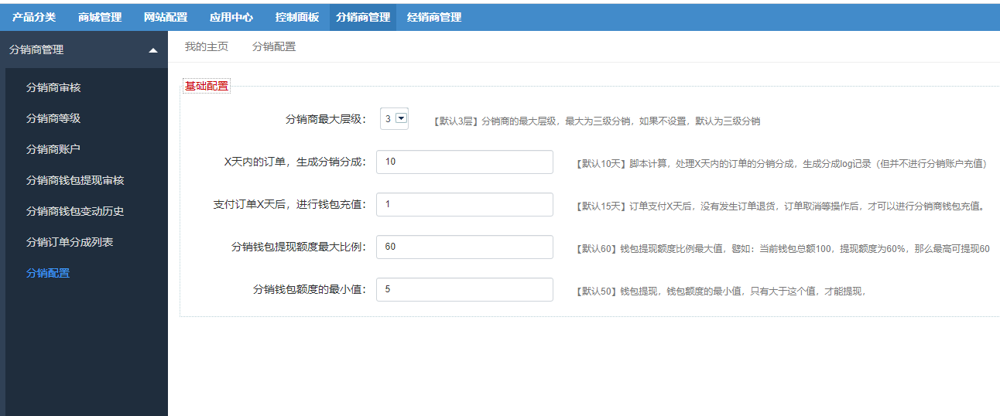

