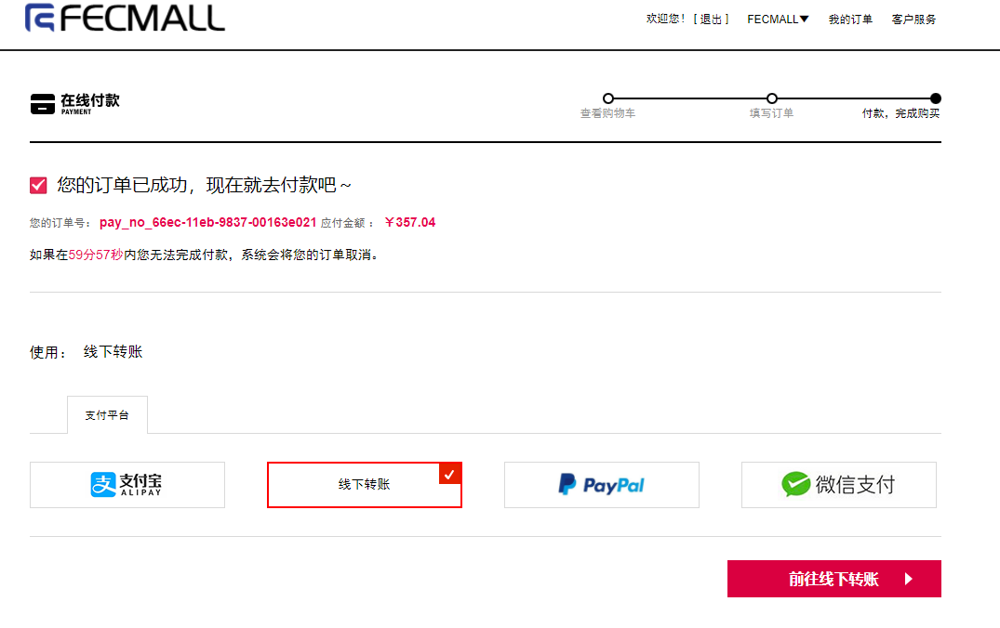
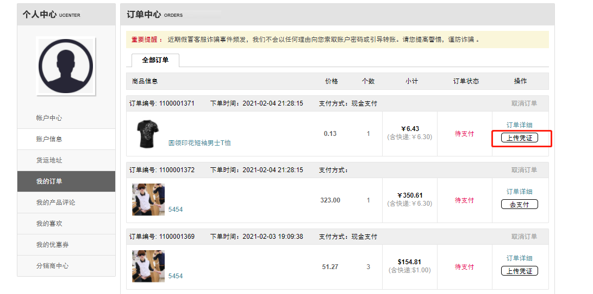
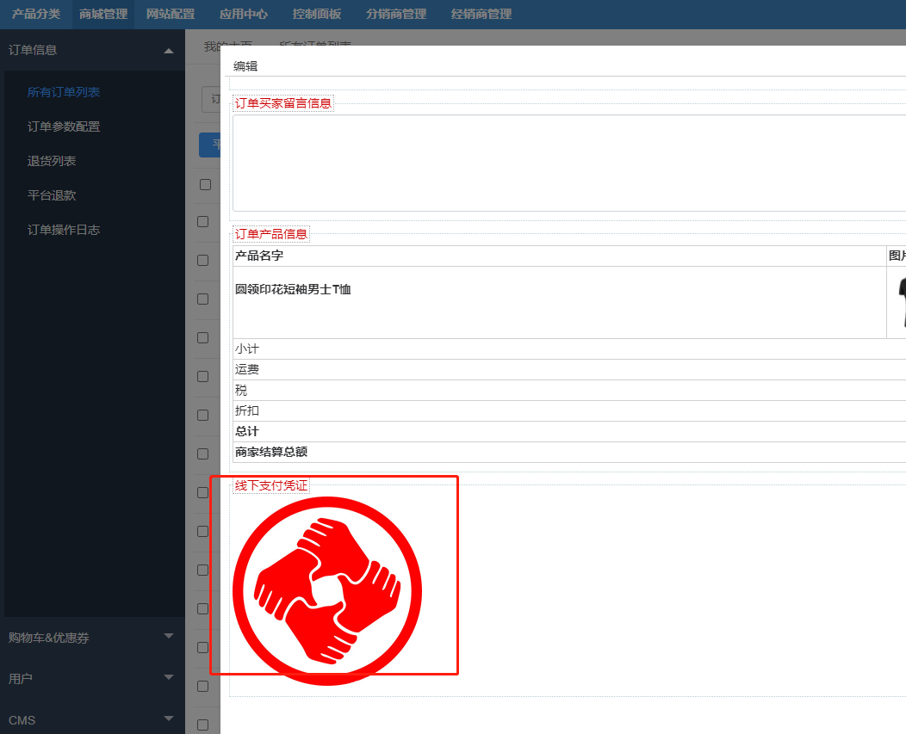
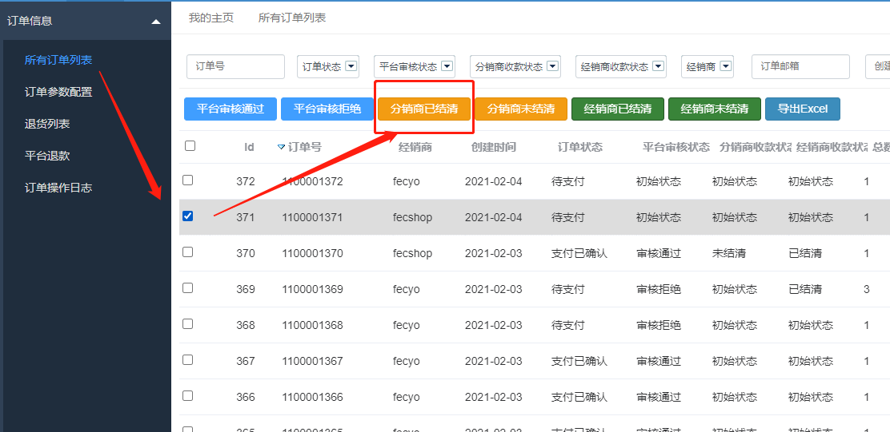

Fecbbb 功能操作-线下支付
=========

> 加入线下打款的支付方式

### 线下打款支付

1.分销商购买商品，可以选择线下打款的方式进行支付，完成后，进行线下打款，然后在
账户中心订单管理部分，上传打款截图凭证

选择线下打款支付

2.下单完成后，进入账户中心，订单管理部分

点击`上传支付凭证`按钮，上传凭证图片即可

3.平台商在订单页面查看

平台商后台： `商城管理` --> `订单信息` -->  `所有订单列表`

点击编辑按钮，在弹框中的底部，即可看到上传的凭证。

如果核验后，已经收到款项，那么 `分销商已结清`操作

如果很长时间没有收到款，您也可以进行 `分销商未结清`操作来进行标识

4.所有订单，都需要进行分销商已结清操作，无论线上支付还是线下打款。

