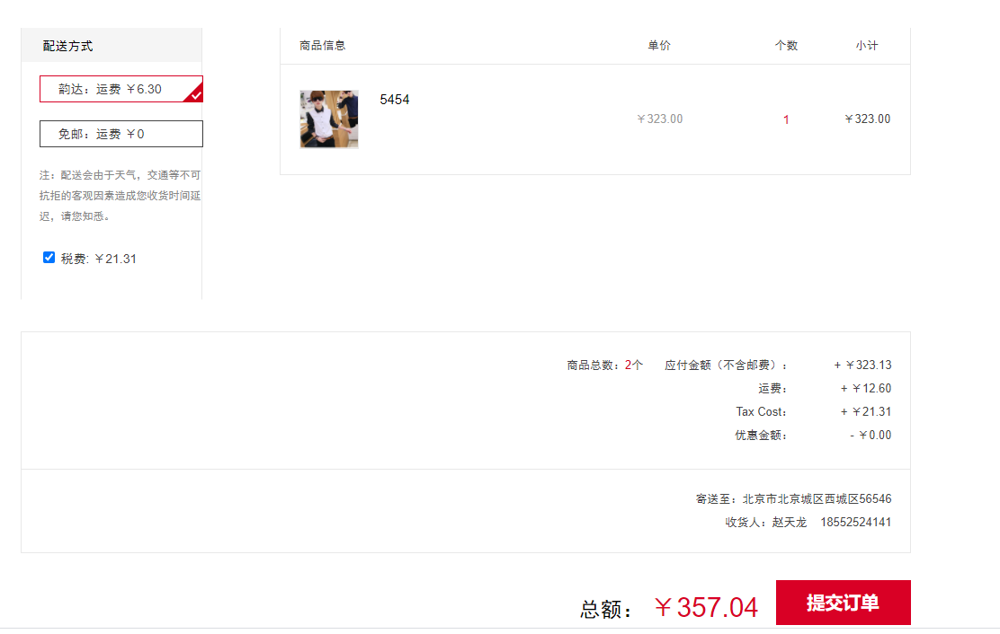
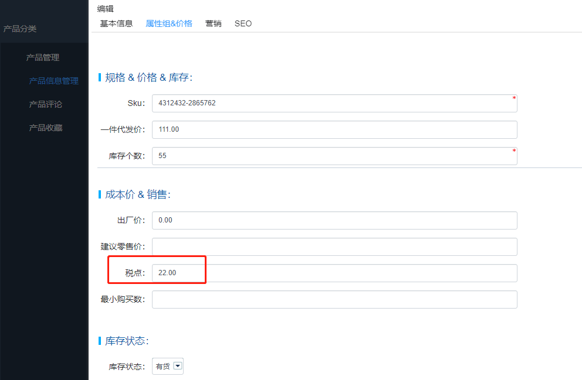

Fecbbb 功能操作-订单税
===============

### 订单税

1.分销商下单，可以根据自身需要，进行勾选，是否需要税

勾选后，订单总额将会加上税费

2.税费计算

2.1经销商申请注册的时候，会填写税点，这个作为经销商商品的默认税费

2.2对于具体商品，可能某些商品和经销商填写的默认税点不一致，可以单个商品各自填写

2.3公式：`订单税费` = `订单商品总额` * `税点%`

3.税费归属

税费归属于平台，不归属于经销商，因此，平台商和经销商结算的时候，税费不在结算的范围内

