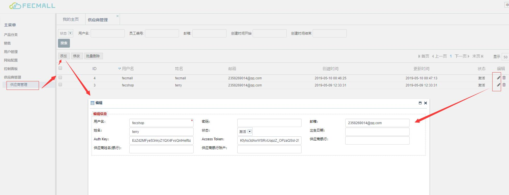
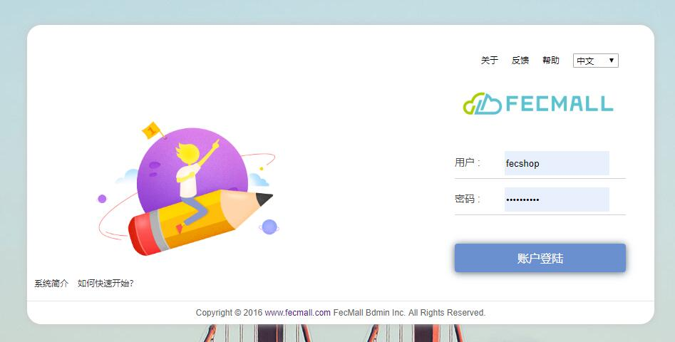
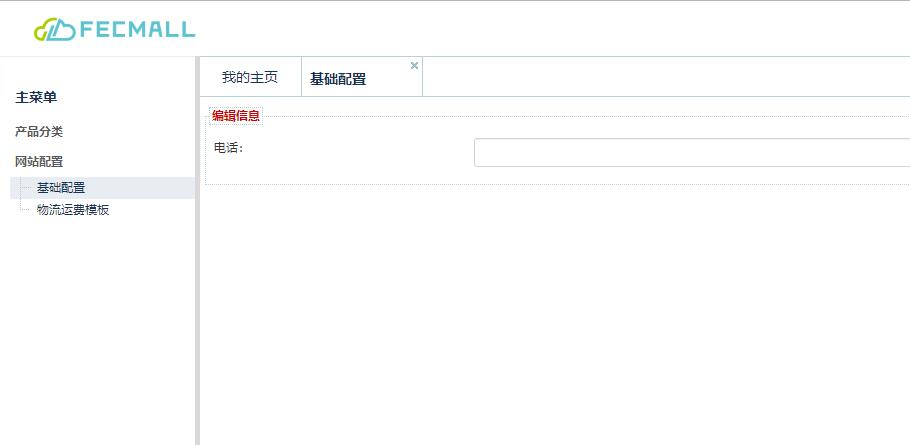
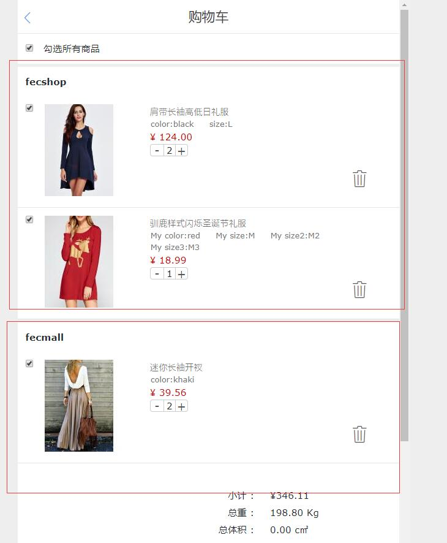
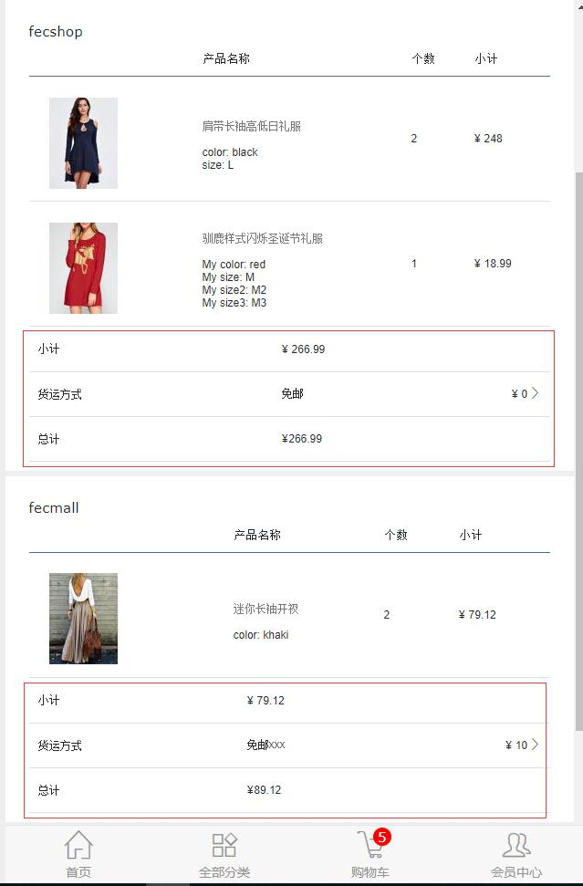
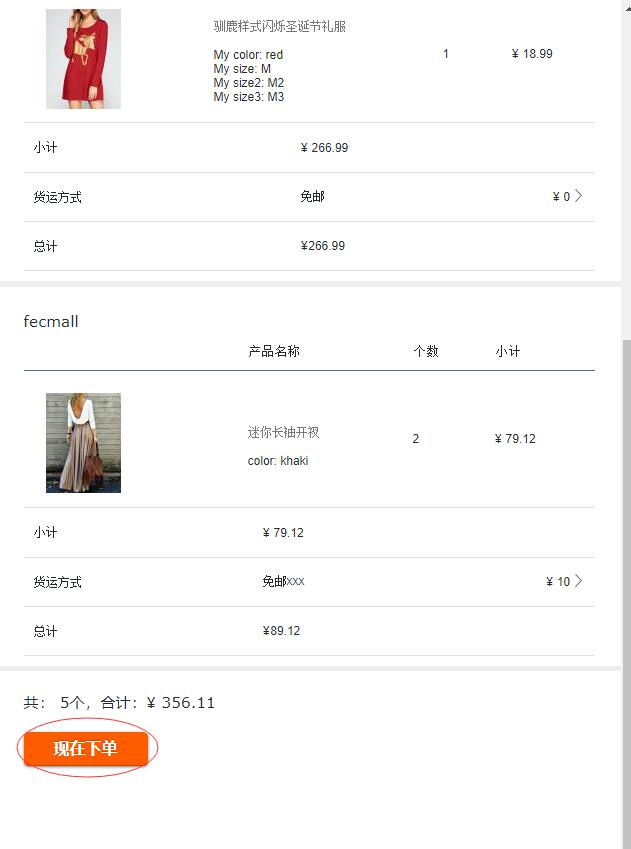

FecMall多商户介绍
============

> 对fecmall多商户的产品订单方面的介绍

### 使用介绍

fecmall的多商户版，流程参考了淘宝

1.平台商在后台创建经销商账户

2.经销商在经销商后台登陆账户

3.经销商登陆账户后创建产品

经销商只能查看自己创建的产品和相应的订单，平台商后台可以看到所有的产品和订单信息

4.经销商进行网站配置，以及物流模板等

其他的详细网站配置，请参看网站配置部分：[FecMall基础配置](fecmall-base-config.md)

5.用户在前端可以看到经销商的产品，进行支付下单

如果用户将多个经销商的产品加入了购物车，将会进行分组

6.用户下单页面

对于fecmall，如果用户添加了多个商户的产品到购物车进行下单（如图添加的是两个商户的产品），
各个经销商的产品将会进行分组，单独计算物流和其他的费用，然后进行汇总，
下单后，将会生成多个订单（参考的淘宝平台订单），
然后进行订单支付（相当于多个订单一起支付），

当我们点击`现在下单`按钮

订单将会生成，进入订单支付页面，选择支付方式后，进行订单支付
，支付后，在账户中心订单部分可以查看刚才下的订单，可以看到是2个订单（因为我们加入购物车的产品是2个经销商的产品）

如果用户和商家谈妥，希望订单的某些产品想要改价格，那么在订单创建后，先不要支付，联系经销商改价格，
改完价格后在进行支付，详细参看：[FecMall订单创建和支付](fecmall-order-create-and-payment.md)

如果用户下单后（没有支付），点击了其他的页面，然后，想进行订单支付，可以进入账户中心
订单管理部分，进行订单的支付，如果刚才下单的产品对应的是多个商户的产品，那么可以看到生成了多个订单，各个订单需要单独支付，
不能一起支付（这个参考的淘宝平台）

总之，多商户产品，下单的时候，相当于一次下了多个订单，进行了统一支付，这样处理有利于订单收货后售后退款等处理。

订单的后面处理请参看下面的订单处理流程

