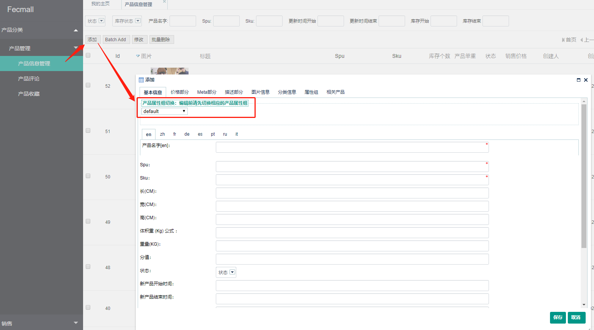
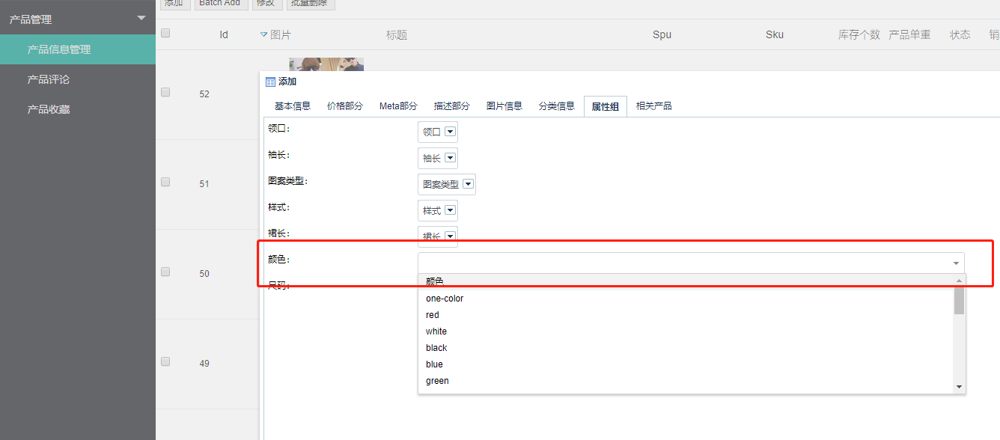
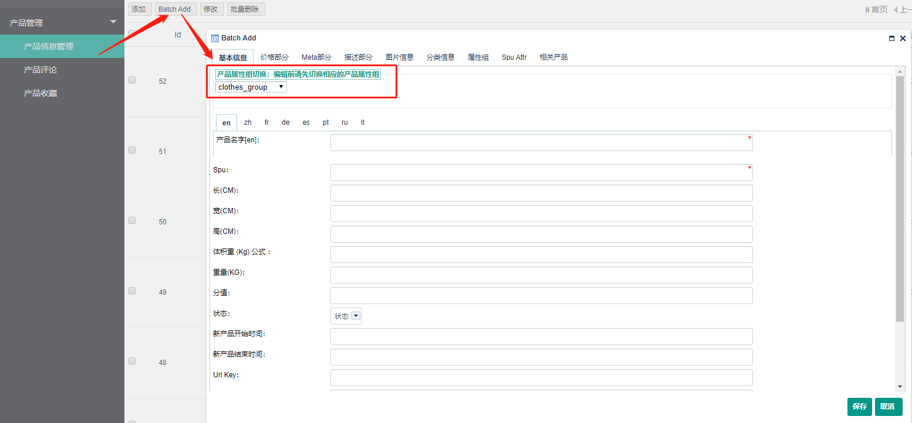
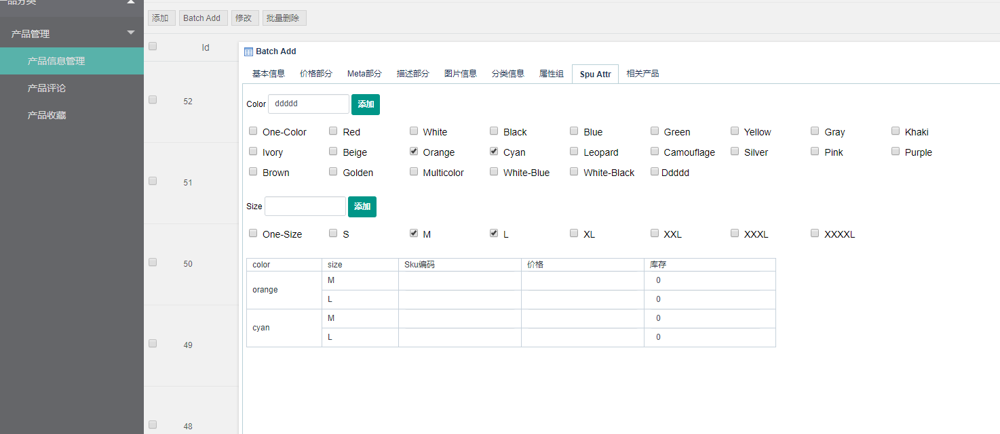
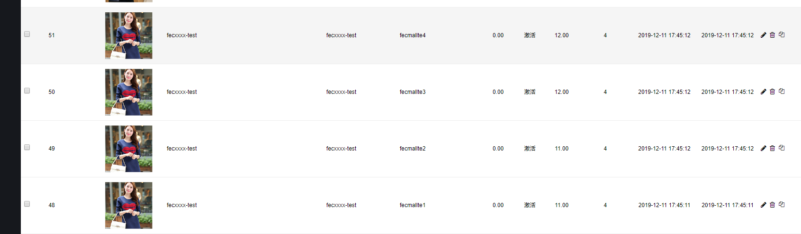

Fecmall 多商户-经销商产品管理
===========

> 经销商对产品进行的管理

### 后台编辑产品

经销商在后台进行产品的添加和编辑

1.添加产品，首先进行属性组的切换，如上图，切换后，
属性组Tab中，就会添加该属性组对应的属性.如下图

对于`editSelect`类型属性，经销商可以选择下拉条里面的数据，也可以自行填写自定义值，如上图color部分

填写完产品的属性，保存即可

2.批量添加自定义产品

对于spu产品，譬如裙子，可能有很多的颜色尺码sku，单个上传比较慢，可以使用fecmall的`产品批量添加`功能

选择属性组后，该属性组里面的规格属性可以`批量添加`

对于列表中没有的属性，可以通过`添加`按钮添加值
，下面填写sku信息，填写其他信息后`保存`，即可批量添加同`spu`下的不同`规格sku`产品

3.文档参考

[Fecmall 如何添加规格属性(自定义属性),并新建相应的产品](http://www.fecmall.com/doc/fecshop-guide/instructions/cn-2.0/guide-fecmall_add_attr_custom_option.html)

