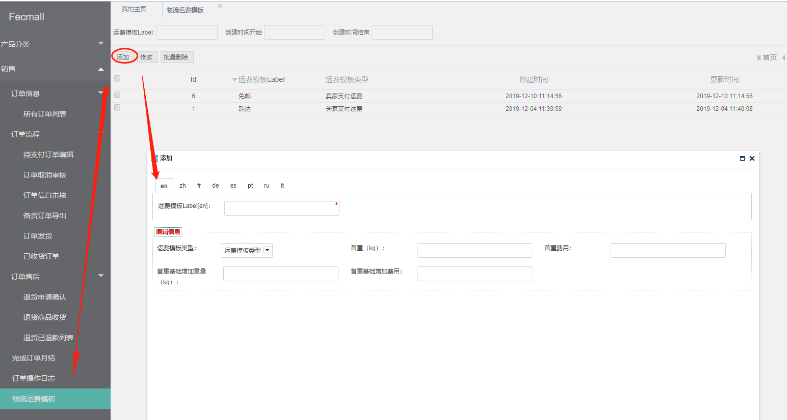

Fecmall多商户 经销商设置物流
===================

> 对于经销商，物流需要自己在`后台`设置

### 经销商设置物流

经销商可以在`后台`设置物流

1.卖家支付运费

就是`卖家`承担运费，买家`免邮`

2.买家支付运费

买家购买的商品，按照`公式`，进行`运费计算`

`首重（kg）`：订单运费计算的`首重`，当订单商品的重量低于`首重`的时候，按照`首重费用`进行计算

`首重费用`：订单运费计算的`首重`，当订单商品的重量低于`首重`的时候，按照`首重费用`进行计算

`首重基础增加重量（kg）`：当订单运费超出首重`每增加`的重量, 运费就在`首重费用`的基础上累加多少`运费`

`首重基础增加费用`：当订单运费超出首重`每增加`的重量, 运费就在`首重费用`的基础上累加多少`运费`

