Fecbbc 多商户优惠券
==========

>  各个商户可以根据自身促销，进行优惠券的生成，发放。

### 经销商优惠券说明

1.Fecmall Fecbbc 优惠券参考淘宝，各个商家的优惠券`各自发放`，各自使用。

2.用户下单的时候，系统会根据各个`商家`，进行分组，各个商家分组的优惠券`各自`使用

3.平台和商家的`结算`，使用优惠券后的`优惠总金额`进行结算

### 优惠券步骤

1.商户在商户后台，进行优惠券的生成

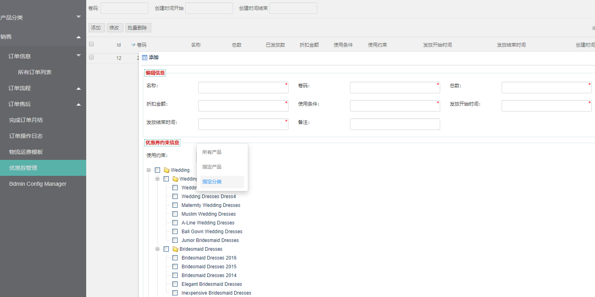

1.1商户可以设置的使用`金额条件`，`优惠金额`，优惠券`有效`的`开始时间`和`结束时间`，以及优惠券的`总数`（领取用户超额后不可以继续领取）

1.2商户可以对店铺的`所有产品`，`部分产品`（sku），`部分分类`的产品进行优惠券的使用限制，在此限制内的产品才能使用优惠券

如图下拉条部分可以看到

2.用户进行优惠券的领取

经销商发布优惠券后，用户可以通过`三种`途径进行优惠券的领取

2.1用户在`领券中心`进行优惠券的领取

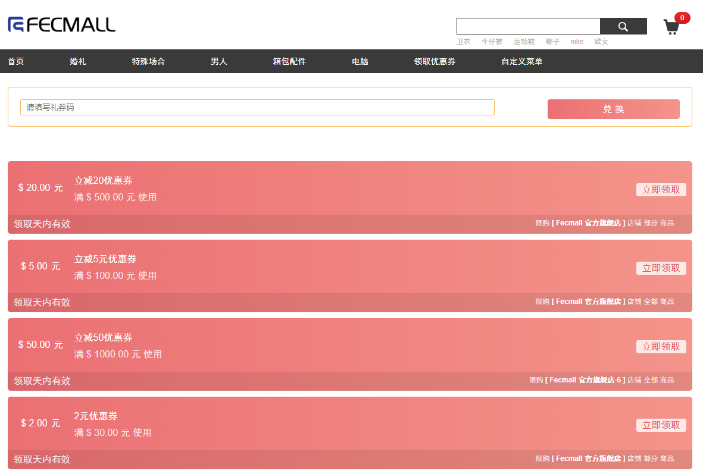

优惠券领取中心，显示出所有商家的优惠券，用户可以点击直接进行优惠券的`领取`

2.2通过优惠券码进行领取

用户可以在Fecmall Fecbbc多商户系统， `账户中心`--> `优惠券`功能部分，填写`优惠券码字符串`，点击提交，进行优惠券的领取

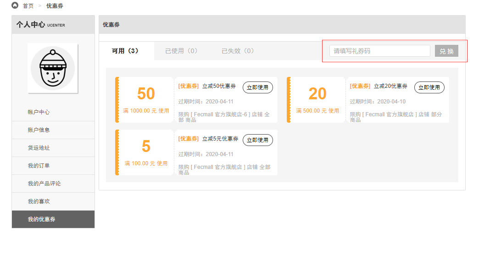

此功能是为了方便商家在某个`渠道`做促销，通过发放`优惠券码`（通过邮件等方式发放），让用户输入`优惠券字符串`进行领取优惠券的流程

2.3产品页面查看和领取优惠券

在每一个产品页面，都会显示该产品`可用的优惠券`，用户可以在产品页面查看优惠券列表

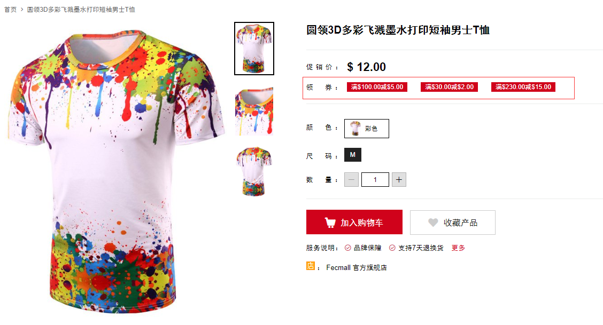

点击优惠券，弹出`优惠券`的领取详细框，点击后进行优惠券的`领取`

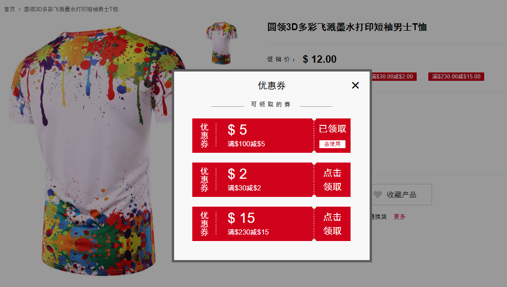

下面是h5页面的优惠券展示：

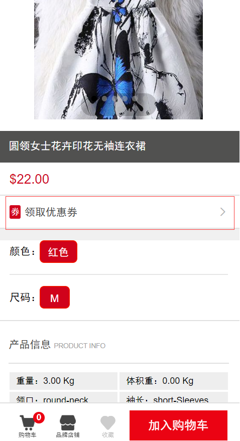

H5产品页面点击`优惠券`，弹出优惠券的`领取详细框`，点击后进行优惠券的`领取`

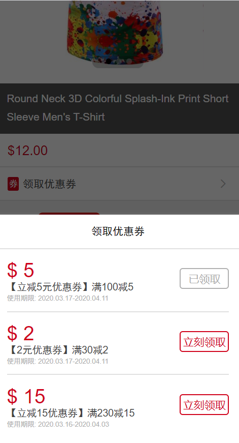

2.4账户中心查看用户的优惠券列表

2.4.1PC入口，`账户中心`查看用户的`优惠券`列表

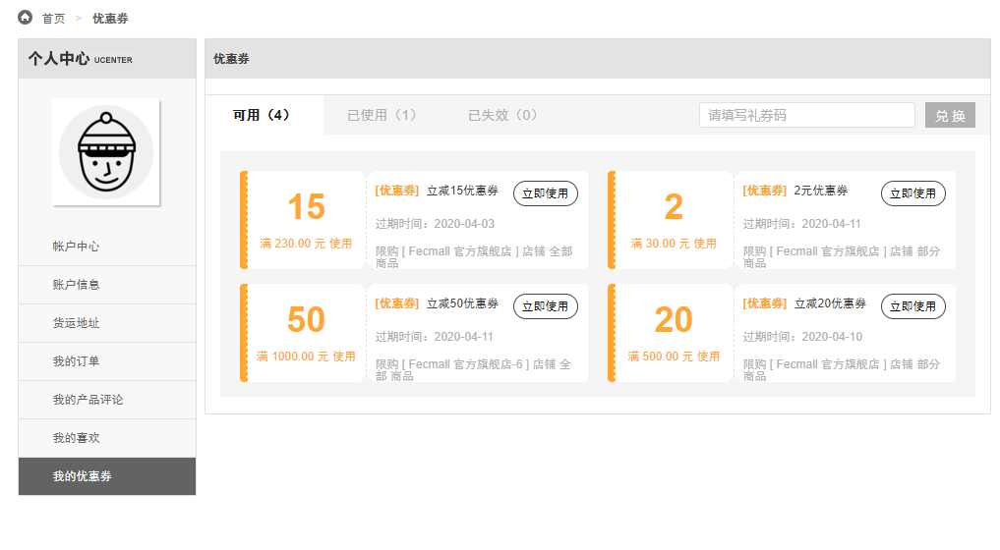

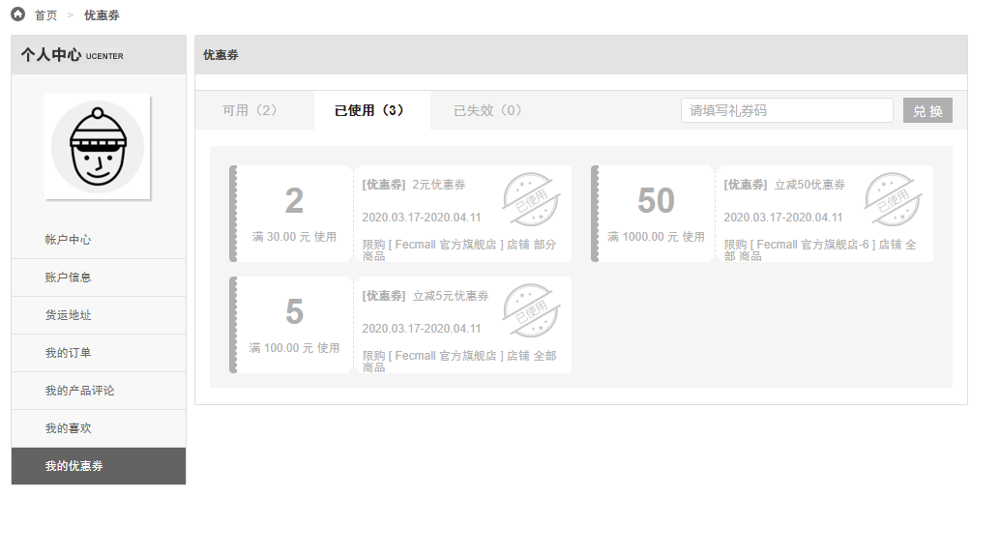

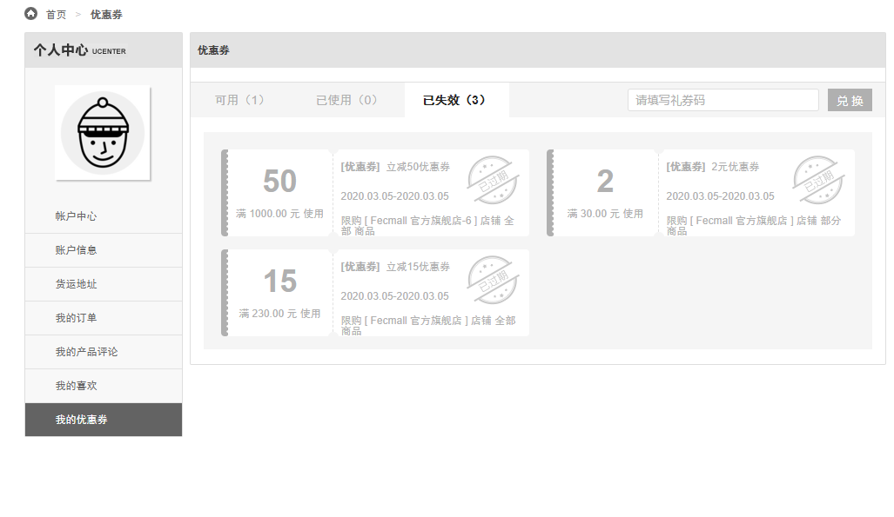

2.4.2PC入口，`账户中心`查看用户的`优惠券`列表

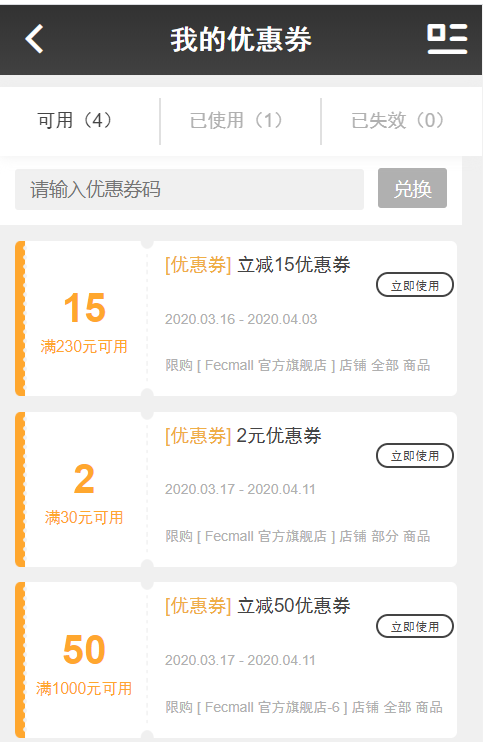

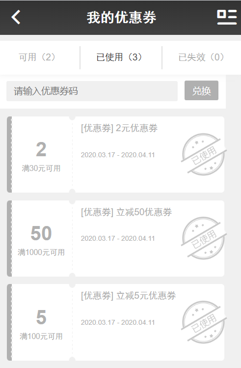

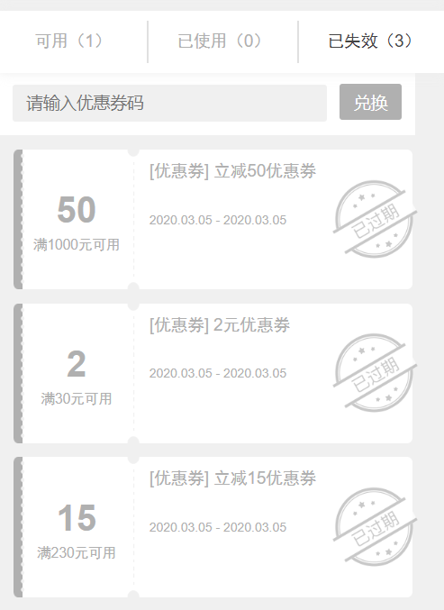

3.用户使用优惠券，下单操作

用户下单的时候，系统默认选择`优惠力度最大`的优惠券，作为用户`默认使用`的优惠券

3.1pc下单页面使用优惠券

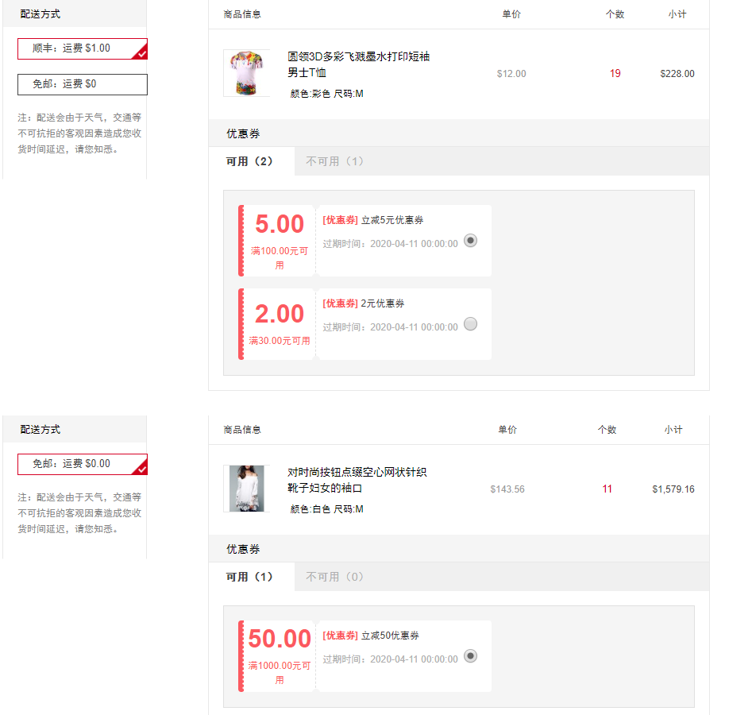

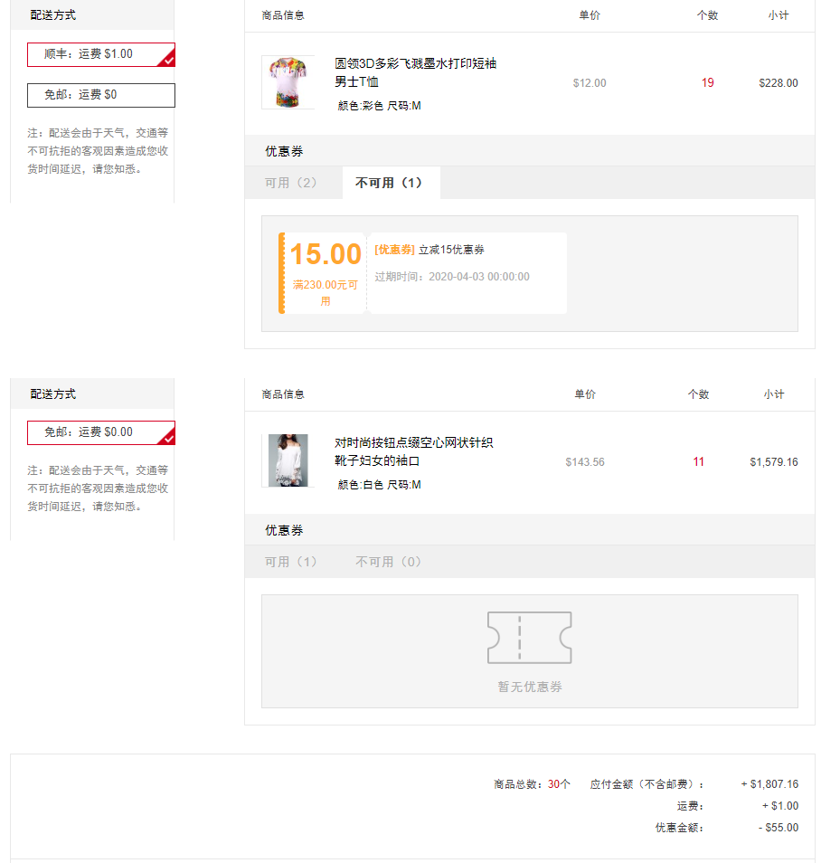

3.1手机H5下单页面使用优惠券

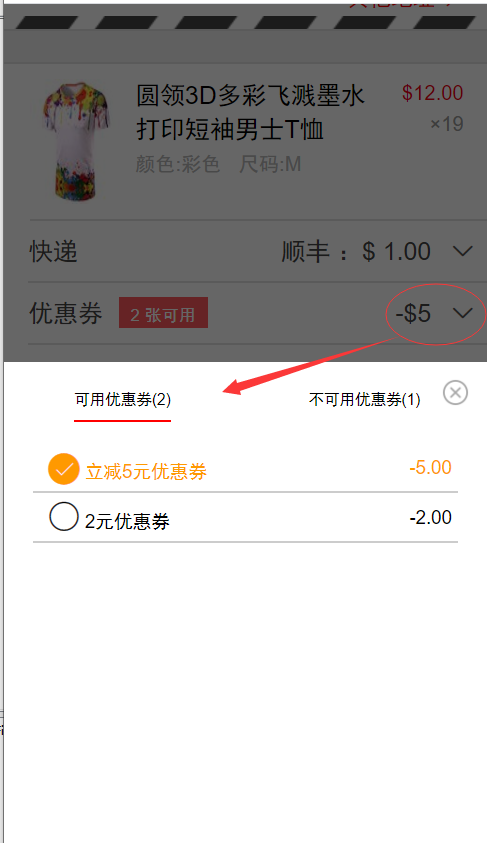

用户可以点击`切换`使用其他优惠券。

4.用户下单，用户下单后，`优惠券`就会被使用，更改为`已使用状态`，用户进行支付

5.如果用户将订单进行了`订单取消`操作，那么该订单使用的优惠券就会被`释放`出来，系统
会将优惠券的`已使用`状态，更改为`未使用`状态，用户可以继续使用该`优惠券`。

