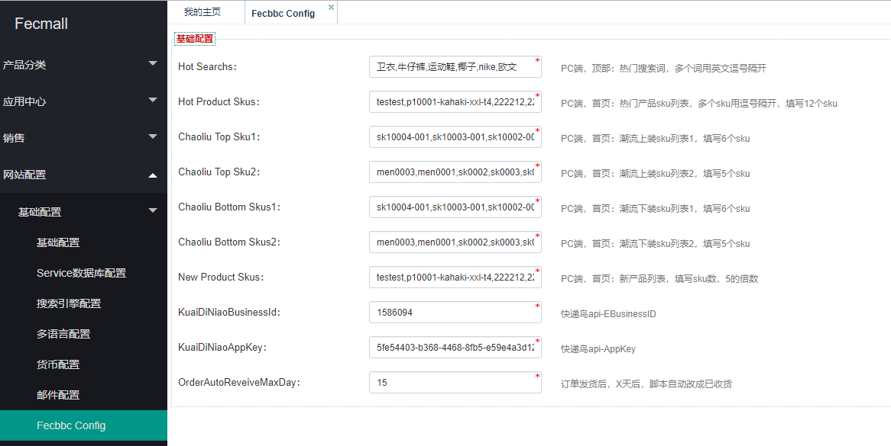

FecMall 多商户安装教程
========

> 安装Fecmall多商户系统的教程


### 安装

1.安装fecmall开源商城

fecmall多商户系统，是在fecmall开源商城系统进行的扩展系统，
是独立包的形式开发，因此，需要先安装fecmall


fecmall安装教程：[Fecmall-2.x安装教程](http://www.fecmall.com/doc/fecshop-guide/develop/cn-2.0/guide-fecshop-2-graphical-install.html)

2.应用市场注册账户，购买fecmall多商户系统

购买地址：http://addons.fecmall.com/42575492

3.购买完成后，登陆fecmall后台， 应用中心--> 应用管理 --> 应用市场

点击在线安装`fecbbc 多商户电商系统`

4.安装完成后，需要nginx 添加一下经销商后台的访问域名

也将域名对应文件路径`@appbdmin/web`（@appadmin/web是平台后台地址）

`nginx`或`apache`的配置，和`appadmin`入口类似的配置，这里不做阐述

经销商后台默认登陆账户：  `fecshop`   `fecshop123`

登陆后，您会发现没有产品，您需要登陆平台商后台，进入产品管理，给产品添加经销商，添加后，就会
看到产品。

您可以登陆平台后台，添加新的经销商，添加后，在经销商后台即可登陆该账户，并发布产品等。


### 配置

1.Store配置


1.1网站配置-->Appfront配置--> Store配置

打开cn和us的store编辑，将`第三方模板路径`值设置为：`@fecbbc/app/appfront/theme/fecbbc`

1.2网站配置-->Apphtml5配置--> Store配置

打开cn和us的store编辑，将`第三方模板路径`值设置为：`@fecbbc/app/apphtml5/theme/fecbbc`

2.参数配置


在这里配置页面顶部的搜索词，以及首页各个板块的sku（在下面截图的右侧有注释）



您可以按照下面的内容先填写上去,安装完成后，根据自己的需要更改

`Hot Search`: `卫衣,牛仔裤,运动鞋,椰子,nike,欧文`

`Hot Product Skus`：`testest,p10001-kahaki-xxl-t4,222212,22221,p10001-kahaki-xxl,p10001-black-m,op0002-33,men0003,men0001,sk0002,sk0003,sk0008`

`Chaoliu Top Sku1`：`sk10004-001,sk10003-001,sk10002-002,sk10002,sk1000-blue,sk2001-blue-zo`

`Chaoliu Top Sku2`：`men0003,men0001,sk0002,sk0003,sk0008`

`Chaoliu Bottom Skus1`：`sk10004-001,sk10003-001,sk10002-002,sk10002,sk1000-blue,sk2001-blue-zo`

`Chaoliu Bottom Skus2`：`men0003,men0001,sk0002,sk0003,sk0008`

`New Product Skus`：`testest,p10001-kahaki-xxl-t4,222212,22221,p10001-kahaki-xxl,p10001-black-m,op0002-33,men0003,men0001,sk0002,sk0003,sk0008,sk0002,sk0003,sk0008,sk1000-blue,sk0004,sk1000-khak`

`KuaiDiNiaoBusinessId`: 用于物流查询的api，可以去快递鸟官方注册，免费的查询有限制，官网地址：http://www.kdniao.com/

`KuaiDiNiaoAppKey`：用于物流查询的快递鸟api信息

`OrderAutoReveiveMaxDay`：订单发货后，X天后，脚本自动改成已收货


2.首页的板块配置

后台菜单： cms-->静态块


新建如下的静态块：（点击添加按钮）

2.1首页大图(PC)

标题：PC：首页大图

标识符：pc-home-big-img

内容：(cn 和 zh)

```
<ul class="bxslider">                
	<li style="">
        <a href="{{homeUrl}}" rel="nofollow" target="_blank" title="件数折">
            
        </a>                
	</li>                
	<li style="">                    
		<a href="{{homeUrl}}" rel="nofollow" target="_blank" title="新品VIP">
            
        </a>                
	</li>                
	<li style="">                    
		<a href="{{homeUrl}}" rel="nofollow" target="_blank" title="件数折">
            
        </a>                
	</li>                
	<li style="">                    
		<a href="{{homeUrl}}" rel="nofollow" target="_blank" title="新品VIP">
            
        </a>                
	</li>            
</ul>
```


2.2首页品牌(PC)

标题：PC：首页品牌

标识符：pc-home-brand

内容：(cn 和 zh)

```
<div class="img-brand">            
	<ul class="img-list imgopacity clearfix">                
		<li class="img-item">
			                    <a href="" target="_blank" title="">                                            </a>                
		</li>                
		<li class="img-item">                    
			<a href="" target="_blank" title="">                                            </a>                
		</li>                
		<li class="img-item">                    
			<a href="" target="_blank" title="">                                            </a>                
		</li>            
	</ul>        
</div>        
<div class="logo-brand imgopacity" data-shownum="16">            
	<ul>                
		<li data-page="0">                    
			<a href="" target="_blank" title="">                                            </a>                
		</li>                
		<li data-page="0">                    
			<a href="" target="_blank" title="">                                            </a>                
		</li>
		<li data-page="0">                    
			<a href="" target="_blank" title="">                                            </a>                
		</li>
		<li data-page="0">                    
			<a href="" target="_blank" title="">                                            </a>                
		</li>
		<li data-page="0">                    
			<a href="" target="_blank" title="">                                            </a>                
		</li>
		<li data-page="0">                    
			<a href="" target="_blank" title="">                                            </a>                
		</li>
		<li data-page="0">                    
			<a href="" target="_blank" title="">                                            </a>                
		</li>
		<li data-page="0">                    
			<a href="" target="_blank" title="">                                            </a>                
		</li>
		<li data-page="0">                    
			<a href="" target="_blank" title="">                                            </a>                
		</li>
		<li data-page="0">                    
			<a href="" target="_blank" title="">                                            </a>                
		</li>
		<li data-page="0">                    
			<a href="" target="_blank" title="">                                            </a>                
		</li>
		<li data-page="0">                    
			<a href="" target="_blank" title="">                                            </a>                
		</li>            
	</ul>        
</div>
```


2.3首页潮流下装(PC)

标题：PC：首页潮流下装

标识符：pc-home-hot-bottom

内容：(cn 和 zh)

```
<div class="tpl-nav">                
	<div class="tpl-keywords">                    
		<a class="keywords0" title="裤装" href="" target="_blank">                                            </a>                    <a class="keywords1" title="新品VIP" href="" target="_blank">                        </a>                
	</div>                
	<div class="tpl-category clearfix">                    
		<a href="" title="休闲裤" target="_blank">休闲裤</a>                    <a href="" title="牛仔裤" target="_blank">牛仔裤</a>                    <a href="" title="运动裤" target="_blank">运动裤</a>                    <a href="" title="工装裤" target="_blank">工装裤</a>                    <a href="" title="束口裤" target="_blank">束口裤</a>                    <a href="" title="九分裤" target="_blank">九分裤</a>                    <a href="" title="多袋裤" target="_blank">多袋裤</a>                    <a href="" title="西裤" target="_blank">西裤</a>                    <a href="" title="COKEIN" target="_blank">COKEIN</a>                    <a href="" title="DUSTY" target="_blank">DUSTY</a>                    <a href="" title="NOTHOMME" target="_blank">NOTHOMME</a>                    <a href="" title="白卷BAIJUAN" target="_blank">白卷BAIJUAN</a>                
	</div>            
</div>            
<div class="tpl-brands imgopacity clearfix">                
	<ul>                        
		<li>                            
			<a title="" href="" target="_blank">                                </a>
		</li>                        
		<li>                            
			<a title="" href="" target="_blank">                                </a>
		</li>                
	</ul>            
</div>
```


2.4首页潮流上装(PC)

标题：PC：首页潮流上装

标识符：pc-home-hot-top

内容：(cn 和 zh)

```
<div class="tpl-nav">                
	<div class="tpl-keywords">                    
		<a class="keywords0" title="" href="" target="_blank">                                            </a>                    <a class="keywords1" title="" href="" target="_blank">                                            </a>                
	</div>                
	<div class="tpl-category clearfix">                    
		<a href="{{homeUrl}}" title="卫衣" target="_blank">卫衣</a>                    <a href="{{homeUrl}}" title="夹克" target="_blank">夹克</a>                    <a href="{{homeUrl}}" title="毛衣/针织" target="_blank">毛衣/针织</a>                    <a href="{{homeUrl}}" title="棉衣" target="_blank">棉衣</a>                    <a href="{{homeUrl}}" title="羽绒服" target="_blank">羽绒服</a>                    <a href="{{homeUrl}}" title="风衣" target="_blank">风衣</a>                    <a href="{{homeUrl}}" title="MADNESS" target="_blank">MADNESS</a>                    <a href="{{homeUrl}}" title="DC" target="_blank">DC</a>                    <a href="{{homeUrl}}" title="gxg.jeans" target="_blank">gxg.jeans</a>                    <a href="{{homeUrl}}" title="黑鲸" target="_blank">黑鲸</a>                    <a href="{{homeUrl}}" title="viishow" target="_blank">viishow</a>                    <a href="{{homeUrl}}" title="FYP" target="_blank">FYP</a>                
	</div>            
</div>            
<div class="tpl-brands imgopacity clearfix">                
	<ul>                    
		<li>                        
			<a title="" href="" target="_blank">                                                    </a>                    
		</li>                    
		<li>                        
			<a title="" href="" target="_blank">                                                    </a>                    
		</li>                
	</ul>            
</div>            
```


2.5底部Footer文字条款(PC)

标题：PC：底部Footer文字条款

标识符：pc-footer-text

内容：(cn 和 zh)

```
<div class="footerbottom">        
	<div class="promise">            
		<div class="center-content clearfix">                
			<div class="left">                    
				<span class="iconfont rgbf"></span>                    <span class="red">100%</span>                    <span class="rgbf">品牌正品</span>                
			</div>                
			<div class="left">                    
				<span class="iconfont rgbf"></span>                    <span class="red">7天</span>                    <span class="rgbf">无理由退换货</span>                
			</div>                
			<div class="left">                    
				<span class="iconfont rgbf"></span>                    <a href="{{homeUrl}}" target="_blank" rel="nofollow">                        <span class="red">便捷</span>                        <span class="rgbf">在线客服</span>                    </a>                
			</div>            
		</div>        
	</div>        
	<div class="footer-help">            
		<div class="center-content clearfix">                
			<div class="left">                    
				<ul class="clearfix">                        
					<li class="left">                            
						<p>                                
							<span>新手专区</span>                            
						</p>                            
						<p>                                
							<a href="{{homeUrl}}" target="_blank" rel="nofollow">注册登录</a>                            
						</p>                            
						<p>                                
							<a href="{{homeUrl}}" target="_blank" rel="nofollow">购物结算</a>                            
						</p>                            
						<p>                                
							<a href="{{homeUrl}}" target="_blank" rel="nofollow">下单支付</a>                            
						</p>                            
						<p>                                
							<a href="{{homeUrl}}" target="_blank" rel="nofollow">收货评价</a>                            
						</p>                        
					</li>                        
					<li class="left">                            
						<p>                                
							<span>会员中心</span>                            
						</p>                            
						<p>                                
							<a href="{{homeUrl}}" target="_blank" rel="nofollow">会员制度</a>                            
						</p>                            
						<p>                                
							<a href="{{homeUrl}}" target="_blank" rel="nofollow">会员优惠</a>                            
						</p>                            
						<p>                                
							<a href="{{homeUrl}}" target="_blank" rel="nofollow">账户管理</a>                            
						</p>                            
						<p>                                
							<a href="{{homeUrl}}" target="_blank" rel="nofollow">密码管理</a>                            
						</p>                        
					</li>                        
					<li class="left">                            
						<p>                                
							<span>购物指南</span>                            
						</p>                            
						<p>                                
							<a href="{{homeUrl}}" target="_blank" rel="nofollow">发票</a>                            
						</p>                            
						<p>                                
							<a href="{{homeUrl}}" target="_blank" rel="nofollow">尺码对照</a>                            
						</p>                            
						<p>                                
							<a href="{{homeUrl}}" target="_blank" rel="nofollow">尺码解读</a>                            
						</p>                            
						<p>                                
							<a href="{{homeUrl}}" target="_blank" rel="nofollow">商品咨询</a>                            
						</p>                        
					</li>                        
					<li class="left">                            
						<p>                                
							<span>支付方式</span>                            
						</p>                            
						<p>                                
							<a href="{{homeUrl}}" target="_blank" rel="nofollow">在线支付</a>                            
						</p>                            
						<p>                                
							<a href="{{homeUrl}}" target="_blank" rel="nofollow">货到付款</a>                            
						</p>                            
						<p>                                
							<a href="{{homeUrl}}" target="_blank" rel="nofollow">分期支付</a>                            
						</p>                            
						<p>                                
							<a href="{{homeUrl}}" target="_blank" rel="nofollow">优惠券、有货币</a>                            
						</p>                        
					</li>                        
					<li class="left">                            
						<p>                                
							<span>配送方式</span>                            
						</p>                            
						<p>                                
							<a href="{{homeUrl}}" target="_blank" rel="nofollow">配送说明</a>                            
						</p>                            
						<p>                                
							<a href="{{homeUrl}}" target="_blank" rel="nofollow">运费说明</a>                            
						</p>                            
						<p>                                
							<a href="{{homeUrl}}" target="_blank" rel="nofollow">验货签收</a>                            
						</p>                            
						<p>                                
							<a href="{{homeUrl}}" target="_blank" rel="nofollow">收货样品</a>                            
						</p>                        
					</li>                        
					<li class="left">                            
						<p>                                
							<span>售后服务</span>                            
						</p>                            
						<p>                                
							<a href="{{homeUrl}}" target="_blank" rel="nofollow">退换货政策</a>                            
						</p>                            
						<p>                                
							<a href="{{homeUrl}}" target="_blank" rel="nofollow">退换货流程</a>                            
						</p>                            
						<p>                                
							<a href="{{homeUrl}}" target="_blank" rel="nofollow">投诉与建议</a>                            
						</p>                            
						<p>                                
							<a href="{{homeUrl}}" target="_blank" rel="nofollow">在线客服</a>                            
						</p>                        
					</li>                        
					<li class="left">                            
						<p>                                
							<span>APP常见问题</span>                            
						</p>                            
						<p>                                
							<a href="{{homeUrl}}" target="_blank" rel="nofollow">IPhone版</a>                            
						</p>                            
						<p>                                
							<a href="{{homeUrl}}" target="_blank" rel="nofollow">Android版</a>                            
						</p>                            
						<p>                                
							<a href="{{homeUrl}}" target="_blank" rel="nofollow">wap版</a>                            
						</p>                            
						<p>                                
							<a href="{{homeUrl}}" target="_blank" rel="nofollow">IPAD版</a>                            
						</p>                        
					</li>                    
				</ul>                
			</div>            
		</div>        
	</div>        
	<div class="footer-link">            
		<div class="center-content clearfix">                
			<div class="about-us">                    
				<div class="left-flag">                                                          
					<a href="" target="_blank" rel="nofollow">                                                    </a>                        <a href="" target="_blank" rel="nofollow">                                                    </a>                    
				</div>                    
				<p class="links">                        
					<a href="" rel="nofollow">返回首页</a>                        <span>|</span>                        <a href="" rel="nofollow">YOHO!Y </a>                        <span>|</span>                        <a href="" rel="nofollow">新力传媒</a>                        <span>|</span>                        <a href="" rel="nofollow">联系我们</a>                        <span>|</span>                        <a href="" rel="nofollow">商家入驻</a>                        <span>|</span>                        <a href="" rel="nofollow">隐私条款</a>                        <span>|</span>                        <a href="" rel="nofollow">友情链接</a>                        <span>|</span>                        <a href="">潮流品牌大全</a>                        <span>|</span>                        <a href="">潮流品类大全</a>                        <span>|</span>                        <a href="">潮流产品大全</a>                        <span>|</span>                        <a href="">潮流资讯</a>                        <span>|</span>                        <a href="">穿衣搭配(男生版)</a>                        <span>|</span>                        <a href="">穿衣搭配(女生版)</a>                        <span>|</span>                        <a href="">潮流人气</a>                        <span>|</span>                        <a href="">潮流潮品</a>                        <span>|</span>                        <a href="">潮流视频</a>                        <span>|</span>                        <a target="_blank" href="" rel="nofollow">出版物经营许可证</a>                        <span>|</span>                        <a target="_blank" href="" rel="nofollow">鲁B2-20120395</a>                        <span>|</span>                        <a target="_blank" href="" rel="nofollow">食品经营许可证</a>                    
				</p>                
			</div>                
			<div class="copyright">                    
				<p>
				</p>                    
				<p>
					                        CopyRight &copy; 2007-2019 XXXXX有限公司                        <a class="rbg6" href="" target="_blank" rel="nofollow">ICP备XXXX号</a>                        NewPower Co. 版权所有 xx省xx市xx区xx东街18号xx产业园xx栋xx楼 xxx-xxxxxxxx                    
				</p>                
			</div>            
		</div>        
	</div>        
	<div class="footer-link-container">            
		<div class="center-content clearfix">                
			<div class="link-info left">
				友情链接：
			</div>                
			<div class="link-section left">                    
				<ul class="clearfix">                            
					<li>
						<a href="http://www.fecmall.com" target="_blank">FECMALL</a>
					</li>                    
				</ul>                
			</div>            
		</div>        
	</div><!--/footer-link-container-->    
</div>    
```

2.6首页走马灯大图(H5)

标题：html5：首页走马灯大图

标识符：h5-home-big-img

内容：(cn 和 zh)

```
<li class="swiper-slide">
	                                    <a href="" rel="nofollow">            </a>                                
</li>                                
<li class="swiper-slide">                                    
	<a href="" rel="nofollow">            </a>                                
</li>                                
<li class="swiper-slide">                                    
	<a href="" rel="nofollow">            </a>                                
</li>
```


2.7首页Banner图-1(h5)

标题：html5：首页Banner图-1

标识符：h5-home-banner-1

内容：(cn 和 zh)

```
<a href="" id="660775" name="" rel="nofollow">    </a>


```


2.8首页banner-2(h5)

标题：HTML5:首页banner-2

标识符：h5-home-banner-2

内容：(cn 和 zh)

```
<a href="" id="36565" name="" rel="nofollow">    </a>
```


2.9首页热门分类(h5)

标题：HTML5:首页热门分类

标识符：h5-home-hot-category

内容：(cn 和 zh)

```
<li>
	<a href="">             </a>                                                  
</li>                        
<li>                            
	<a href="">               </a>                                                 
</li>                        
<li>                            
	<a href="">             </a>                                                  
</li>                        
<li>                            
	<a href="">               </a>                                                 
</li>
<li>                            
	<a href="">             </a>                                                  
</li>                        
<li>                            
	<a href="">               </a>                                                 
</li>
<li>                            
	<a href="">             </a>                                                  
</li>                        
<li>                            
	<a href="">               </a>                                                 
</li>
<li>                            
	<a href="">             </a>                                                  
</li>                        
<li>                            
	<a href="">               </a>                                                 
</li>
<li>                            
	<a href="">             </a>                                                  
</li>                        
<li>                            
	<a href="">               </a>                                                 
</li>
```


2.10首页热门品牌(h5)

标题：HTML5:首页热门品牌

标识符：h5-home-hot-brand

内容：(cn 和 zh)

```
<li class="brand">
	<a href="">            </a>                    
</li>                    
<li class="brand">                        
	<a href="">            </a>                    
</li>                    
<li class="brand">    
	<a href="">             </a>                    
</li>                    
<li class="brand">    
	<a href="">            </a>                    
</li>                    
<li class="brand">    
	<a href="">            </a>                    
</li>                    
<li class="brand">    
	<a href="">            </a>                    
</li>                    
<li class="more">    
	<a href="">            </a>                    
</li>
```


3.产品配置（测试产品）

3.1 添加经销商账户

因为测试数据是fecmall开源商城的，产品部分并没有供销商数据（产品从属于那个经销商），
因此需要您在后台设置一下经销商（可以添加经销商）

安装fecmall多商户，经销商默认只有fecshop一个账户，您可以在后台继续添加经销商账户

后台：供应商管理  -> 供应商管理

添加经销商账户，成功后，就可以去经销商后台登陆了


3.2淘宝模式产品数据初始化

fecmall安装后，默认是fecmall的产品测试数据，由于fecbbc多商户添加了淘宝模式产品，需要对这些历史数据进行初始化数据处理，
因此您需要执行一下初始化脚本

> 如果您不想处理这些数据，您可以进入数据库，将`product_flat`表的产品数据清掉,`product_flat_qty`产品库存表数据清掉，
产品分类关系表`category_product`清掉，然后后台新建淘宝模式产品即可


```
cd addons/fecmall/fecbbc/shell
sh initTbProduct.sh
```

执行完后，可以在后台，产品管理部分，看到产品数据
 

 3.3为产品设置经销商,


您可以在平台后台，产品管理部分，编辑产品，为产品设置经销商


如果产品没有设置经销商，用户将不能将产品加入购物车。


4.其他设置

4.1产品详情开启面包屑导航

平台后台：网站配置--> Appfront配置  --> 分类产品配置

设置  `产品页面-显示面包屑导航`：`yes`


到这里基本就配置完成了，其他的基本是fecmall开源商城部分的配置，这里就不阐述了。


