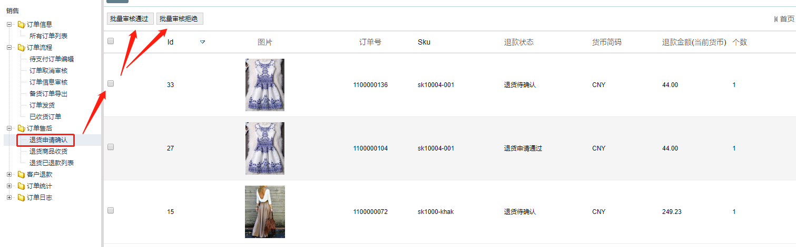
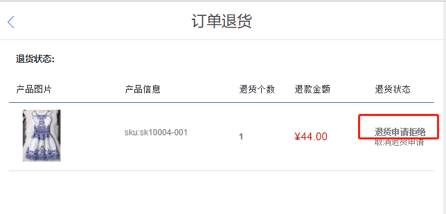
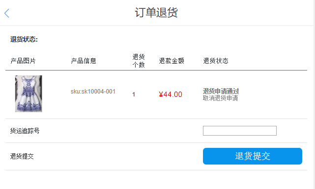

FecMall用户退货-审核
=============

> 当用户后台发起退货申请后，经销商在后台进行审核的流程

当用户发起申请后，经销商可以在后台看到请求，
可以进行 `审核通过` 和 `审核拒绝` 的操作

 


### 订单退货状态变化

1.进行操作的退货状态条件

```
Yii::$service->order->info->afterSaleReturnStatusCanAuditAcceptArr = [
    Yii::$service->order->afterSale->after_sale_status_return_request,
    Yii::$service->order->afterSale->after_sale_status_return_refuse,
];
```

满足这些条件得退货请求，才能进行退货请求审核，


2.订单退货`审核通过`操作

操作函数：

```
Yii::$service->order->process->bdminAuditAcceptReturnByAsId($as_id)
```

满足1部分的订单，可以通过该函数进行订单退货`审核通过`操作

3.订单退货`审核拒绝`操作

操作函数：

```
Yii::$service->order->aftersale->bdminAuditRefuseReturnByAsId($as_id)
```

满足1部分的订单，可以通过该函数进行订单退货`审核拒绝`操作


订单请求被拒绝后，经销商管理员，还是可以继续将这个请求进行订单退货`审核通过`操作

用户在账户中心，订单部分，可以看到`退货申请`的状态，下面是
订单退货`审核拒绝`操作后的状态显示

 

如果经销商将退货请求，进行订单退货`审核通过`操作，那么用户
在账户中心，订单部分，可以看到退货申请的状态，可以进行退货商品`发货`操作。

 

用户可以将退货商品`发货`，然后填写`货运号`，进行退货商品`发货`操作
