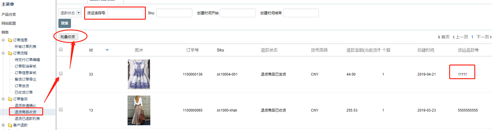

FecMall用户退货商品-经销商收货
================

> 退货商品 - 用户发货后，经销商收到货物后，进行收货操作

### 退货商品-经销商收货

经销商收到货物后，经销商在后台可以进行收货操作

 

勾选`退货商品`，点击`批量收货`按钮, 就会进行退货商品收货操作，
完成退货状态变更为`退货商品已收货`


### 订单退货-发货状态变化


1.进行操作的退货商品收货的条件

```
Yii::$service->order->info->afterSaleReturnStatusCanReceiveArr = [
    Yii::$service->order->afterSale->after_sale_status_return_dispatch,
];
```

满足这些条件，可以进行`退货商品- 已收货`操作


2.订单退货`已收货`操作

操作函数：

```
Yii::$service->order->aftersale->customerDispatchReturnByAsId($as_id)
```

查看该函数的代码，可以发现，会生成一条退款记录，

```
Yii::$service->refund->customerOrderReturnCreateRefund($orderAfterSaleModel)
```


生成记录后，状态为未支付状态。


