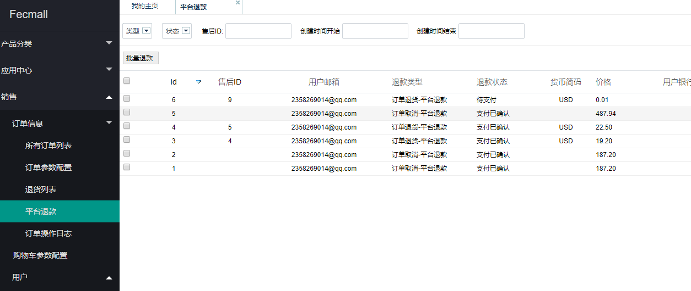
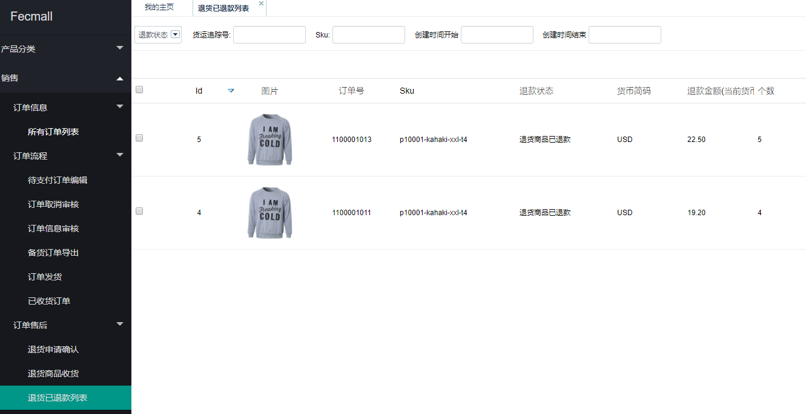

FecMall用户退货完成-退款
===============

> 当退货商品收货操作后，会生成一条退款记录，需要平台进行退款

### 退货商品退货完成-退款

> 目前的退款是线下的方式退款，然后在后台更改退款记录状态的方式完成。

在线支付订单，订单的钱是由平台收的，因此需要`平台`进行退款。

平台通过线下退款完成后，在后台修改退款记录的状态。

3.无论是平台退款后，在退货已退款部分都可以查看到已完成退款的退货条目

