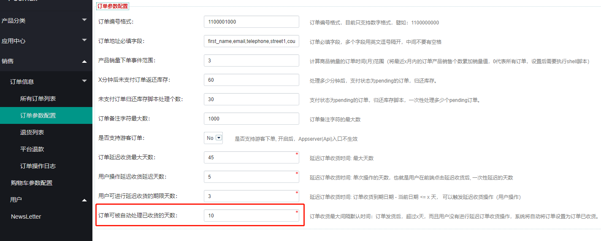

FecMall订单自动收货脚本
==============

> 订单订单发货后，超过x天后，如果用户没有进行订单收货
确认，系统脚本将自动处理订单，将状态改为自动后或

脚本：`@fecbbc/shell/autoReceiveOrder.sh`

将`订单收货`到期后的订单，自动将订单状态改为已收货

`已收货订单`代表订单完成，可以进行`结算`，
当产品出现其他问题发生`退货`等，通过订单`售后`来解决

