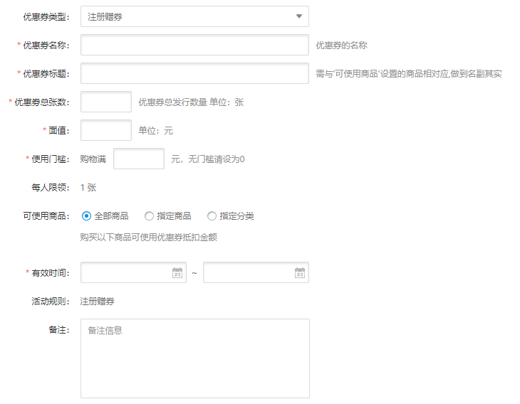
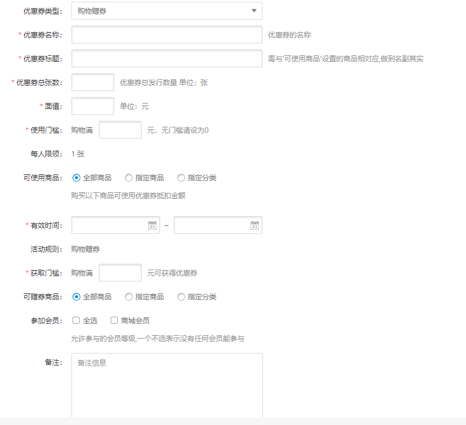
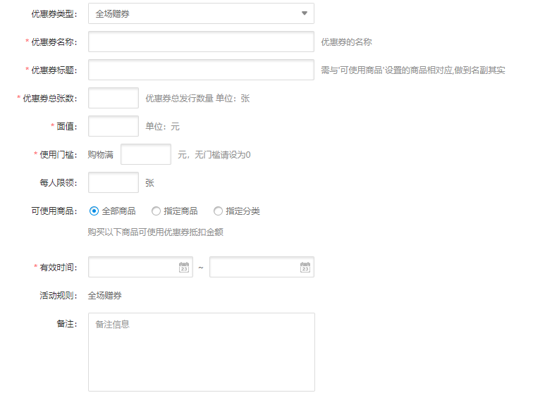
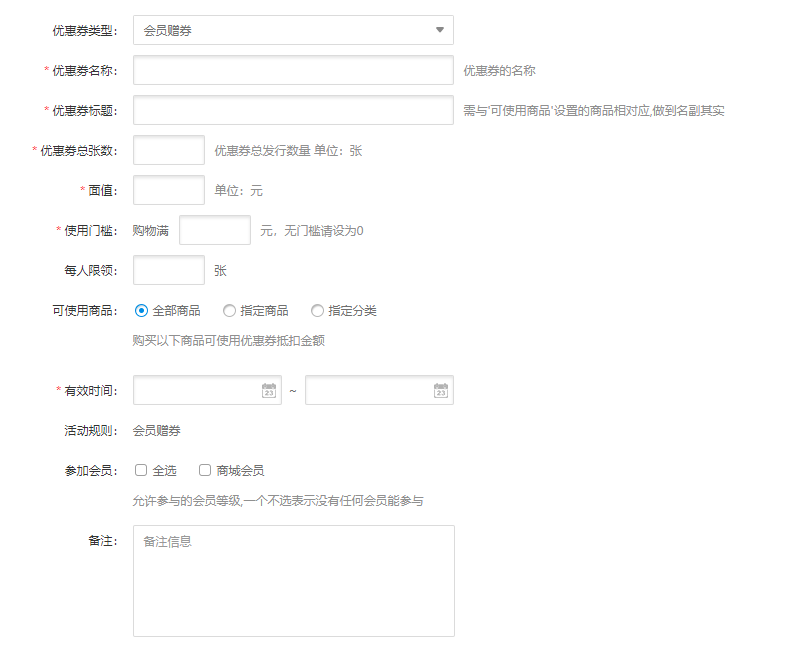

Fecmall Fecbdc多商户分销-优惠券管理
========================

> 多商户分销系统的优惠券，`平台商`，`经销商`，`分销商`都可以进行优惠券发放

优惠券加入发放的开始时间和结束时间，只有在这个时间段，才能领取优惠券

备注：该功能还在开发中.

### 优惠券的角色类型

逻辑：优惠券，本着`谁发放`，`谁承担`的原则

1.如果是`平台`发放优惠券，那么需要`平台`来进行补贴，譬如某平台优惠券优惠10元，用户下单后，对该订单少付了10元，那么，对经销商结算的时候，该10元由平台商承担。

2.如果是`经销商`发放的优惠券，那么，产品进行优惠的时候，那么这个费用由`经销商`承担。

3.如果是`分销商`发放的优惠券，那么，产品进行优惠的时候，这个费用由`分销商`承担

### 优惠券的发放类型

1.注册赠券：用户注册成功后，触发的赠送的优惠券

`发放角色`: 平台商

`发放逻辑`：用户注册账户成功后，系统查看是否存在有效的注册赠券，如果存在多张，则选择币值最高的一个注册赠券，绑定到用户的帐号中

2.购物赠券

`发放角色`：平台商，经销商，分销商

`发放逻辑`：在优惠券上面，绑定可赠券商品，当这些商品被下单后，将会触发赠券机制，发放到用户中。

经销商发放，可使用商品：全部商品（指的是经销商自己的所有产品），指定产品，（不能按照分类发放）

3.全场赠券

`发放角色`：平台商，分销商，平台商

`发放逻辑`：发放优惠券，全体用户都可以进入活动页面领取，领取后，优惠券和用户的绑定，对于分销商和平台商而言，一般都会限制产品，也就是只有自己的产品才可以使用该优惠券。

和活动绑定，通过某个活动发放。

4.会员赠券

`发放角色`：平台商，分销商，平台商

`问题`：会员用户组定义后，如果实现注册用户变为会员用户组?

`发放逻辑`：优惠券生成的时候，勾选相应的用户组，在该用户组里面的用户才有资格领取

会员赠券，在特定页面领取，不在这个会员组的用户，可以看到，但是无法领取

会员的升级通过订单量和订单金额来实现升级。

### 生成优惠券限制

对于`分销商`，`经销商`，`平台商`的优惠券的优惠力度，需要做限制，尤其是`分销商`，
分销商的优惠券如果优惠力度过大，导致产品价格过低，进而分销商跑路的情况，如果规避？

生成优惠券限制，如果分销商的优惠券使用后，订单的总额小于分销商成本价，
那么优惠卷金额就会失效，变成：   订单的总额 - 分销商成本价

### 赠券行为方式

1.用户`行为赠券`。

用户进行`注册`，`购物`等方式进行的购物券赠送方式，或者引申升级，当用户进行某些操作，对用户进行发放优惠券，譬如用户下单后，未支付，返回到首页，可以发放优惠券来刺激用户支付等。

2.用户`手动领券`

用户进入`领券中心`进行优惠券领取

3.管理员手动`绑定赠券`。

`分销商`，`经销商`，`平台商`，可以单独给某个用户发放优惠券

4.系统CRON脚本自动化发放

可以通过`离线脚本`，跑计划任务，对满足要求的用户发放特定的优惠券。

### 优惠券的显示

1.领券中心显示

在该部分，显示所有的可以领取的`优惠券`，用户可以点击优惠券领取，领取优惠券，已领取的优惠券，显示已领取
用户也可以进入优惠券详情页面进行优惠券领取

2.产品页面显示

用户登陆的前期下，在`产品页面`，计算和该产品有关的优惠券

2.1优惠券有可使用商品限制，该产品可以使用的优惠券作为列表

2.2包含用户已经领取的，以及用户未领取的优惠券，而且是有效优惠券

2.3从这个优惠券列表中选择出来一张优惠力度最大的优惠券，作为`二合一优惠券`

2.4点击这个`优惠券图标`后，直接跳转到优惠券详情页面，用户可以直接领取

3.用户中心显示优惠券列表

优惠券和用户绑定后，就会显示在用户中心的优惠券列表

分为：`可使用`优惠券，`过期`优惠券
。
4.下单页面显示可用优惠券

4.1用户下单的时候，默认选择`币值最高`的优惠券

4.2 下单页面，显示用户的`可用优惠券`，和`不可用优惠券`

4.3 用户可以通过勾选的方式，切换不同的优惠券

补充：

5.优惠券显示，产品页面对应的优惠券列表

5.1可以领取的优惠券（发放时间合法）

5.2优惠券的张数未到最大值。

5.3用户已经领取的优惠券，而且未过期，未使用的优惠券

5.4如果用户没有登陆，那么对应8.1和8.2对应的优惠券列表

5.5对于上面的8.1和8.2，会员优惠券不在这个范围内

5.6对于用户已经领取的会员优惠券，可以看到，并且使用

5.7从这个优惠券列表中，挑一张面值最大的优惠券最为产品对应的优惠券

5.8点击这个优惠券，进入优惠券的详情页面，可以进行优惠券领取，如果优惠券
已经领取，那么显示已经领取

### 优惠券的使用

用户在下单页面，点击选择优惠券进行`指定优惠券`

### 优惠券订单结算

当用户订单使用了优惠券进行的结算

1.订单表：加入字段：`coupon_type`（优惠券类型)，`origin_grand_total`(未使用优惠券的订单总额), `origin_base_grand_total`（未使用优惠券的订单总额-基础货币）

2.优惠券遵循原则：谁发放，谁负责，谁出钱

3.各个环节的利润计算

3.1都是以`origin_base_grand_total`为准进行计算

3.2 平台商，分销商，经销商，谁发放了优惠券，谁来负责出这个钱

3.3 三者计算利润的同时，如果优惠券是自身发放，需要扣除优惠的金额。

### 会员

1.后台编辑`会员等级`

2.用户的会员如何`升级`？或者说用户切换到不同的用户组，通过什么规则发生？

3.会员的福利，通过`优惠券`来完成。

### 补充

1.经销商生成优惠券，只能针对自己的产品。

对于经销商而言，生成优惠券的指定：1.经销商所有产品， 2，指定特定产品。（指定特定产品100）

分销商：可以分销任意产品，因此在产品方面没有限制

