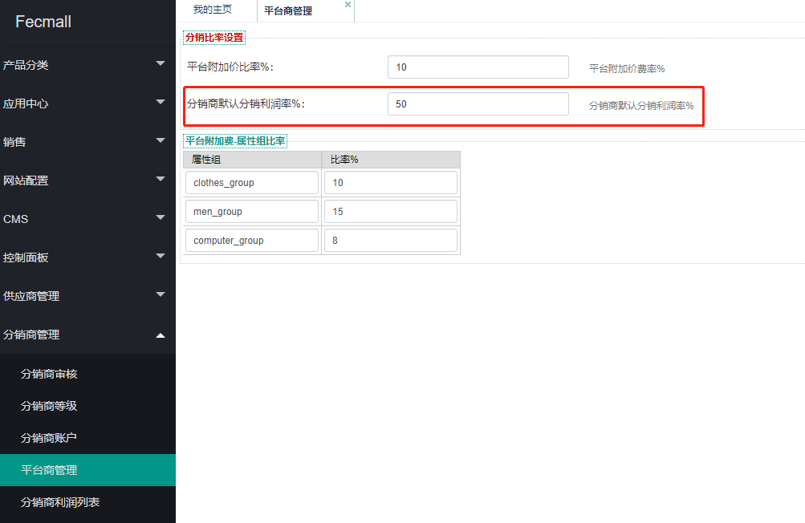
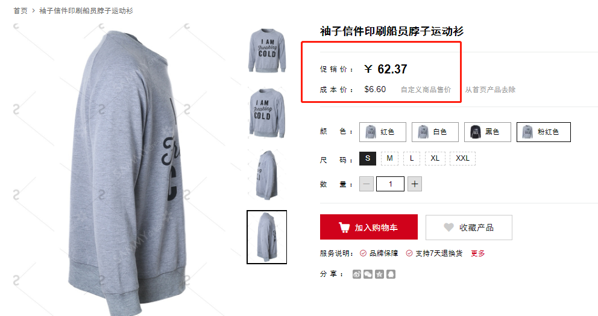
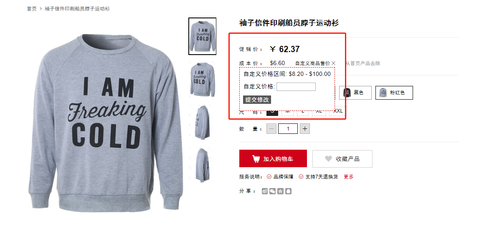
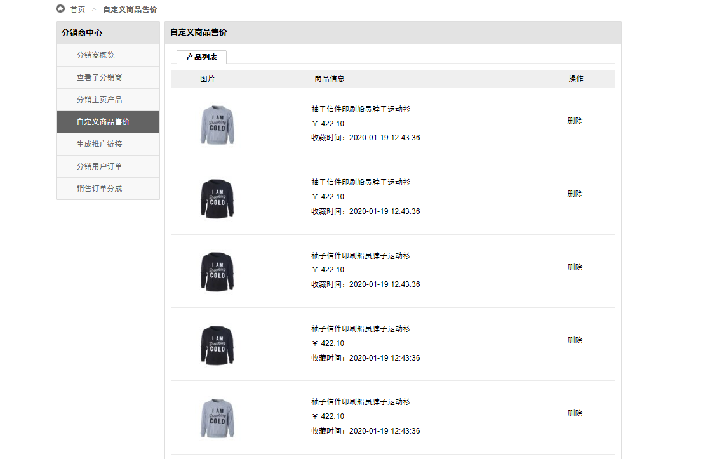

Fecmall Fecbdc多商户分销-分销商自定义商品售价
========================

> 分销商可以根据自己的需要，自定义分销价格

### 分销商利润

平台后台，默认有一个分销商的利润设置

分销商的`分销价格`，就是通过`公式`计算而来，参数包含：`分销商成本价`，`分销商默认分销利润率`%

具体计算的由来，详细参看：[FecMall Fecbdc 分销价格公式计算](fecmall-fecbdc-price-compute.md)

在产品页面，可以看到产品的分销商的分销价格和成本价格（成本价格以默认货币显示，为了好计算）

### 分销商自定义分销价格

可以看到合法的自定义价格的区间，根据自己的需要进行价格的调节即可

除了在产品详细页面可以自定义价格区间，在fecmall fecbdc多商户分销系统的分类页面页可以自定义价格

提交后，分销商的分销价格将会被修改，分销商可以在分销商中心页面，查看修改价格的产品列表

