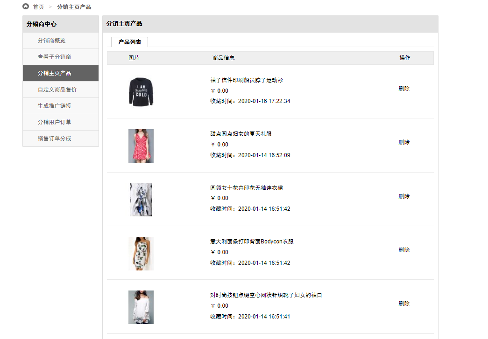
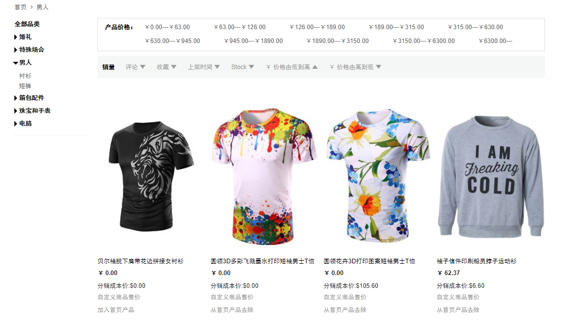
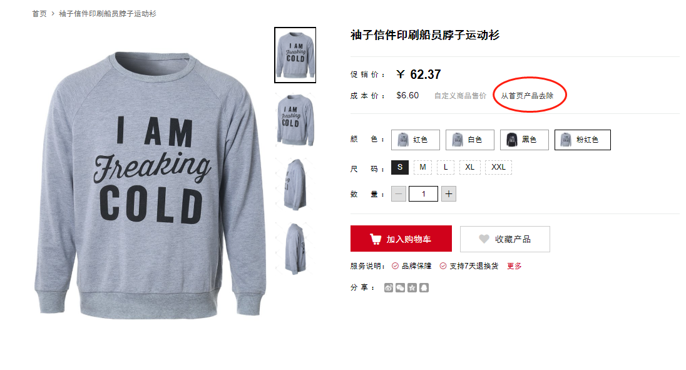
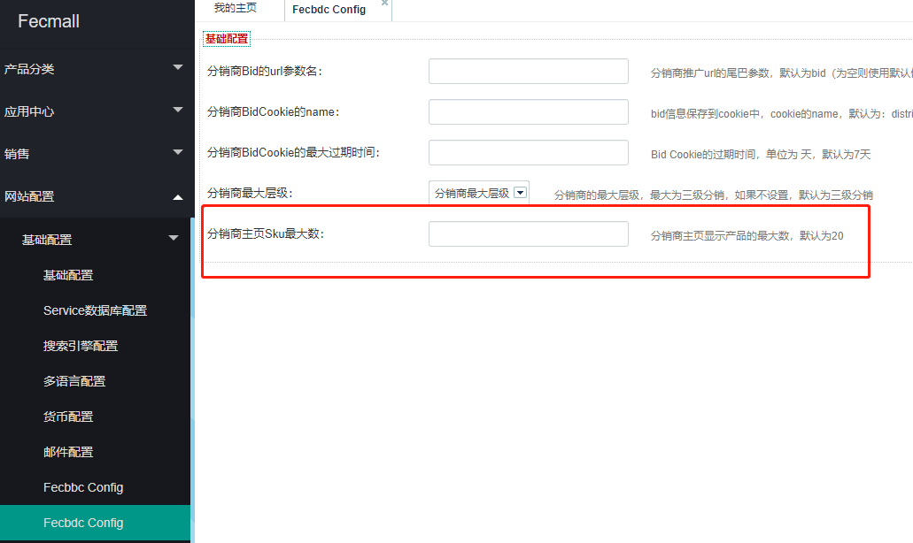

Fecmall Fecbdc多商户分销-分销商主页产品
========================

> 分销商登陆帐号后，可以将产品加入主页，以及查看主页有哪些产品

1.分销商在分销商中心，查看加入主页的产品

分销商可以将产品从首页清除

2.分销商将产品加入首页

在首页，分类页，搜索页等列表页面都会看到，`将产品加入首页`，以及`从首页去除`的链接，
下面是首页部分

分类页面：

已经加入首页的产品，将显示`从首页产品去除`，点击后，将不在首页显示

未加入首页的产品，将显示`加入首页产品`，点击后，将会显示在首页

3.产品详细页面

4.加入首页的产品有个数限制，平台后台会设置这个限制，超出限制后，继续执行`加入首页产品`操作，将会报错

平台后台设置如下：

