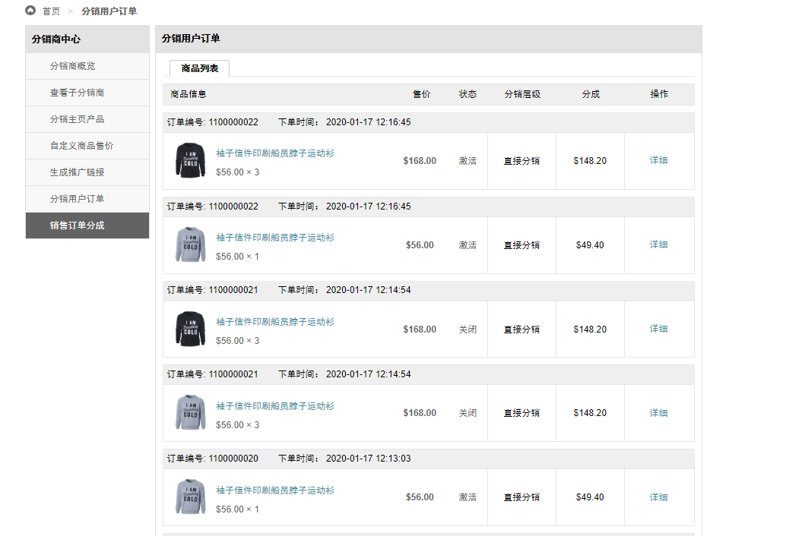
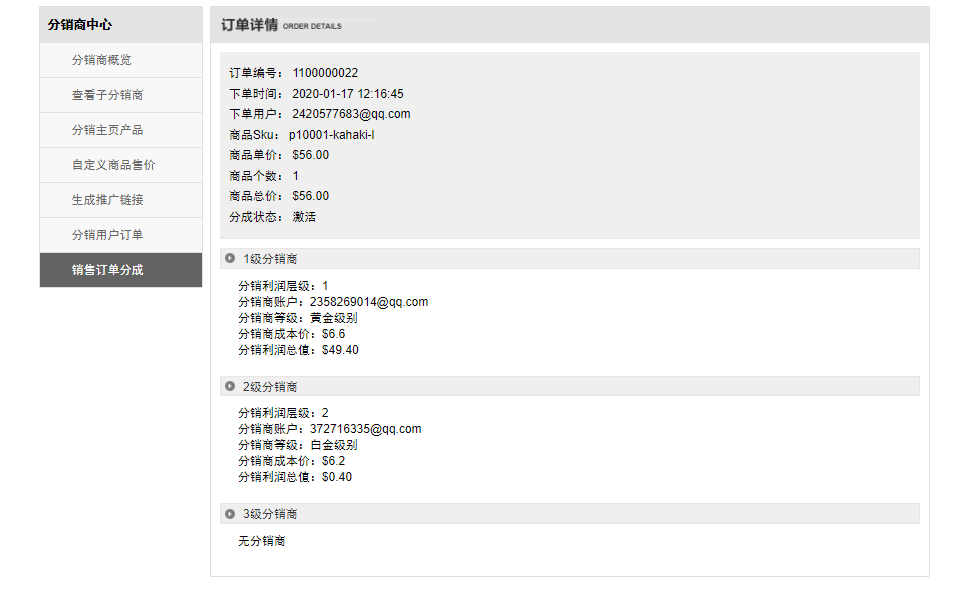

Fecmall Fecbdc多商户分销-分销商订单提成
========================

> 分销商订单利润分成列表

1.分销商可以在分销商中心，`分销商订单提成`部分，查看利润分成

分销层级：`直接利润`，代表通过自己的分销商入口进行下单的用户，其他的代表通过子分销商入口进来下单的用户

状态：如果是`关闭状态`，是因为用户对订单进行了`订单取消`，或，`订单退货退款`  等操作导致的

2.点击详细，查看该分成对应的订单的详细利润分成情况

