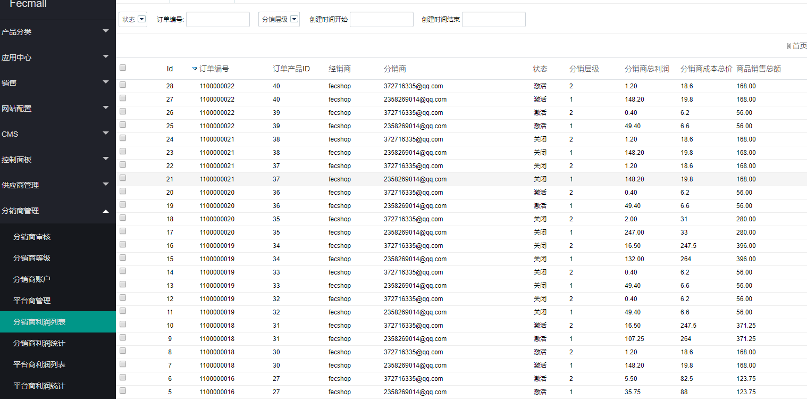
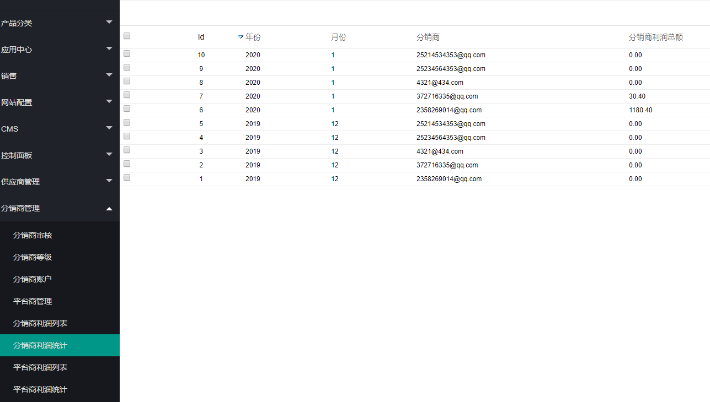
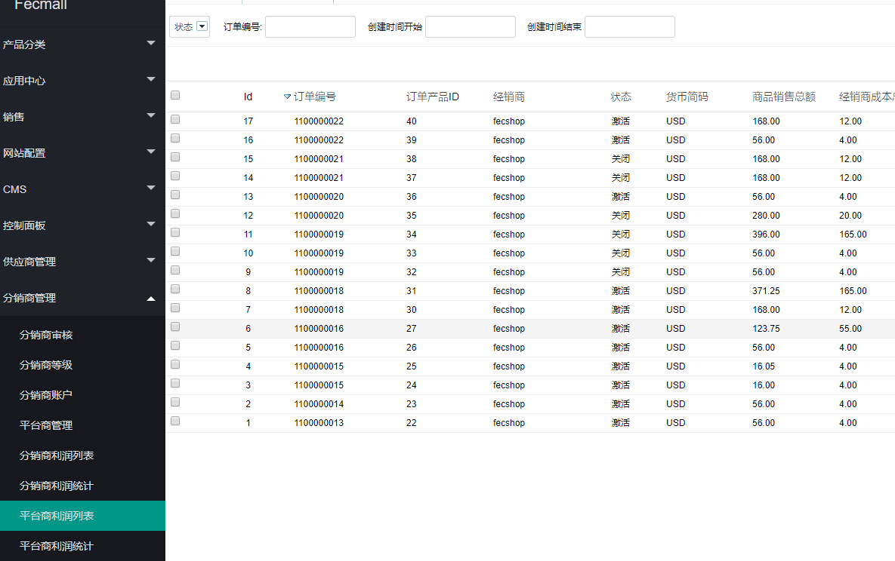
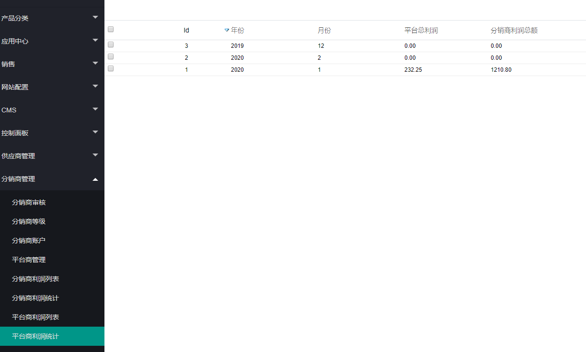

Fecmall Fecbdc多商户分销-分销商平台商利润信息
========================

### 分销商利润列表

当用户通过分销商入口进入商城下单后，分销商可以得到相应的分成利润，父级分销商也可以得到一定的分成利润

如图：

1.数据行，是以订单产品表为单位，也就是订单中的每个产品，独立计算分销商的利润

2.如果用户订单被取消，或者退货，那么分销利润数据行将会被关闭

### 分销商利润统计

分销商的月结利润计算，通过脚本计算而来

### 平台商利润列表

1.数据行，是以订单产品表为单位，也就是订单中的每个产品，独立计算分销商的利润

2.如果用户订单被取消，或者退货，那么分销利润数据行将会被关闭

### 平台商利润统计

平台商的月结利润计算，通过脚本计算而来

