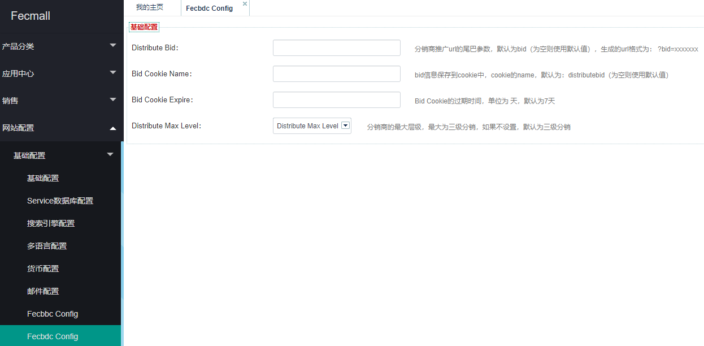
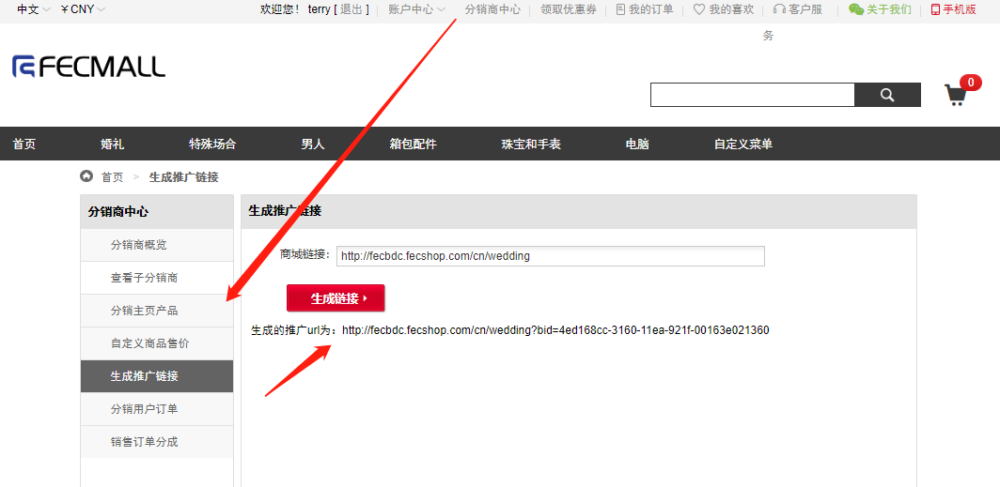
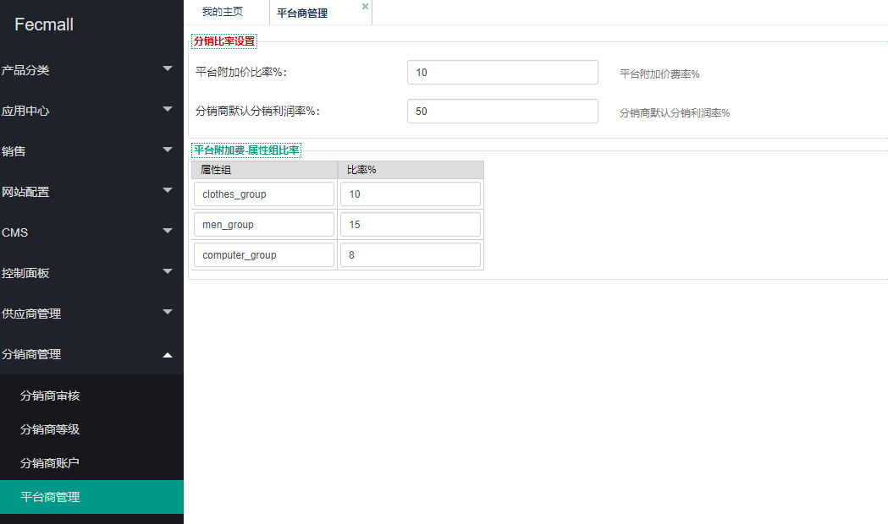

Fecmall Fecbdc多商户分销-平台商设置参数
========================

> 平台商后台配置参数设置

1.Fecbdc参数配置：

后台配置参数

配置参数讲解：

`Distribute Bid`：
分销商推广url的尾巴参数，默认为`bid`（为空则使用默认值），生成的url格式为： `?bid=xxxxxxx `
,分销商可以将商城的任意一个url在分销商账户中心，推广url生成部分生成`推广url`

建议使用`默认值`，不需要设置

`Bid Cookie Name`：
bid信息保存到`cookie`中，cookie的`name`，默认为：`distributebid`（为空则使用默认值） 

建议使用默认值，不需要设置

`Bid Cookie Expire`：
Bid Cookie的过期时间，单位为`天`，默认值为`7`天 

分销商生成推广url后，用户点击该url进入商城后，将会写入`cookie`，该参数设置cookie的`过期时间`，当
cookie过期后，用户的下单行为将与该分销商`无关`。

`Distribute Max Level`：分销商的最大层级，最大为`三级`分销，如果不设置，默认为`三级分销`

2.平台利润参数配置

`平台附加价比率%`：用来计算平台附加价的`比率`，进而用于计算`分销商成本价格`。

`分销商默认分销利润率%`：分销商默认分销利润率%, 通过该比率，计算商品的分销商`分销价格`。

`平台附加费-属性组比率`: 是`平台附加价比率%`针对属性组的细分，可以针对不同的属性组，设置
不同的`平台附加价比率%`。

