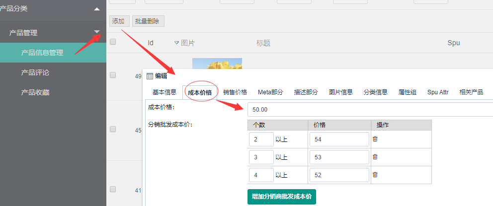
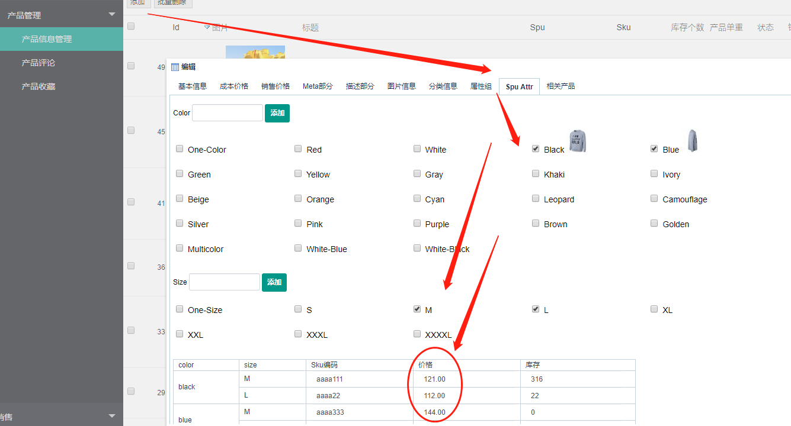
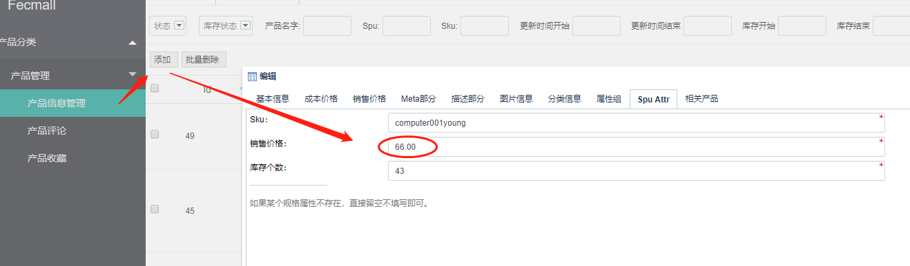
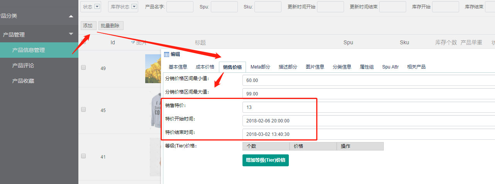
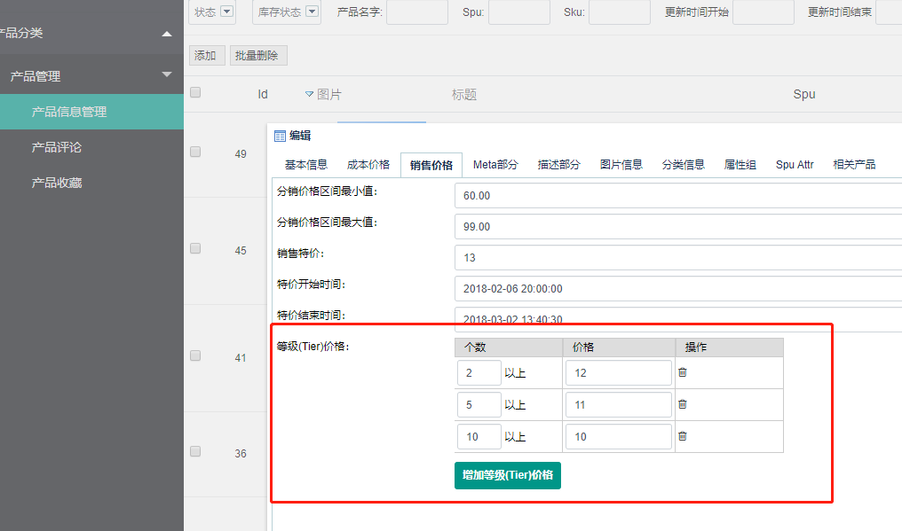
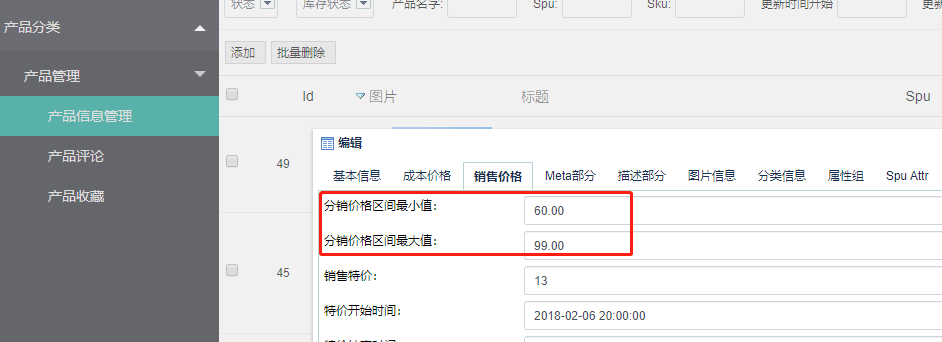
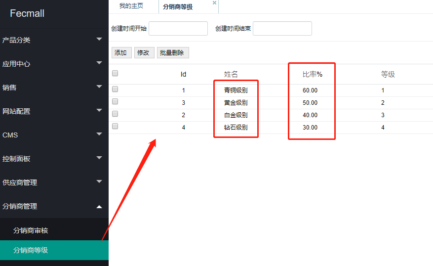
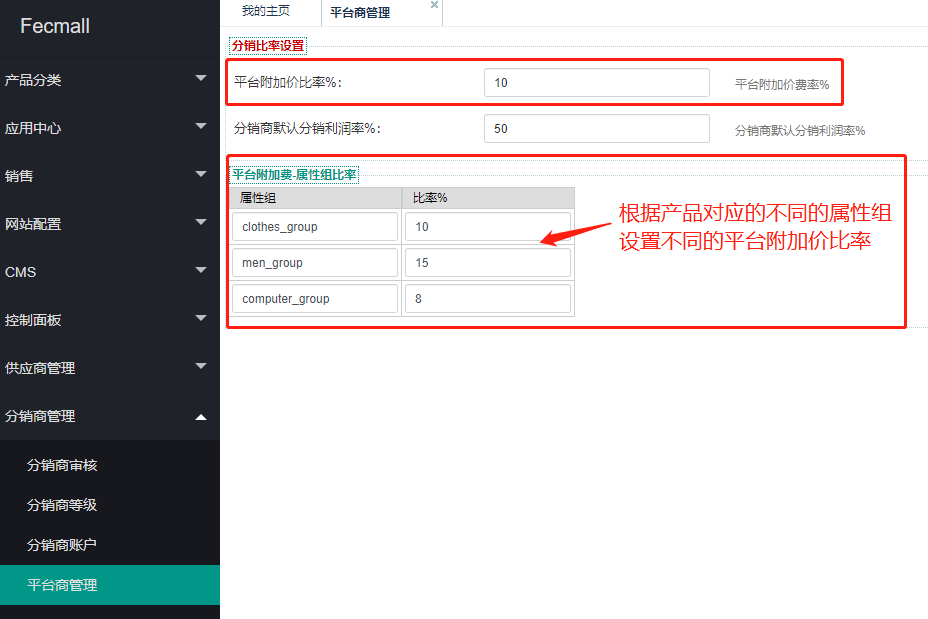
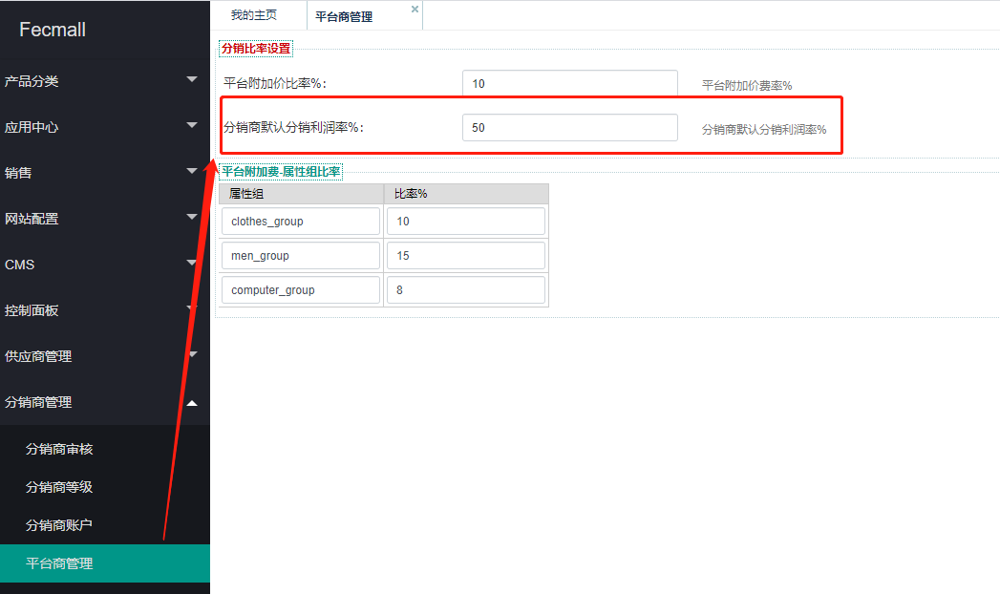
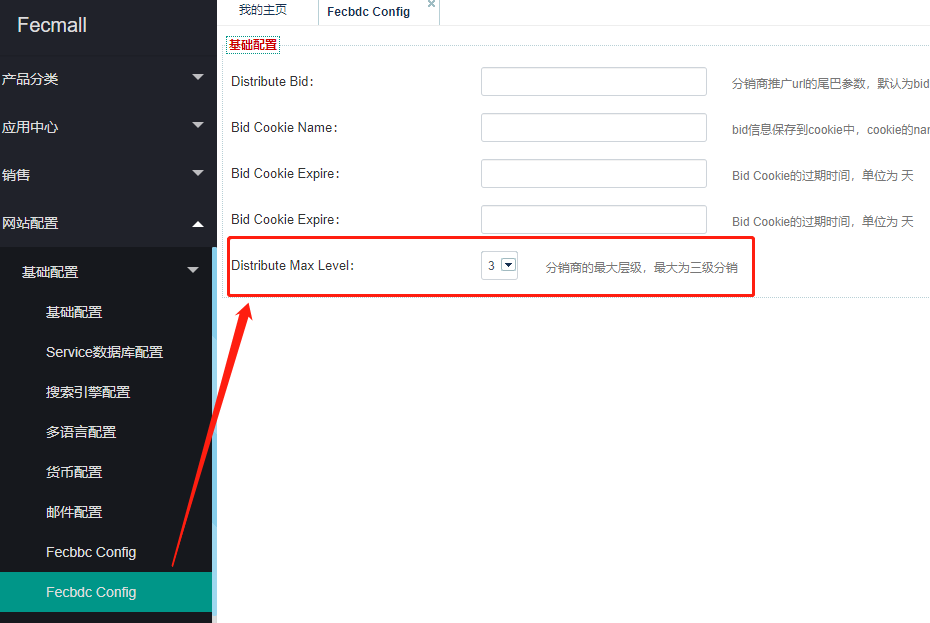

FecMall Fecbdc 分销价格公式计算
================

> 本章详解讲述分销平台的各个价格，以及相应的设置，本章节非常重要，贯穿分销系统的整个流程，请仔细阅读


### 业务逻辑设计

系统对象： `分销平台商`，`经销商`，`分销商`

通俗的说，就是`分销平台商`搭建平台，`经销商`铺货，进行产品上传和订单处理，`分销商`利用平台和产品，进行商品分销

Fecbdc分销系统，就是将`经销商`，`分销商`，通过`平台`进行资源整理，设计`利润点`，三方共赢的思路，
从利润设计的角度分析，逻辑如下：

1.`经销商`类似于`厂家`，生产商品，有一个`出厂价`，这个出厂价，就是`经销商成本价`，也就是`供货价`，
这个价格中已经包含了`经销商的利润`，这个价格也是后面作为平台和经销商进行结算的月结价格

2.经销商，规定了`经销商成本价`，还得规定商品的`售价`，譬如农夫山泉，出厂价8毛，但他们会统一各个商店售价 2元一瓶，不能乱卖，对各个销售点进行售价限制，
因此经销商，除了设置`经销商成本价`，还要设置商品的`销售价`，其中销售价部分包含：销售原价，销售`特价`，销售`批发价格`，
当商品出售后，商品`销售价`和`经销商成本价`的差值，就是`平台利润`

3.分销商作为分销平台最重要的营销方式，`商品分销价格`是通过公式单独计算的，当分销商带来的用户，
按照分销商的逻辑来计算价格，当按照`分销商`的`价格计算`时，经销商设置的售价会`覆盖`，以分销商的分销价格为准。

因此终端用户通过`分销商入口`进入商城，看到的是分销商的`分销价格`，而不是经销商的销售价格

在这个价格计算过程中，要考虑三者的`关系`和`利润`，当分销商带来的用户出订单后，`分销商`得赚走一部分利润，
`平台`也要赚一部分利润，`经销商`也要赚钱利润，三方共赢。

平台利润设计：

3.1`经销商`在自己的`商品`上面加了一点`利润`（经销商的利润），加了自身利润点后，得到经销商供货的`成本价`，给与分销平台，
`分销平台`和`经销商`的结算，就是按照`经销商成本价`计算

3.2`平台商`在`经销商成本价`的基础上，通过`平台附加价`和`分销商等级比率`，又加了一点钱利润（平台的利润），
作为`分销商成本价`，给与分销商


3.3分销商在`分销商成本价`的基础上，又加了一部分钱，作为分销商的利润
，进而计算出来商品的`最终售价`，等终端用户下单后，那么将`最终售价`中加入的各个利润点，`给与`各个合作方
，因此，这个是一个合作共赢的模式，每出售一个商品，`平台商`，`分销商`，`经销商`都可以赚一部分利润，

4.`分销商`为了满足自己的需要，想要`自定义商品`的分销价格，而不是使用系统默认公式计算的分销价格，
这样分销商就可以根据自己的情况，对某些商品进行酌情加价或者降价，
但是`经销商`不想让`分销商`搞的太乱，因此，`经销商`需要设置`分销价格区间`，
来限制分销商`自定义分销价格`的范围，`分销商`只可以再这个`分销价格区间`内自定义`分销价格`。

5.平台商为了刺激分销商的推广力度，加入了`分销商等级`, 分销商带来的`用户销售额`越多，分销商的`等级`就越高，那么分销商就可以拿到
更低的`分销商成本价`。

6.平台商为了让分销商的数量`裂变增多`，加入了`三级分销`部分，当分销商`A`推荐分销商`B`，分销商`B`推荐了分销商`C`，当分销商`C`的用户下单后，`分销商A`和`B`都可以得到一定的分成。

7.如果`分销商A`推荐了很多分销商，那么分销商A就可以不干活，等着别人干活收钱，这很显然是很不好的,因此，在三级分销层级基础上，
加入了分销商等级，当`子分销商的等级`>=`父分销商的等级`，`子分销商`产生订单后，`父分销商`就不能得到分成，只有`父分销商`的`等级`比`子分销商
`的`等级`高的时候，才会有分成，而且`等级差`越大，分的越多，这会刺激分销商在裂变推广的同时，自身越加大推广力度，只有
产生更多的订单，才能获得更高的等级，才能获得更多的子分销商的收入。

Fecmall Fecbdc分销商城的整体逻辑，就是为了解决上面的业务而设计的
，看完这个业务目的后，会理解透彻很多，因此请仔细阅读上面的利润流程设计。

下面是详细讲述这个过程中的各个概念。


### 分销价格概念


1.`经销商成本价格`：指的是经销商商品的`供货价格`，【每个产品单独设置】(经销商在计算`经销商成本价格`的时候，已经加了自身的利润点)

譬如【商品1】，经销商的供货价格为5元，因此`经销商成本价格`为5元, 经销商可以在后台这里设置商品的成本价格




2.`经销商销售价格`：指的是经销商设置的销售价格，当用户直接访问商城（不是通过分销商入口过来的用户），
看到的就是经销商的销售价格。【每个产品单独设置】

譬如【商品1】的 `经销商销售价格` 为121元, 经销商可以在后台这里设置商品的销售价格

2.1规格产品，设置各个规格sku的销售价格



2.2非规格产品，设置销售价格




3.`经销商销售特价`： 指的是经销商设置的销售特价，后台设置`经销商销售特价`后，当用户直接访问商城（不是通过分销商入口过来的用户），
看到的就是经销商的销售特价。【每个产品单独设置】

譬如【商品1】的 经销商销售价格 为15元, 销售特价为13元， 经销商可以在后台这里设置商品的销售价格




除了设置销售特价，您还可以设置销售特价`生效`的`开始`和`结束`时间。


4.`经销商销售批发价`：指的是经销商设置的销售批发价，后台设置后，当用户直接访问商城（不是通过分销商入口过来的用户），
购买多个商品后，使用的是`经销商销售批发价`【每个产品单独设置】

一般针对购买多个商品的用户，进行的优惠价格




5.`经销商-分销价格区间`：`经销商`设置产品分销的价格区间，是`经销商`对`分销商`自定义商品`分销价格`的范围限制，
产品A设置分销的`最低价格`和`最高价格`后，分销商分销产品A自定义的分销商的`分销价格`必须在这个区间内。【每个产品单独设置】

譬如【商品1】的 `经销商-分销价格区间` 为10-20元之间

经销商可以在后台这里设置商品的分销价格区间,通过这个设置，来限制分销商`自定义分销价格`的范围



设置后，分销商自定义的分销价格，必须再这个价格区间之内，否则无法提交


**上面的价格，都是分销商在产品价格编辑部分进行的设置，作为产品价格参数的初始设置部分，而下面的分销商价格，则是公式计算而来**

5.1当用户`直接访问`平台商城，那么显示的产品价格为`经销商设置的销售价格`

5.2当用户通过`分销商入口`访问平台商城，那么显示`分销商的分销价格`，下面的部分介绍分销商的各个价格的计算


6.`分销商等级比率`：不同等级的`分销商`，有着不同的`等级比率`，等级越高，比率`越低`，可以拿到`更低`的`分销成本价格`，譬如： 


| 分销商等级         | 分销商比率     |
| ------------------| ---------------|
| 分销商青铜等级   | 110%   |
| 分销商黄金等级   | 80%     |
| 分销商白金等级   | 50%     |
| 分销商钻石等级   | 40%     |


分销商等级比率，在分销平台后台设置：





7.平台附加价 

在计算`分销商默认分销价格`的时候，会在`经销商成本价格`的基础上，加上`平台附加价`，作为平台商的管理费用成本。


`平台附加价` = `经销商成本价格` * `平台附加率`  

可以在平台后台设置`平台附加率`  




您可以设置通用的`平台附加率`，如果您想根据不同的属性组，设置不同的`平台附加率`，可以在上图的属性组部分设置，
譬如：服装类产品属性组加的高一点，电子类产品属性组加的低一点


8.分销商成本价格

相当于分销商的拿货价格（可以看成，平台给分销商供货的成本价格）

`分销商成本价格` = `经销商成本价格` * （1+`分销商等级比率`） + `平台附加价`

参数-`经销商成本价格`：就是经销商编辑产品的时候，填写的商品`经销商成本价格`，在上面的`1.`部分有介绍

参数-`分销商等级比率`：这个是平台设置的一个比率参数，在上面的`6.`部分有介绍

参数-`平台附加价`：在上面的`7.`部分有介绍

因此可以看出来，`分销商等级`越高，`分销商等级比率`越低，越可以拿到更低的`分销商成本价格`


9.`分销商默认分销利润率`

根据`分销商默认分销利润率`，计算出来一个默认的分销商`分销价格`

在平台后台设置`分销商默认分销利润率`





10.分销商默认销售价格

系统会根据分销商的等级，计算出来一个默认的`分销商默认销售价格`

`分销商默认销售价格` = min( Max（`分销商成本价` * `分销商默认分销利润率`，`经销商-分销区间最低价`）, `经销商-分销区间最高价`)

参数-`分销商成本价`:在上面的`8.`部分有介绍

参数-`分销商默认分销利润率`:在上面的`9.`部分有介绍

参数-`经销商-分销区间最低价` 和 `经销商-分销区间最高价`:在上面的`5`部分有介绍

`min`和`max`函数备注说明：

10.1函数`Max(a, b)`: 取`a`和`b`中最`大`的一个数字作为结果，譬如  `max(3, 5) = 5`    `max(10, 4) = 10` ,

10.2函数`Min(a, b)`: 取`a`和`b`中最`小`的一个数字作为结果，譬如  `max(3, 5) = 3`    `max(10, 4) = 4`,

当分销商没有自定义商品分销价格的时候，商品默认的分销价格，就是：`分销商默认销售价格`

譬如：

```
对于【商品1】经销商成本价5元，经销商分销区间为10-20
分销商默认分销利润率:20%
分销商A成本价格为 8（计算得来的值）
分销商B成本价格为11（计算得来的值）
那么

分销商A默认销售价格 = min(max(8 * (1+20%), 10), 20)= min(max(9.6 , 10), 20) = min(10,20) = 10
分销商B默认销售价格 = min(max(11 * (1+20%), 10), 20) = min(max(13.2 , 10),20) = min(13.2, 20) = 13.2
```

11.分销商自定义销分销价格最大值和最小值

分销商可以自定义商品的分销价格，但是有一个范围限制

`分销商自定义销分销价格最大值` = `经销商-分销区间最大值`

`分销商销售价格最小值` = Max( `经销商-分销区间最小价`, `分销商成本价`)


```
譬如：

商品甲：`经销商-分销区间`为 10 - 20 

对于商品甲，分销商A的分销成本价为8，分销商B的分销成本价为12

那么，通过上面的公式计算，可以得到

分销商A的分销价格的最小值和最大值，分别为：10-20

分销商B的分销价格的最小值和最大值，分别为：12-20

```


12.分销商的利润

当用户下单后，那么对于订单中的商品A，`分销商的利润`公式如下：

`分销商的利润` = `分销商销售价格` - `分销商成本价格`


### 分销商等级和三级分销利润

分销商等级

| 分销商等级         | 分销商比率     |
| ------------------| ---------------|
| 分销商青铜等级   | 110%   |
| 分销商黄金等级   | 80%     |
| 分销商白金等级   | 50%     |
| 分销商钻石等级   | 40%     |


分销商等级比率，在分销平台后台设置：


1.平台后台编辑`分销商等级`，等级部分必须按照`1`，`2`，`3`，`4`，`5`的顺序填写等级

2.每一个级别，对应一个比率，这个就是`分销商比率`，等级越高，比率越低，进而可以拿到更低的`分销成本价`

3.对于三级分销，约定层级（下面按照这个关系讲解）：分销商C  -->  分销商B --> 分销商A,  `B`是`A`的父级，`C`是`B`的父级

3.1`分销商A的直接利润` = `分销商的销售价格` - `分销商的成本价格`

3.2`分销商B的间接利润`(B是分销商A的上级) = max(`分销商A的成本价格` - `分销商B的成本价格`, 0)

对于分销商B，如果等级比分销商A低，那么值就会为0

3.3`分销商C的间接利润`(C是分销商B的上级) = 
Min(max(`分销商B的成本价格` - `分销商C的成本价格` , 0), max(`分销商A的成本价格` - `分销商C的成本价格`, 0))

对于分销商C，如果等级比分销商B低，那么值就会为0

按照公式的逻辑：

```
实例1：  分销商A 青铜等级， 分销商B黄金等级，分销商C白金等级
利润分配结果：A是直接利润，BC都可以划走一部分利润

实例2：分销商A 黄金等级， 分销商B青铜等级，分销商C白金等级
利润分配结果：A是直接利润，B没有利润，C有利润，相当于C将B应该分的利润分走了。

实例3：分销商A 青铜等级， 分销商B钻石等级，分销商C黄金等级
利润分配结果：A是直接利润，B有利润，但是c没有利润

实例4：分销商A 钻石等级， 分销商B青铜等级，分销商C黄金等级
利润分配结果：A是直接利润，BC都没有利润
```

因此，可以看到：

1.`分销商A`产生订单，获取`直接利润`，直接利润的多少，是由分销商A的`等级`决定的，和父级分销商，子级分销商`没有关系`，
无论父级分销商的级别高，还是级别低，对分销商A没有影响

2.如果`分销商B`的`级别`比`分销商A`高，那么`分销商B`会得到一部分分成，这块利润并不是从A的利润中扣，而是通过`分销商等级成本价`的`差值`，获取的。

3.作为上级分销商，只有加大推广力度，把`级别`提升，那么,子分销商产生订单，上级分销商才会有利润分成。

4.分销商入口过来的用户下单越多，分销商的销售总额就越高，`级别`越高。


5.您可以在后台对分销的层级进行设置，默认是三级分销。




总结：上面贯穿了分销平台的利润计算构成，透彻了这个，基本就理解了fecbdc分销系统的逻辑。


下面的章节都是实际操作。


