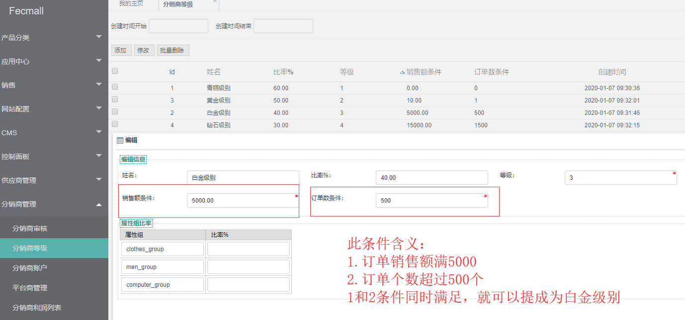

Fecmall Fecbdc多商户分销-计算分销商等级的脚本
========================


### 设置分销商等级条件

平台后台设置分销商各个等级的订单金额以及订单个数限制




`销售额条件`：分销商带来的用户订单销售额

`订单数条件`：分销商带来的用户订单个数


注意：

1.必须同时满足这两个条件，才可以进行等级提升

2.子分销商带来的订单不在计算范围内


### 脚本计算

```
cd ./addons/fecmall/fecbdc/shell
distributeComputeLevel.sh
```

您可以通过CRON计划任务，定时跑这个脚本


