FecMall Fecbdct 囤货逻辑
================


### Fecbdct 囤货逻辑简介


讲解囤货系统的各个步骤的逻辑


### 经销商产品编辑部分


1.经销商产品编辑部分


产品编辑部分，加入：`是否允许分销商囤货`  和  `分销囤货批发成本价`

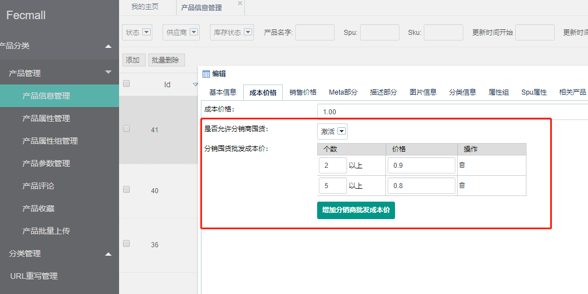


`是否允许分销商囤货`: 分销商通过此开关，可以编辑产品是否允许囤货，开启后，才允许分销商进行囤货操作

 `分销囤货批发成本价`：囤货数量越多，囤货成本价越低，刺激分销商一次多囤货


### 分销商进行囤货操作


对于可囤货产品，分销商可以看到囤货按钮（必须是分销商登陆账户后）


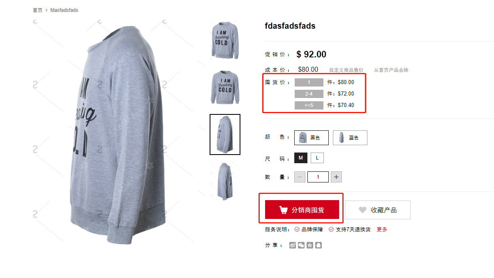


对于`不可囤货产品`，按钮为`灰色`, 不可进行囤货操作

分销商点击`囤货按钮`，进行囤货，跳转到`囤货支付`页面，注意，一次只能对`一个`产品进行囤货，不能一次多个产品，因为是多商户系统，涉及到的问题多。
这样实现也是为了简化难度。

分销商支付后，扣除`经销商的产品库存`，`分销商虚拟仓库存`将会增加

1.分销商查看`虚拟仓库存`

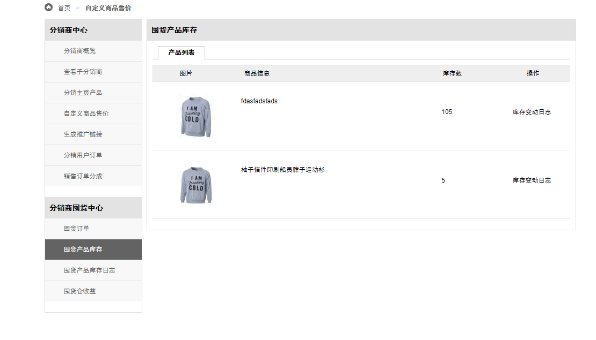

2.分销商查看详细的`库存变动log`

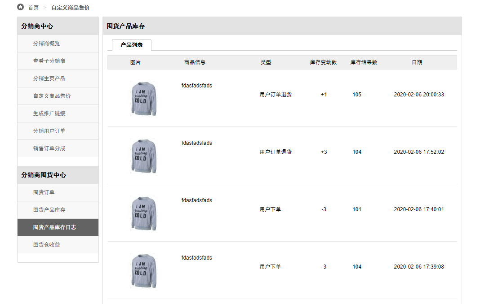

3.分销商查看`囤货订单`信息

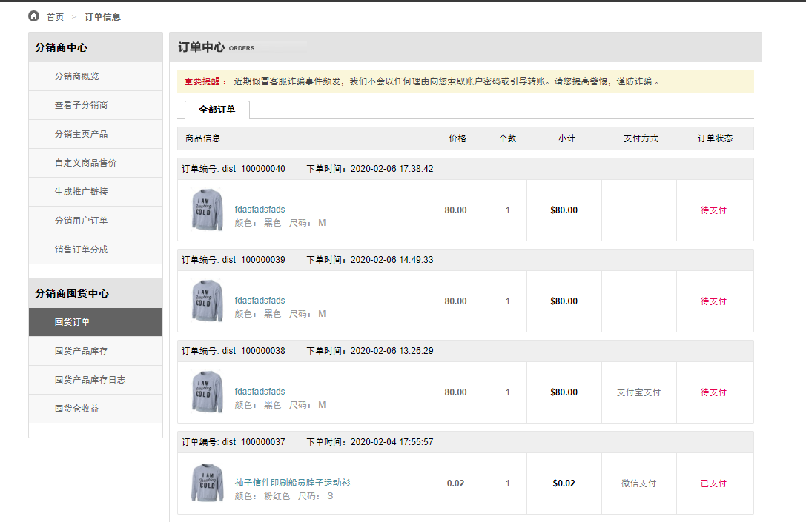


4.平台商后台查看`囤货订单`

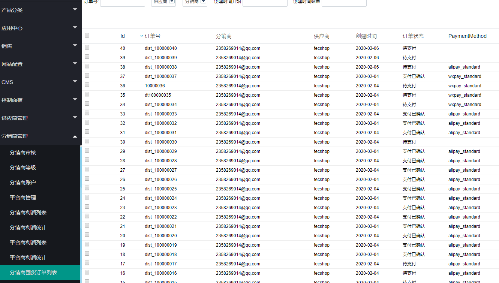


5.经销商后台查看`囤货订单`

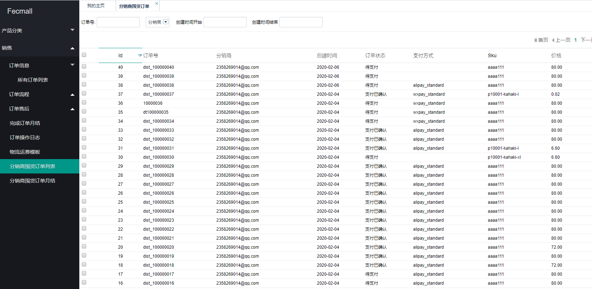


囤货订单`支付成功`后，才会进行`库存的转移`（扣除经销商产品库存，新增分销商囤货库存），为此，
囤货订单和用户订单公用支付部分，将所有的`支付方式`进行了重写( payment services)


### 囤货订单月结

囤货订单支付后，由`平台商`进行收款，然后，
通过脚本计算`囤货订单`的销售额，`平台商`按照`账期`，结算给`经销商`


1.脚本是`后台脚本`计算，通过月的方式进行统计计算

2.计算出来后，`经销商`可以再后台查看`囤货订单月结`


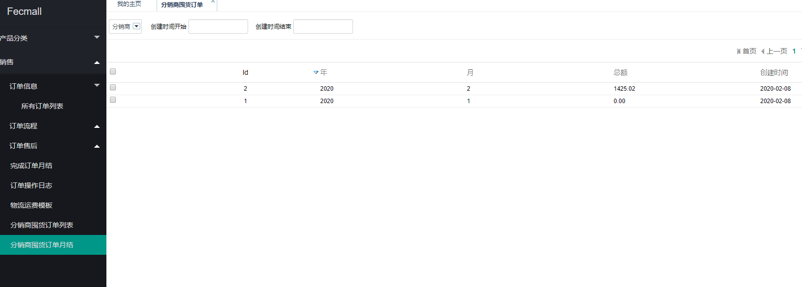


### 用户下单，使用`分销商虚拟仓囤货库存`


1.用户下单，先检查对应的分销商是否有`库存`，如果存在库存，则扣除`分销商虚拟库存`


./addons/fecmall/fecbdct/services/Order.php

```
protected function actionGenerateOrderByCart($address, $shipping_methods, $payment_methods, $clearCart = true, $token = '', $order_remark = '') {
    ...
    // 保存订单产品
    $saveItemStatus = Yii::$service->order->item->saveOrderItems3($distributeId, $bdmin_cart_info['products'], $order_id, $bdmin_cart_info['store'], $bdmin_user_id);
  
    ...
}
```
找到  ./addons/fecmall/fecbdct/services/order/Item.php 里面的函数`saveOrderItems3`可以看到


```
$stock_type = Yii::$service->product->stock->deductBdminAndDistribute($distributeId, $stock_items);
```

就是这个函数，进行`分销商虚拟库存`的扣除操作，如果扣除失败，则进行`经销商库存`的扣除(也就是fecbbc里面默认的产品库存)。


2. 订单产品表加入了字段 `stock_type`

生成`订单表`以及`订单产品表`信息，在订单产品表加入了字段 `stock_type`(产品库存扣除类型：1代表扣除的经销商库存，2代表扣除的分销商囤货库存), 
该字段用于订单取消，订单退款等操作，进行分销商囤货库存返还


3.库存扣除完成后，生成用户订单，如果扣除的`分销商虚拟仓库存`，`分销商`在`分销商中心` - `囤货产品库存日志`看到库存变动的详细日志，以及分销囤货库存总数的
变化


### 用户订单取消，退款等操作，返还分销商囤货库存


1.`订单取消操作`返还分销商囤货库存

订单取消的类型： `未支付订单-用户取消`，`未支付订单脚本-自动取消`，`已支付未审核订单-用户取消`

如果订单产品使用的是`分销商囤货库存`，那么需要进行`库存的返还`


2.`完成订单售后退款`返还分销商囤货库存

用户订单收货后，售后发起的`退款申请通过`后，将会触发`分销商囤货库存返还`操作。

如果订单产品使用的是`分销商囤货库存`，那么需要进行`库存`的返还


### 分销库存订单收益计算


当一个订单使用了`分销商虚拟仓囤货库存`，那么订单的利润分成将会进行变动

1.使用`分销商囤货库存`的订单产品，产品的`经销商成本价`部分，归属于`分销商收益`，而不是归属于`经销商`

使用`经销商库存`的订单产品，产品的`经销商成本价`部分，归属于`经销商`

2.如果订单发生了`退款退货`，那么根据退货的个数`剔除`，`未退货`的归属于`分销商收益`

3.脚本统计，月结的方式，单独计算`分销商囤货月结`收益，

3.1分销商查看看`囤货收益`：

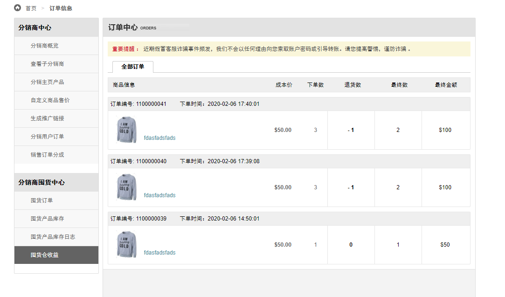

3.2平台商查看囤货`订单月结`

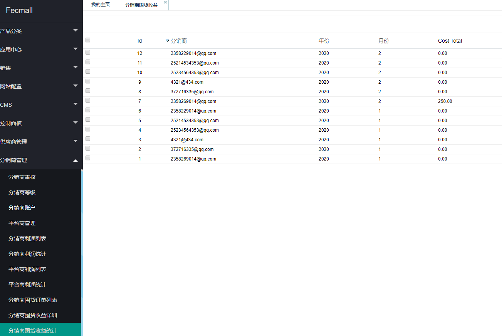

3.3经销商查看囤货`订单月结`

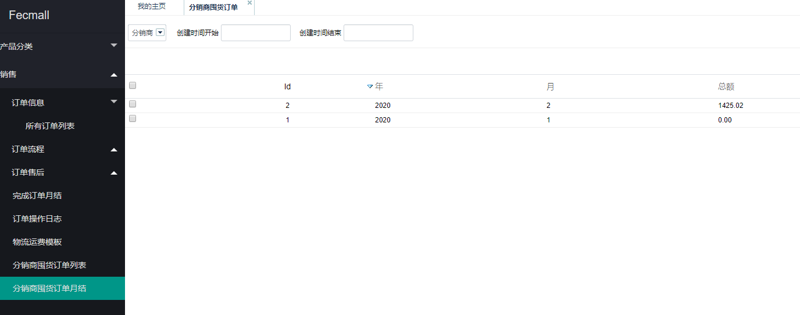


