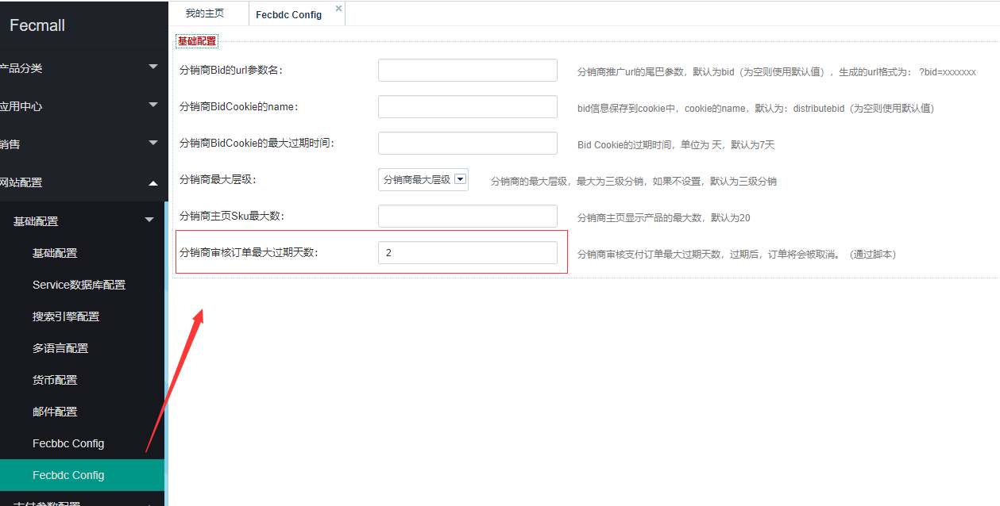

分销商未审核订单自动取消
==========


分销商对应的用户`订单支付`后，需要`分销商`进行`审核`，才能进行下一步操作

但是有一些订单，`分销商`到了一定的时间没有`审核`（`强制囤货产品`没有库存，也有可能是忘记了），
那么系统脚本会将`分销商审核超时`的订单，`自动取消`掉


`过期时间`:在平台商后台设置天数




执行的脚本

```
cd ./addons/fecmall/fecbdct/shell
sh cancelDistributeNoAuditOrder.sh

```

您可以通过cron设置该脚本每天执行
