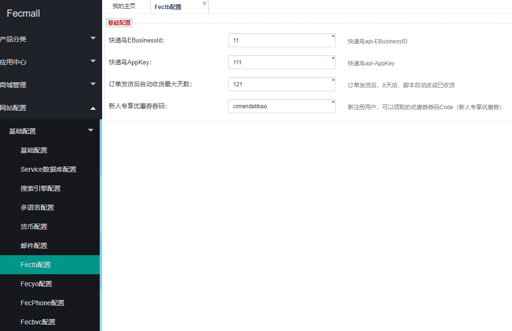
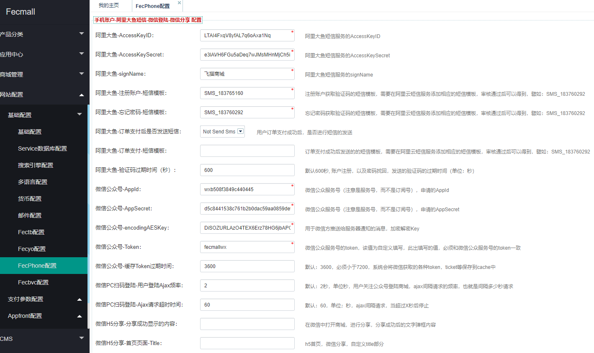
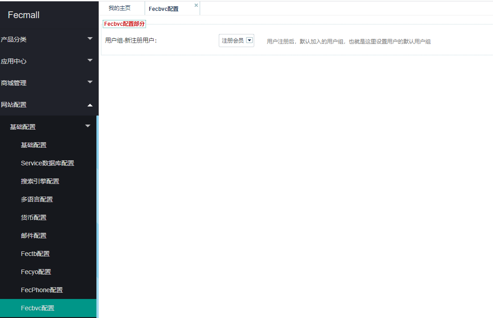

Fecbvc PDF电子书籍商城安装
==================

> 本商城系统，是针对pdf电子书籍（虚拟产品），以及实物书籍在售的在线商城


### Fecbvc PDF电子书籍商城安装

1.Fecbvc是在fecyo和fecmyorder上面进行扩展的，您需要先安装fecyo和fecmyorder


应用市场地址：

1.1fecyo：http://addons.fecmall.com/27944278

1.2fecmyorder: http://addons.fecmall.com/41116332

1.3fecbvc: http://addons.fecmall.com/84991566


2.后台应用中心在线安装这三个扩展，

2.1需要注意的是，先安装`fecyo`和`fecmyorder`，最后
安装fecbvc，否则将会报错

2.2安装完成后，后台设置应用的优先级

`应用中心` --> `应用管理`  --> `已安装应用`

优先级：`fecmyorder` >  `fecbvc` > `fecyo` , 可以设置下面的值，譬如：


`fecyo`:`1`

`fecbvc`:`2`

`fecmyorder`:`3`


### Fecbvc PDF电子书籍商城配置

安装完成后，就进入配置部分

fecyo的配置，参看文档：http://www.fecmall.com/doc/fecshop-guide/addons/cn-2.0/guide-fecmall-addons-system-fecyo-cn-h5.html

fecyo配置完成后，进行本部分的配置

1.安装php扩展，以及php上传大文件设置

1.1安装php zip扩展，该扩展用于zip打包

1.2安装php  Imagick，该扩展用于pdf文件生成图片，可以参看帖子：http://www.fecmall.com/topic/2439

1.3php 上传大文件报错的解决： http://www.fecmall.com/topic/2458

2.文件权限设置

根目录执行

```
mkdir  ./appimage/pdfStorage
mkdir  ./appimage/pdfZipStorage
chmod 777 -R ./appimage/pdfStorage
chmod 777 -R ./appimage/pdfZipStorage
```

这两个文件路径是保存上传的pdf和zip压缩包的文件路径


3.设置store


3.1第三方模板路径设置，将第三方模板路径设置为：


appfront store 第三方模板：`@fecbvc/app/appfront/theme,@fecyo/app/appfront/theme/fecyo`

apphtml5 store 第三方模板：`@fecbvc/app/apphtml5/theme,@fecyo/app/apphtml5/theme/fecyo`


4.设置菜单


配置文件：`appfront/config/fecshop_local_services/Page.php`，menu部分的配置更改：

```
'menu' => [
    'displayHome' => [
        'enable' => true,        // 是否在菜单中显示home
        'display'=> 'Home',        // 显示对应的字符。
    ],
    'frontCustomMenu' => [
        [
            'name'        => 'E-book',            // 菜单名字
            'urlPath'     => '/catalog/pdfcategory/index',    // 菜单对应的url
            
        ],
    ],
],
```           

### 商城参数配置

1.配置参数








2.添加pdf类别


4.后台用户组编辑，用户组的level必须从1开始累加设置等级数，否则会出错


