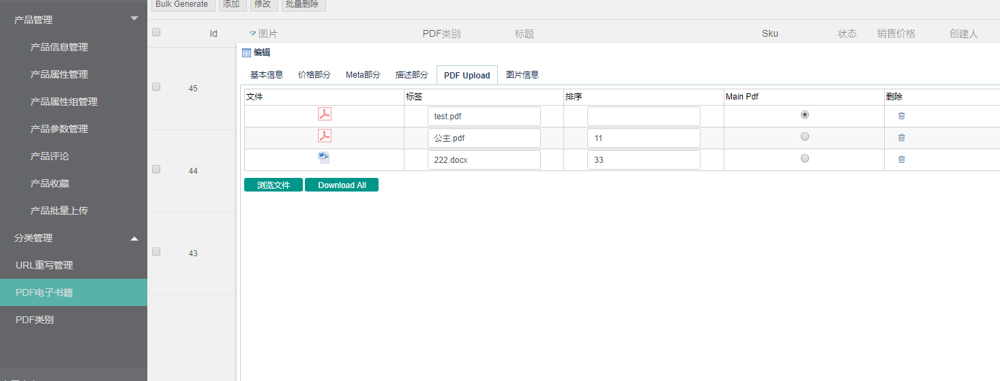
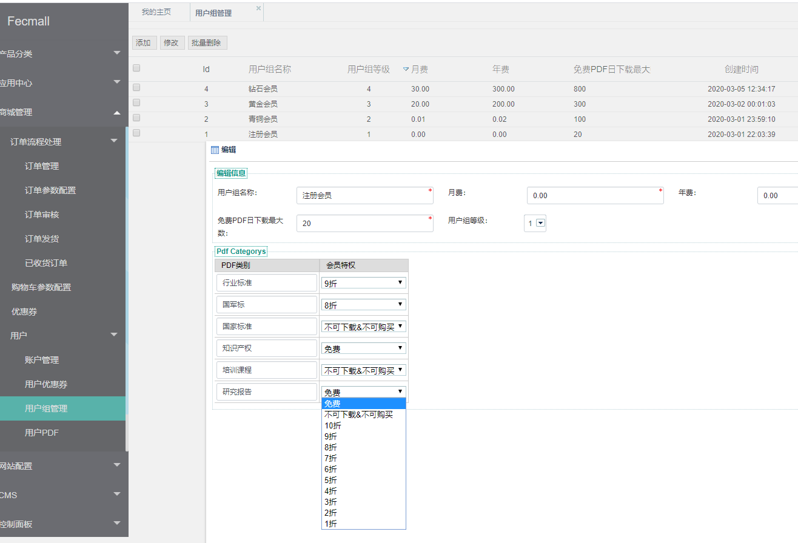
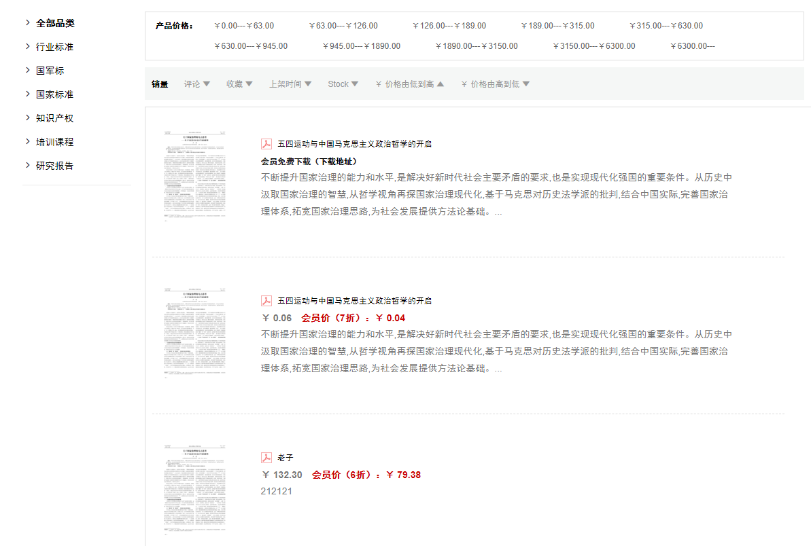
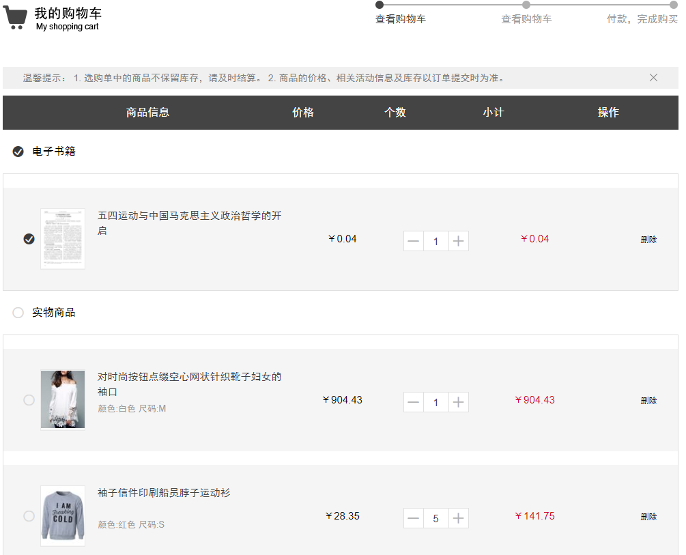
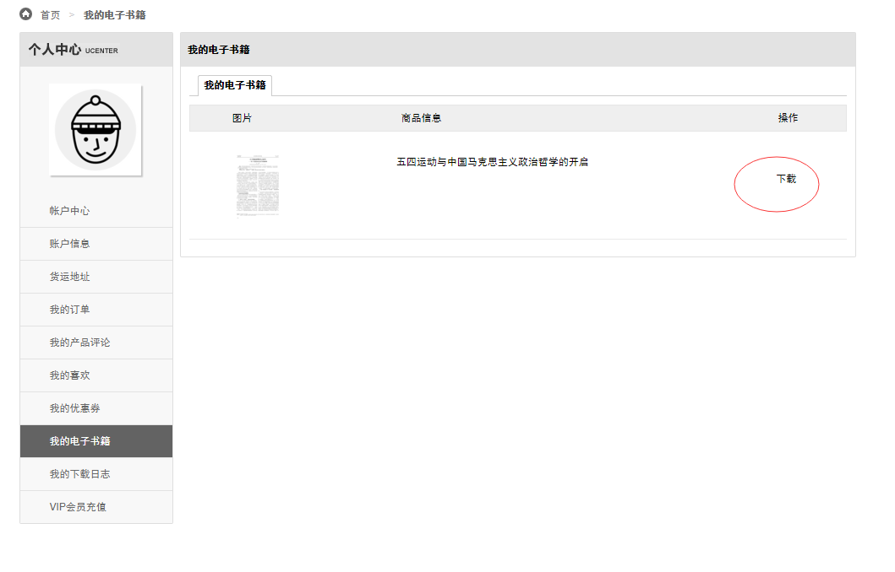
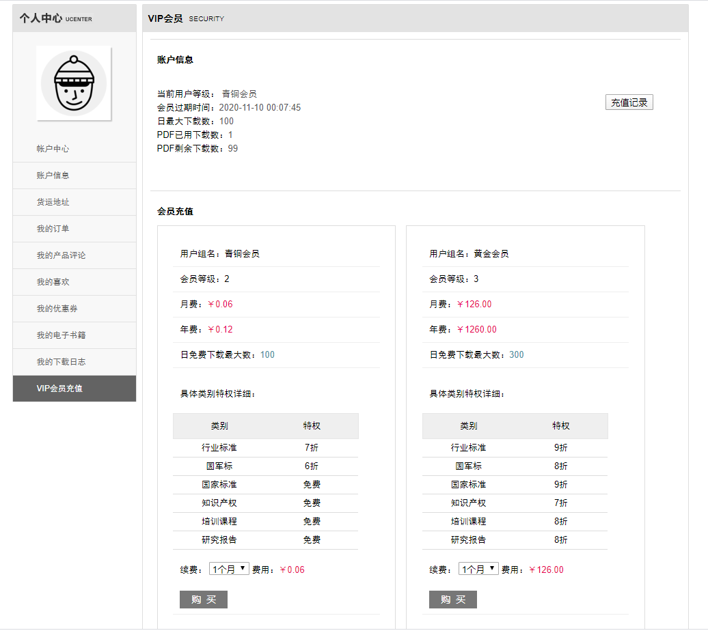
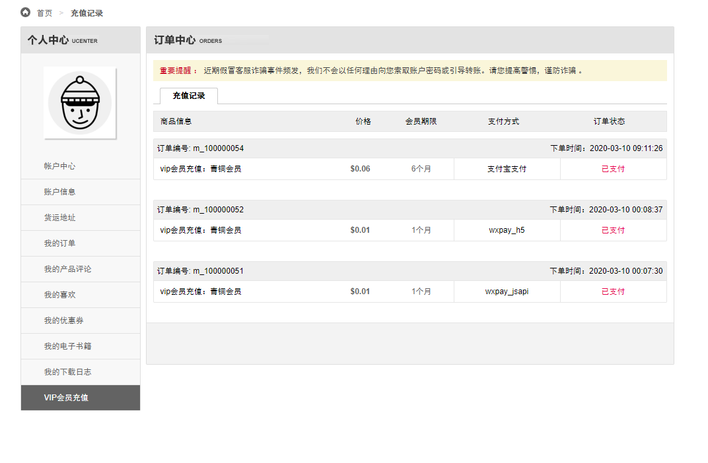

关于FecMall Fecbvc PDF电子书籍商城
===============

> FecMall Fecbvc PDF电子书籍商城，针对虚拟pdf电子书籍的在线商城，可以后台上传pdf，在线出售，在线下载，
vip会员购买，vip会员特权，以及实际书籍出售一体化的商城系统

### FecMall Fecbvc PDF电子书籍商城 简介

FecMall Fecbvc PDF电子书籍商城，针对虚拟pdf电子书籍的在线商城，可以后台上传pdf，在线出售，在线下载，
vip会员购买，vip会员特权，以及实际书籍出售一体化的商城系统

### Fecbdc多商户系统演示

> 下面的pc和h5演示，进入`电子书籍`菜单，查看`pdf电子书籍`部分

Fecbvc PC演示地址： http://fecbvc.fecshop.com/cn/

Fecbvc html5演示地址： http://fecbvch5.fecshop.com/cn/

平台后台入口：暂不开放

通过演示地址，可能看不出来太多的东西，您可以仔细看完本文档，详细了解fecbdc里面的逻辑

### Fecbdc多商户系统入口介绍

`前端商城入口`：Pc + H5商城入口，商城用户查看购买产品的入口，用户可以pc和h5入口访问商城，进行查看产品，下单等

`平台后台入口`：平台使用的后台，平台管理人员管理的后台入口，在这里可以给经销商开账户，查看所有的产品订单等等

`Api入口`：经销商使用的api，可以进行订单和产品的处理

`Console入口`：平台商操作离线脚本的入口，进行一些批量数据的处理

### 关于系统授权

需要付费购买，应用市场购买地址

应用市场地址：http://addons.fecmall.com/84991566

### Fecbvc 详细功能

1.本系统是在fecyo基础上进行的扩展包，支持`PDF电子书籍`下载，支持`实物商品`在售,
关于`实物商品`，这里不做阐述，下面只介绍本部分扩展的pdf在线商城部分。

2.支持pdf产品，上传pdf后，通过pdf文件的前几页生成图片，供用户浏览前几页的内容

3.pdf提供免费下载，购买下载，以及vip免费下载等方式，通过将pdf加入购物车，一起进行下单支付，支付成功后在账户中心进行下载

4.提供vip用户组，譬如青铜会员，黄金会员，钻石会员等，后台设置的产品的各个类别的不同权限，
管理员在后台设置

5.用户通过付费的方式，进行vip会员的购买，购买后就有了相应的权限

6.用户查看相应的pdf，可以享受会员的优惠

用户可以进入pdf产品详细页面查看pdf的内容

7.用户将产品加入购物车，虚拟产品和实物产品将会在购物车中进行分组

8.用户支付后，可以在账户中心查看购买的pdf，进行下载

9.用户可以充值各个级别的会员vip，享受更高的权益

以及查看自己的充值记录

