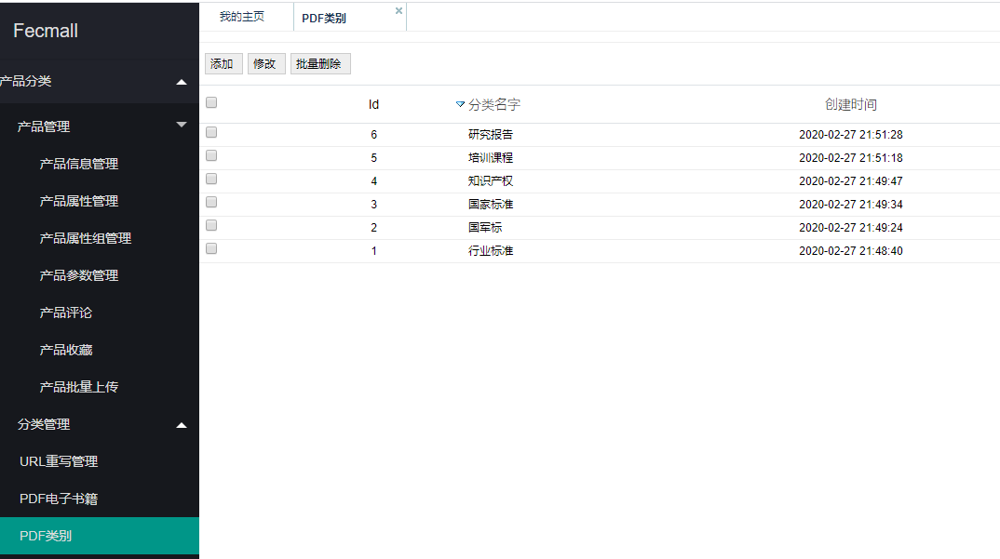
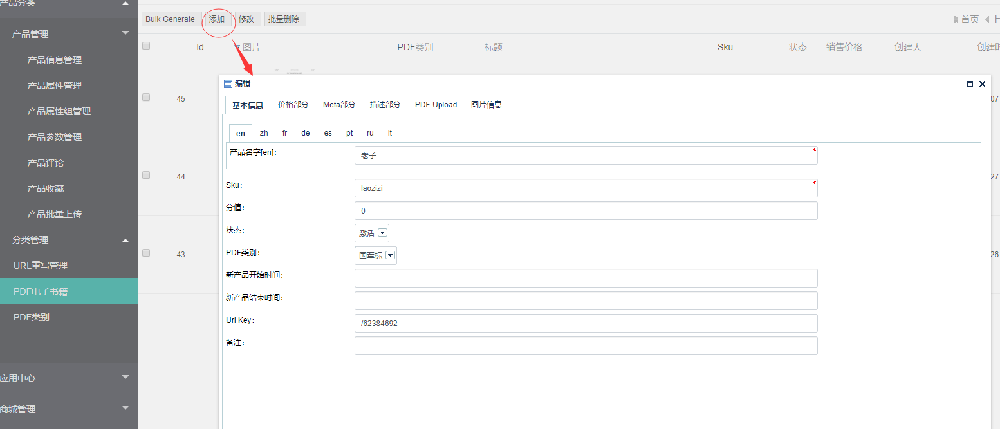
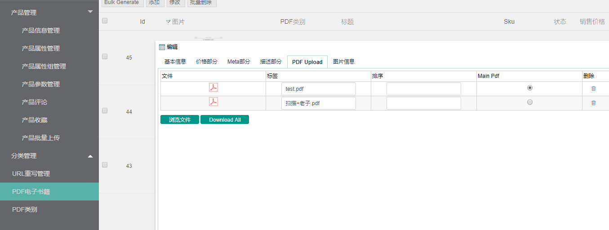
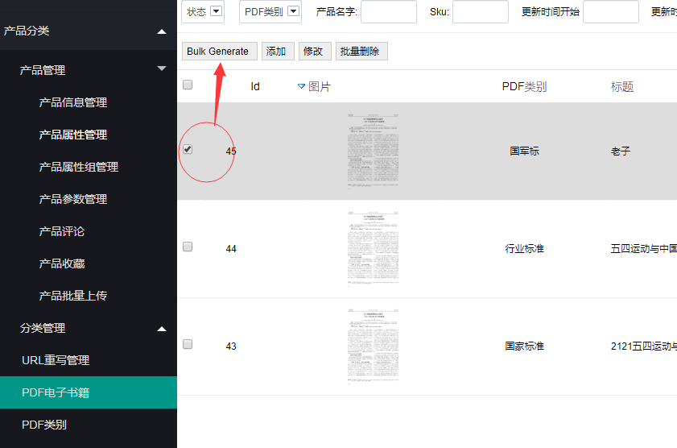

Fecbvc PDF分类和产品添加
===============

> 对pdf产品的上传编辑，以及pdf分类的编辑

### PDF分类

1.您可以在后台添加pdf分类

2.点击添加按钮，添加pdf产品

3.上传pdf文件

这里需要`注意`的是，如果pdf超过10页，请使用pdf阅读器，将pdf的前几页切出来生成一个小的pdf文件，
上传后，请将这个`小的pdf勾选`为`主pdf`

这么做的原因：php读取pdf生成图片，如果pdf过大，就会导致生成图片崩溃，因此需要使用一个小的pdf来生成图片

注意：`主pdf`文件一定要小，否则生成图片将会卡住

然后您就可以保存了

4.pdf文件生成图片

勾选产品，点击按钮生成图片

因为pdf生成图片比较耗费内存，因此请尽量单个文件操作生成。

生成后，您就可以看到生成后的图片

