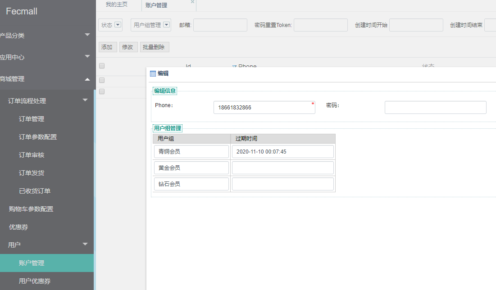
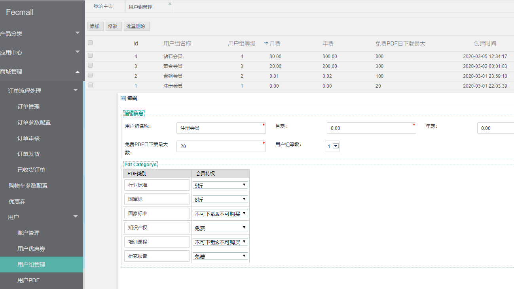
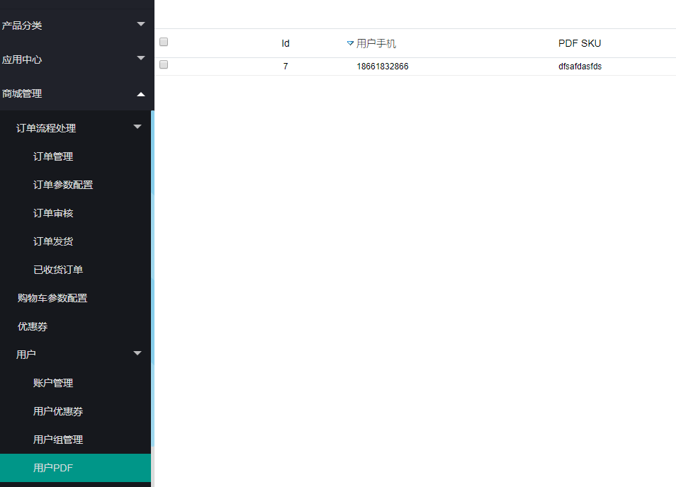

Fecbvc 用户操作
=========

> 用户方面的一些操作

### vip用户组概念

用户和用户组是一对多的关系，因此用户理论上可以购买多个vip，而且不冲突，
系统根据过期时间，过滤出来可用的vip用户组，然后选择一个权限最高的vip用户组作为当前的用户，
您可以在后台查看用户对应的用户组信息

可以看到各个用户组的过期时间，过期后将不可用，需要用户继续购买

用户组管理部分，您可以添加各个vip用户组

**需要注意的是**:用户组必须从1开始，依次增加，如上图，否则将会出错。

用户前台购买vip会员后，将会拥有该vip的权限

用户购买的pdf列表：

用户购买vip订单列表：

