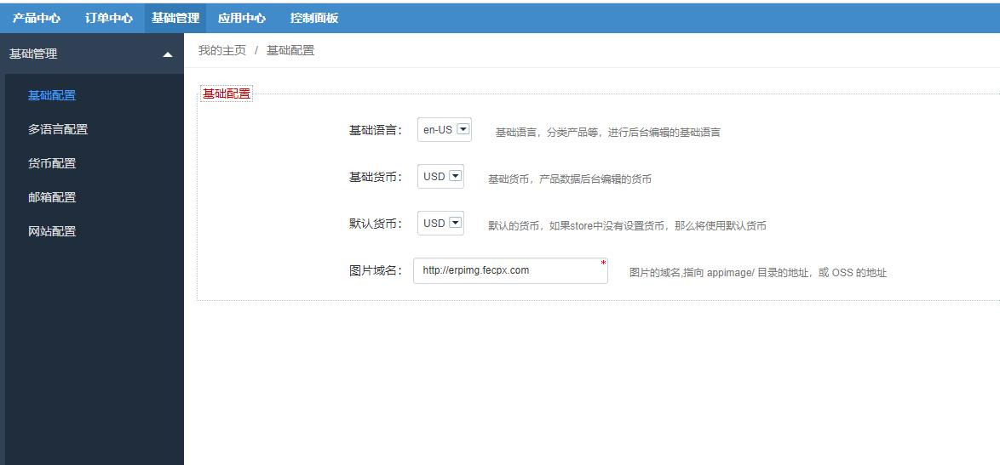
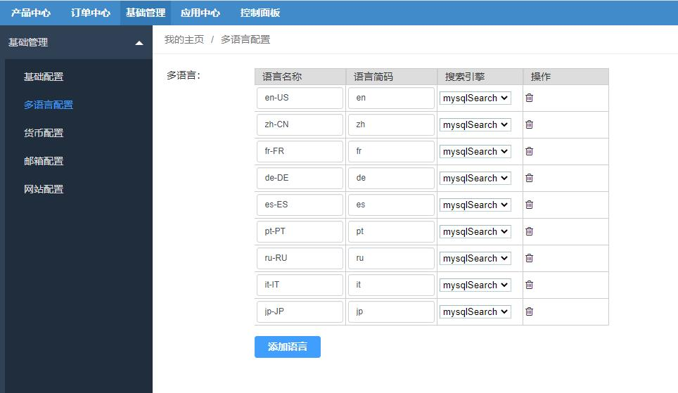
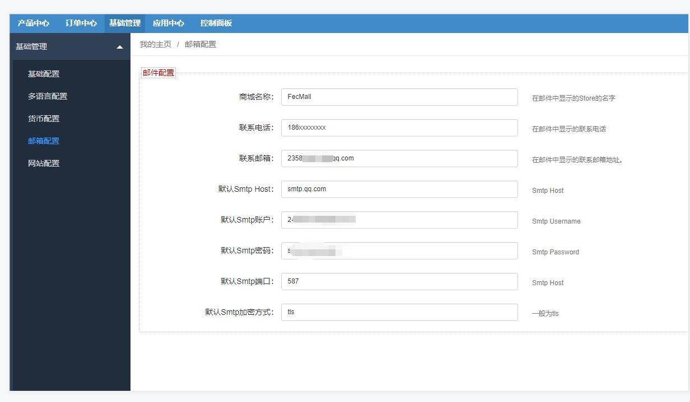
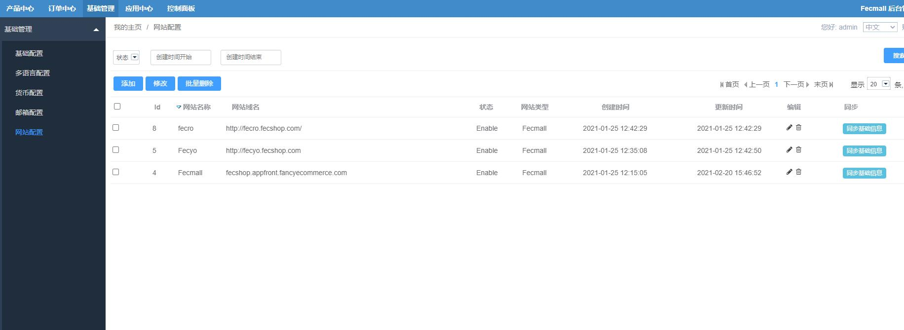

ERP基础配置
======

> erp的一些基础配置部分

### ERP基础配置

1.基础配置

配置基础语言，基础货币，图片域名等

2.多语言配置

您可以在这里添加多语言

3.多货币配置

您可以在这里添加多货币

4.邮箱配置

您可以在这里配置邮箱SMTP信息（后面订单部分发送邮件会用到）

### ERP网站配置

1.添加fecmall商城网站

您可以在这里添加商城网站

您需要在您的fecmall商城后台，添加一个后台用户，作为api用户，并且配置fecmall appapi入口，譬如

Api Domain：`http://fecshop.appapi.fancyecommerce.com`

Api User：`apiuser`

Api Password：`xxxx`

