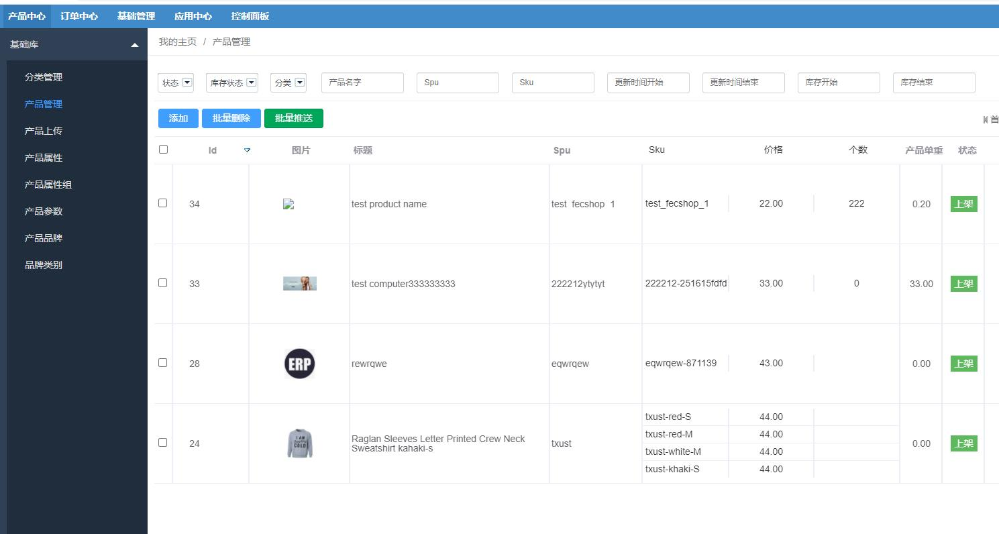
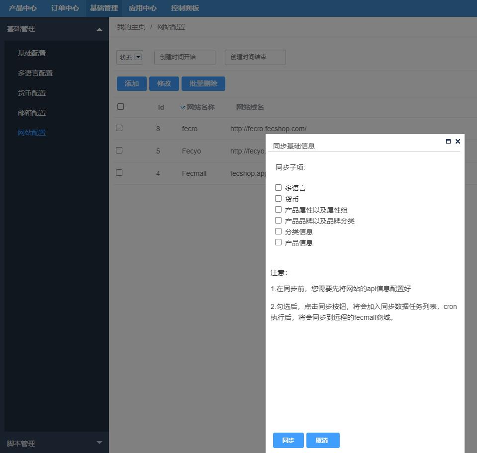
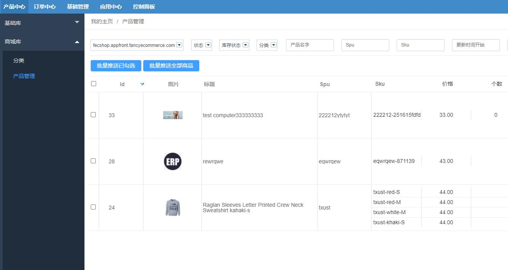

同步Fecmall商城数据
=========

> Erp数据同步到 Fecmall商城的说明

### Erp数据结构

Erp数据结构分为两大`基础库`和`商城库`两大部分

1.`基础库`数据：包含产品属性，产品组，产品品牌，产品品牌分类，多语言信息，
多货币信息等，这些信息是公用的，`基础库`和`商城库`公用

2.`商城库`数据：包含产品数据和分类数据，因为每个商城的商品，分类，是不同的。

譬如：有的站点只有服装商品，有的只有鞋子商品，有的服装站点我们希望价格高一些，有的希望价格低一些，
因此，我们需要按照一定的规则，将基础库商品，同步到商城库，在同步的过程中，加入一些数据处理，
譬如按照比例调高价格，商品名称字符过滤等。

我们需要把`基础库`产品同步到`商城库`后，可能我们还需要手动修改商品数据，然后在同步到fecmall商城。

因此，除了`基础库`数据表，我们需要单独的数据库表来存储`商城库`数据
，当商品库的数据没有问题后，我们就可以将其同步到远程的fecmall商城中。

### erp基础库产品数据，同步到erp商城库

在同步之前，您需要：

1.先编辑好您的基础数据，详细参看：[ERP基础配置](fecmall_fecerp_base_config.md)

2.在erp基础库中添加商品，详细参看：[ERP基础产品管理](fecmall_fecerp_product_manager.md)

3.商城库中添加分类，详细参看：[ERP商城产品管理](fecmall_fecerp_product_sync.md)

进行商品同步，操作：

点击批量推送：

**推送配置选项说明**：

`选择您需要推送的站点`: 当您在erp后台`基础管理` -->`基础管理`  --> `网站配置` 中添加了站点后,
这里就会出来站点。

`选择您推送站点对应的分类`: 您需要先选择站点，然后才能选择分类，在操作之前，您应该先到商城库里面为站点添加分类.
erp后台`产品中心` -->`商城库`  --> `分类` ,先为站点添加分类

`选择您推送产品的选择方式`: 分为2种情况1.只推送勾选的产品（勾选某几个商品进行推送），2.推送当前所有（您通过过滤条件
筛选出来的产品列表，所有页就将被同步到商品库）

**新增配置**：

如果同步过程为新增商品，您如果想处理某些数据，可以这里设置规则

**更新配置**：

如果同步过程为更新商品，您如果想处理某些数据，可以这里设置规则

配置完成后，点击`批量推送`，即可完成操作

注意：同步的原理是task，也就是这里只会发一个任务，而任务的真正执行，靠的是console脚本，因此，您需要等一段时间才能看到
基础库产品数据同步到商品库。

### erp商城库数据，同步到远程fecmall商城

同步的数据内容如下：

`产品属性组`: 您可以参看了解：[Fecmall属性和属性组](https://www.fecmall.com/doc/fecshop-guide/instructions/cn-2.0/guide-fecmall_product_attr_and_group.html)

`产品属性`：您可以参看了解：[Fecmall属性和属性组](https://www.fecmall.com/doc/fecshop-guide/instructions/cn-2.0/guide-fecmall_product_attr_and_group.html)

`产品品牌`以及产品`品牌分类`：商品的品牌列表数据，包含品牌，品牌分类，品牌名称，品牌图片

`分类信息`：商品对应的分类信息，您可以参看了解：[Fecmall分类](https://www.fecmall.com/doc/fecshop-guide/instructions/cn-2.0/guide-fecmall_category.html)

`产品信息`：产品的数据信息, 您可以参看了解：[Fecmall 产品](https://www.fecmall.com/doc/fecshop-guide/instructions/cn-2.0/guide-fecmall_product.html)

您可以在`基础管理` --> `基础管理` --> `网站配置`部分, 点击`同步基础信息`,如上图

同步内容：`多语言`，`货币`，`产品属性以及属性组`，`产品品牌以及品牌分类`，`分类信息`，`产品信息`

1.在新建站点的时候，需要先将`多语言`，`货币`，`产品属性以及属性组`，`产品品牌以及品牌分类`，这些
基础数据同步到远程商城，然后再同步`分类信息`，最后同步`产品信息`, 顺序不可颠倒。

2.对于基础数据`多语言`，`货币`，`产品属性以及属性组`，`产品品牌以及品牌分类`，改动较少，
当您改动了后，需要所有的站点都同步一次，以免数据不存在，同步的产品就是丢失数据。

3.更新产品分类数据之前，请先前往 `产品中心` --> `商城库`,查看您的商城库中的产品和分类，是否已经整理好
，然后您再更新产品和分类数据

4.除了在`网站配置`全量更新产品数据，你还可以在  `产品中心` --> `商城库`  --> `产品管理`，勾选产品的方式，进行自定义不同产品
数据

5.提交后，是给系统下了一个task任务，因此需要等任务执行完成后，才能同步完成

关于Task
, 可以参看：[Task任务脚本](fecmall_fecerp_shell_task.md)

6.产品的同步是通过api完成的，因此您需要在fecmall配置appapi入口，然后
后台添加用户，详细参看：[ERP基础配置](fecmall_fecerp_base_config.md) 第5部分`添加fecmall商城网站`,
否则将无法同步远程fecmall商城。

