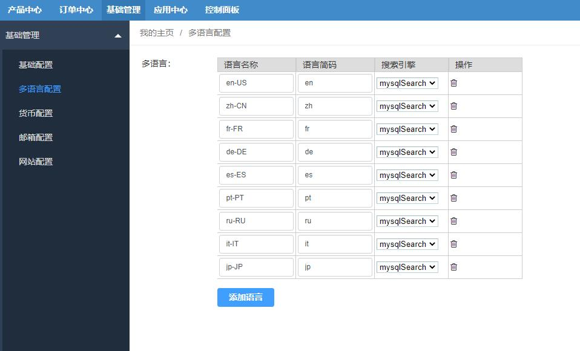
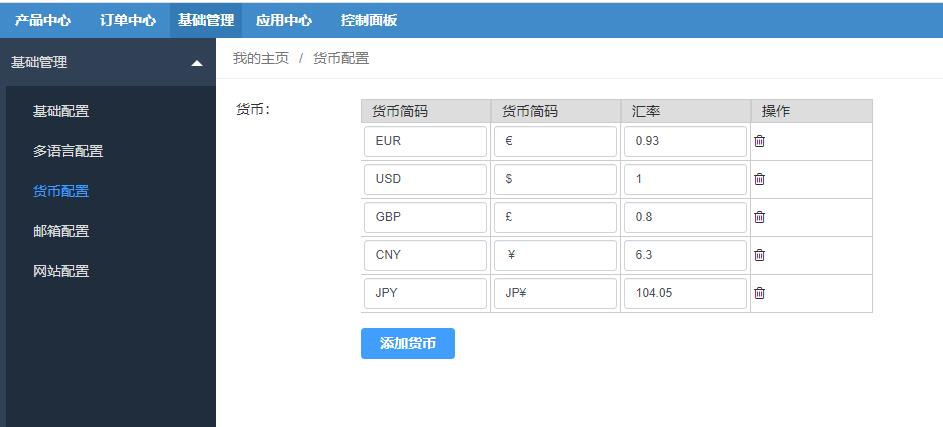
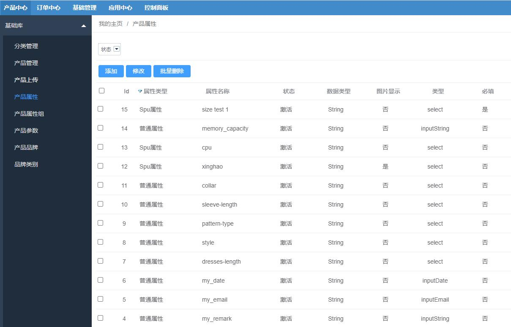
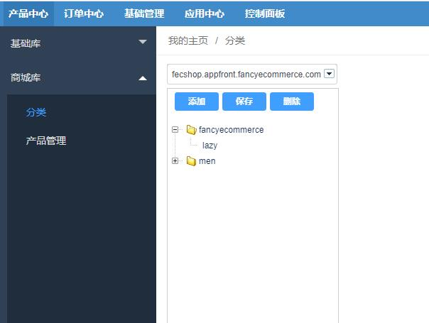
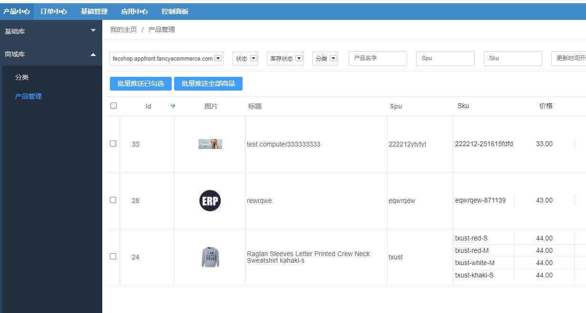

ERP同步远程Api
===========

> Fecmall同步远程Api的说明

### 关于同步远程Api

将ERP的数据通过insert，update，delete的方式，更新到远程，进行数据的同步。

### Api列表

1.同步多语言的api

1.1ERP-类文件： `@fecerp\services\task\LanguageMallToRemote`

1.2远程Fecmall Language Api：[Fecmall Api 设置多语言](https://www.fecmall.com/doc/fecshop-guide/develop/cn-2.0/guide-fecmall-api-mutil-lang-set.html)

1.3功能说明：

您在erp中设置多语言配置信息。

通过该Api，可以将erp设置的多语言数据，同步到fecmall商城（注意，这里的同步是`替换`，如果您在fecmall中设置了`多语言`将会被清空，
替换为erp系统中的多语言配置）

2.同步多货币的api

2.1ERP-类文件： `@fecerp\services\task\CurrencyMallToRemote`

2.2远程Fecmall Curency Api：[Fecmall Api 设置货币](https://www.fecmall.com/doc/fecshop-guide/develop/cn-2.0/guide-fecmall-api-currency-set.html)

2.3功能说明

您在erp中设置`多货币`配置信息。

通过该Api，可以将erp设置的`多货币`数据，同步到fecmall商城（注意，这里的同步是`替换`，如果您在fecmall中设置了`多货币`将会被清空，
替换为erp系统中的多货币配置）

3.同步`产品属性` 和 `产品属性组`的api

3.1ERP-类文件： `@fecerp\services\task\GoodsAttrMallToRemote`

3.2远程Fecmall Attr Api：[Fecmall Api 产品属性更新 UpsertOne](https://www.fecmall.com/doc/fecshop-guide/develop/cn-2.0/guide-fecmall-api-attr-upsert.html)

3.3远程Fecmall Attr Group Api：[Fecmall Api 产品属性组更新](https://www.fecmall.com/doc/fecshop-guide/develop/cn-2.0/guide-fecmall-api-attr-group-upsert.html)

3.4该步骤，会先执行同步`产品属性` ，然后再同步 `产品属性组`

3.5功能说明

您在erp中设置`产品属性` 和 `产品属性组`配置信息。

通过该Api，可以将erp设置的`产品属性` 和 `产品属性组`数据，同步到fecmall商城（注意，
这里的同步是`添加`和`更新`，如果fecmall商城 第一次添加这个`产品属性` 或 `产品属性组`，将会添加新的`产品属性` 或 `产品属性组`
，如果已经添加过，则会更新，是否添加过的依据，是fecmall商城通过存在erp的id来判断的）

4.同步产品品牌的api

4.1ERP-类文件： `@fecerp\services\task\GoodsBrandMallToRemote`

4.2远程Fecmall Brand Image Api：[Fecmall Api 分类图片同步](https://www.fecmall.com/doc/fecshop-guide/develop/cn-2.0/guide-fecmall-api-category-image-sync.html)

4.3远程Fecmall Brand Category Api：[Fecmall Api 产品品牌分类 UpsertOne-2](https://www.fecmall.com/doc/fecshop-guide/develop/cn-2.0/guide-fecmall-api-product-brand-category-upsert-2.html)

4.4远程Fecmall Brand Api：[Fecmall Api 产品品牌 UpsertOne-2](https://www.fecmall.com/doc/fecshop-guide/develop/cn-2.0/guide-fecmall-api-product-brand-upsert-2.html)

4.5功能说明

您在erp中设置`产品品牌` 和 `产品品牌分类`配置信息。

通过该Api，可以将erp设置的`产品品牌` 和 `产品品牌分类`数据，同步到fecmall商城（注意，
这里的同步是`添加`和`更新`，如果fecmall商城第一次添加这个`产品品牌` 或 `产品品牌分类`，将会添加新的`产品品牌` 或 `产品品牌分类`
，如果已经添加过，则会更新，是否添加过的依据，是fecmall商城通过存在erp的id来判断的）

5.同步分类的api

5.1ERP-类文件： `@fecerp\services\task\CategoryMallToRemote`

5.2远程Fecmall Category Api：[Fecshop Api 分类 UpdateOne-2](https://www.fecmall.com/doc/fecshop-guide/develop/cn-2.0/guide-fecmall-api-category-upsertone-2.html)

5.3远程Fecmall Category Image Api：[Fecmall Api 分类图片同步](https://www.fecmall.com/doc/fecshop-guide/develop/cn-2.0/guide-fecmall-api-category-image-sync.html)

5.4功能说明

您在erp中的`分类`数据。

通过该Api，可以将erp设置的`分类`数据，同步到fecmall商城（注意，
这里的同步是`添加`和`更新`，如果fecmall商城第一次添加`分类`，将会添加新的`分类`
，如果已经添加过，则会更新，是否添加过的依据，是fecmall商城通过存在erp的id来判断的）

6.同步产品的api

6.1ERP-类文件： `@fecerp\services\task\GoodsMallToRemote`

6.2远程Fecmall Product Api：[Fecshop Api 产品 UpdateOne-2](https://www.fecmall.com/doc/fecshop-guide/develop/cn-2.0/guide-fecmall-api-product-upsertone-2.html)

6.3远程Fecmall Product Image Api：[Fecmall Api 产品图片同步](https://www.fecmall.com/doc/fecshop-guide/develop/cn-2.0/guide-fecmall-api-product-image-sync.html)

6.4功能说明

您在erp中的`产品`数据。

通过该Api，可以将erp设置的`产品`数据，同步到fecmall商城（注意，
这里的同步是`添加`和`更新`，如果fecmall商城第一次添加`产品`，将会添加新的`产品`
，如果已经添加过，则会更新，是否添加过的依据，是fecmall商城通过存在erp的id来判断的）

