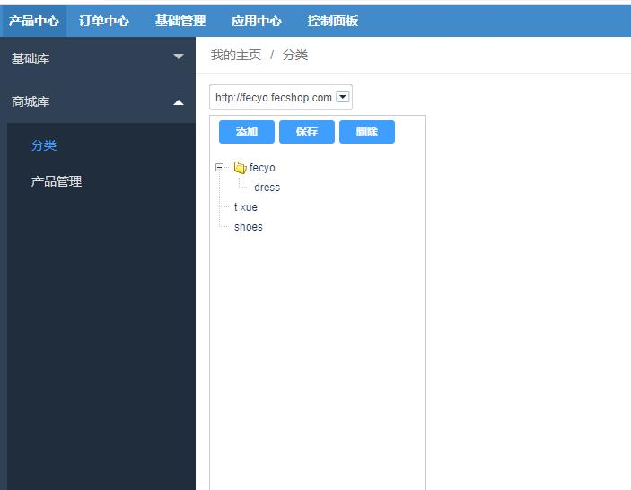
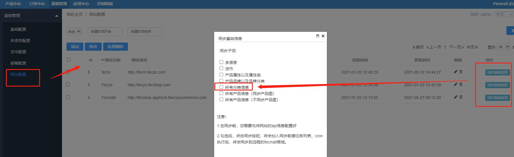
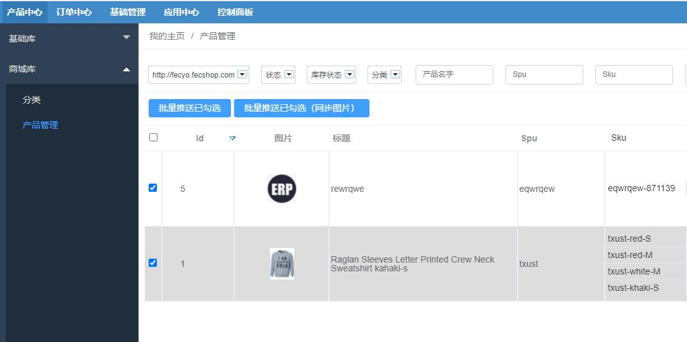

ERP Fecmall Task 介绍
==========

> Fecmall task的介绍


### ERP Fecmall Task 介绍

关于erp Task，可以参看：[Task任务脚本](fecmall_fecerp_shell_task.md)

打开@fecerp/services/task/fecmall您会发现有很多的具体的`taskType services`，这里一一说明


1.CategoryMallToRemote

同步`商城库分类`设置到fecmall商城

`产品中心`-->`商城库`-->`分类`的分类数据同步到fecmall商城



您可以在这里添加同步分类的task




2.CurrencyMallToRemote 

同步`基础货币`配置到fecmall商城

您可以在erp后台设置货币：`基础管理` --> `基础管理` -->  `货币配置`

然后在  `基础管理` --> `基础管理` -->  `网站配置` ， 点击`同步基础信息`，弹框中勾选`货币`，进行同步

3.GoodsAttrMallToRemote

同步`基础产品属性`配置到fecmall商城

您可以在erp后台设置`基础产品属性`：`产品中心` --> `基础库` -->  `产品属性` / `产品属性组`

然后在  `基础管理` --> `基础管理` -->  `网站配置` ， 点击`同步基础信息`，弹框中勾选`产品属性以及属性组`，进行同步


4.GoodsBaseToMall

erp内部数据同步，将 `基础库产品` 同步到  `商城库产品` 

[ERP基础库产品管理](fecmall_fecerp_product_manager.md)

[ERP商城库产品管理](fecmall_fecerp_product_sync.md)


5.GoodsBrandMallToRemote

同步`基础产品品牌`配置到fecmall商城

您可以在erp后台设置`基础产品品牌`：`产品中心` --> `基础库` -->  `产品品牌` / `品牌类别`

然后在  `基础管理` --> `基础管理` -->  `网站配置` ， 点击`同步基础信息`，弹框中勾选`产品品牌以及品牌分类`，进行同步


6.GoodsMallToRemote

同步`商城库产品`数据到fecmall商城

您可以在erp后台设置`商城库产品`：`产品中心` --> `商城库` -->  `产品管理`


6.1同步所有数据

 `基础管理` --> `基础管理` -->  `网站配置` ， 点击`同步基础信息`，
 弹框中勾选`所有产品信息（同步产品图）`，或者` 所有产品信息（不同步产品图）`,
 进行全量同步

6.2同步选中商品

先通过条件过滤产品列表，然后可以进行`勾选推送`，或者`过滤条件下的全量推送`




7.LanguageMallToRemote

同步`多语言`配置到fecmall商城

您可以在erp后台设置货币：`基础管理` --> `基础管理` -->  `多语言配置`

然后在  `基础管理` --> `基础管理` -->  `网站配置` ， 点击`同步基础信息`，弹框中勾选`多语言`，进行同步


8.Task

这个是一个基础类，和远程商城做对接，需要实现一些基础的封装函数，您可以在这里填写

譬如函数`taskApi()`：Yii::$service->task->taskApi() 


```
public function taskApi($taskSiteId, $apiUrlKey, $type="get", $data=[], $timeout = 10)
    {
        $_taskService = $this->_getTaskServiceByType('Task', $taskSiteId);
        
        return $_taskService->taskApi($taskSiteId, $apiUrlKey, $type, $data, $timeout);
    }
```

当站点类型为`$taskSiteId`的时候，对应的就是`@fecerp/services/task/fecmall/Task`


