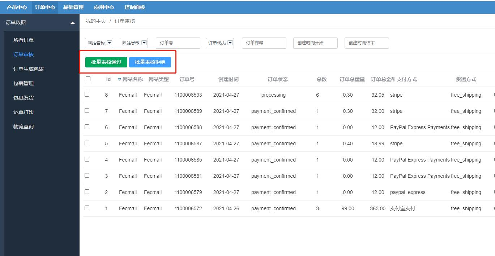

ERP订单审核
=====

> 接收订单后，订单需要人工进行审核，审核通过后，才可以进入备货部分

### ERP订单审核

您可以在后台进行订单审核

1.`订单审核通过`：通过后，订单进入备货状态，可以进行订单生成包裹

执行该部分的代码为：`Yii::$service->order->process->auditOrderAccept($orderModel)`

2.`订单审核拒绝`：拒绝后，订单将会被卡住，无法进入下面的流程。

执行该部分的代码为：`Yii::$service->order->process->auditOrderRefuse($orderModel)`

