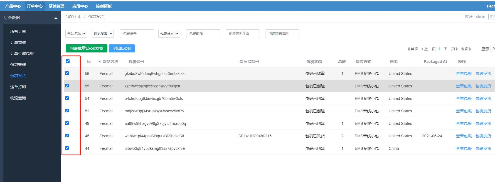
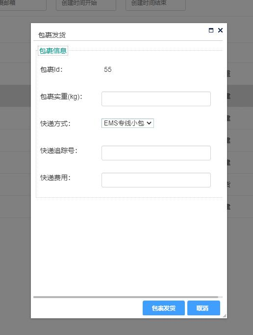

ERP订单包裹发货
==========

> 进行包裹发货操作

###ERP订单包裹导出

您可以点击`导出Excel`按钮，导出包裹信息

### 包裹发货

您可以点击包裹列表右侧的 `包裹发货`按钮

填写物流信息，进行`包裹发货`

包裹发货函数：`Yii::$service->package->processing->dispatchPackage($packageId, $deliveryMethod, $delivery_tracking_number, $package_weight, $shipping_cost)`

进行如下操作：

1.包裹状态改为`已发货dispatched`

2.包裹发货后，订单状态改为`已发货`。

3.扣除包裹中商品的实际库存。

全部操作完成后，包裹发货完成。

### 包裹批量Excel发货

通过导入excle表格（表格中含有包裹编号，包裹快递方式，快递追踪号，快递重量，快递费用等信息），
进行多个包裹批量发货的操作。

**暂未实现**

