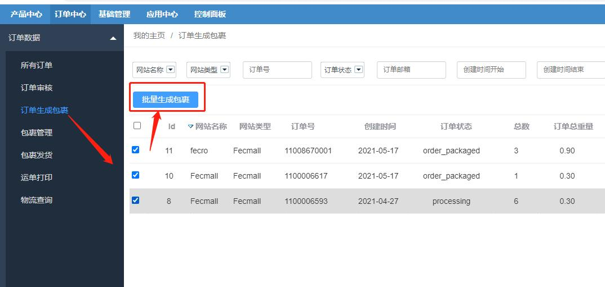
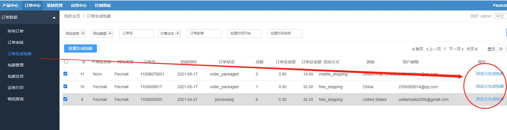
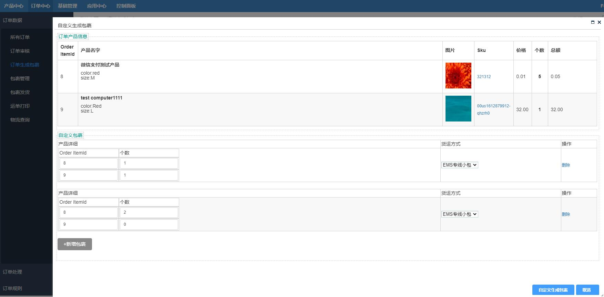

ERP订单生成包裹
=========

> 审核通过的订单，就可以进行订单生成包裹操作

### ERP订单生成包裹

1.概念

订单：用户在商城平台下的订单，订单中会存在多个商品。

包裹：是一个快递发货单位，一个包裹一个快递单号，一个包裹中会存在多个商品，这些商品可能
来自于多个订单，当然，一个订单可能拆分成多个包裹发货，
因此订单和包裹的关系，是多对多的关系。

2.操作-订单批量生成包裹

大多数情况，一个订单生成一个包裹发货，因此可以通过操作
`订单批量生成包裹`来完成

操作完成后，订单状态由`processing（备货中）`改为`order_packaged（已打包）`，并且生成包裹数据，
您可以在包裹表`order_package` 和  包裹商品表`order_package_item` 查看具体的包裹信息。

3.操作-订单自定义生成包裹

如果您的订单商品过多，或者某些商品缺货，需要分成几个包裹发走，您可以自定义多个包裹

点击`自定义生成包裹`，弹出自定义窗口

3.1您可以点击按钮`+新增包裹`, 填写多个包裹

3.2如果某个包裹的某个商品个数为0，则填写0即可

3.3如果您自定义的包裹`商品总数`，等于订单`商品总数`，那么商品无剩余，生成的包裹数等于您自定义的包裹数量

譬如：订单的`商品A`个数为`5`，自定义`包裹1`中`商品A`个数为`2`，自定义`包裹1`中`商品A`个数为`3`，提交后，
将生成2个包裹

3.4如果您自定义的包裹`商品总数`，小于订单`商品总数`，那么商品有剩余，剩余的商品将生成一个包裹

譬如：订单的`商品A`个数为`5`，自定义`包裹1`中`商品A`个数为`2`，自定义`包裹1`中`商品A`个数为`1`，提交后，
将生成3个包裹，第三个`包裹3`中`商品A`个数为`2`

3.5如果您自定义的包裹`商品总数`，大于订单`商品总数`，那么将会报错。

譬如：订单的`商品A`个数为`5`，自定义`包裹1`中`商品A`个数为`4`，自定义`包裹1`中`商品A`个数为`3`，提交后，
将会报错 `package qty is too large`

4.订单生成包裹后，您可以进入`包裹管理`部分，查看生成的包裹

