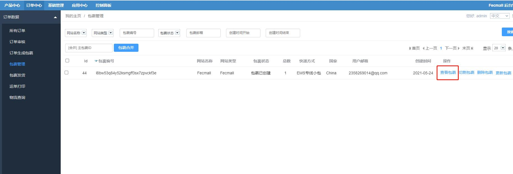
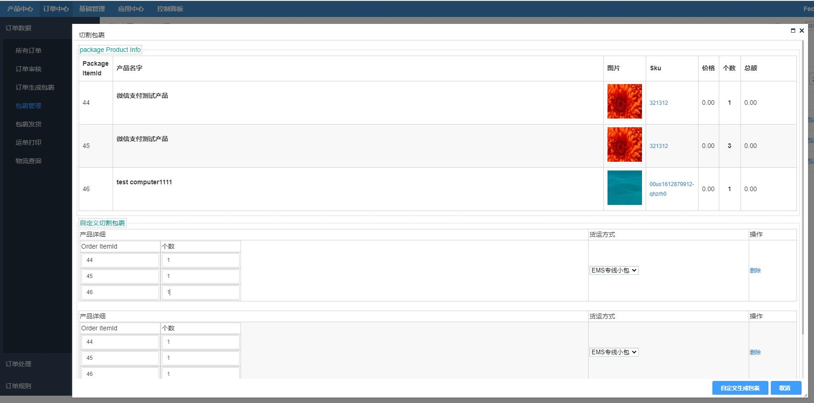
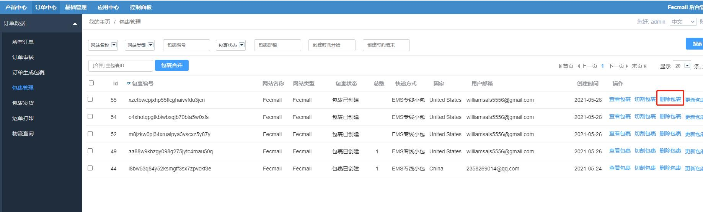

ERP订单包裹管理
==========

> 订单包裹生成后，在这里将看到生成的包裹信息，您可以进行包裹的查询，拆分，合并，删除，更新等操作

### 包裹查询

查看包裹

可以通过条件过滤`包裹`列表，也可以点击右侧的`查看包裹`按钮，查看某个包裹的详细信息

### 包裹合并

当两个包裹可以进行同时发货的时候，可以进行包裹合并，将多个包裹合成一个包裹进行发货

1.勾选包裹：勾选需要进行发货的包裹

2.填写`主包裹id`：在`包裹合并`按钮左侧的`输入框`，填写作为`主包裹`的`id`, 填写后，新生成包裹的收货人，国家，省市，联系电话等
信息，将使用`主包裹`的这些信息

`主包裹`的`id`，必须在您勾选的包裹列表中存在，否则将报错

3.点击`包裹合并`按钮，进行包裹合并操作

完成后，原来的包裹删除，生成了一个新的包裹。

4.合并包裹的函数：`Yii::$service->package->mergePackage($packageIds, $mainPackageId)`

### 包裹切分

如果你的包裹，需要继续切成多个包裹，可以执行该操作

1.点击包裹列表右侧的`切割包裹`按钮，对包裹进行切割

切分包裹的原理，和订单生成多个包裹类似，切分包裹后，原包裹删除，新增几个新包裹。

2.切分包裹的函数：`Yii::$service->package->splitPackage($packageId, $customPackageInfo)`

### 包裹删除

1.您可以点击包裹列表右侧的  `删除包裹`按钮，将某个包裹删除

2.删除包裹的函数：`Yii::$service->package->deletePackage($packageId)`

3.包裹的删除，有连带效应，关联一起的包裹将都会被删除

详细举例：

3.1对象：

订单：`订单A` , `订单B`，  `订单C`

包裹：`包裹a`，`包裹b`, `包裹c`

3.2对象关系

`包裹a`包含`订单A` 和 `订单B`的商品

`包裹b`只包含`订单B`的商品，

`包裹c`只包含`订单C`的商品，

3.3操作：删除`包裹a`

3.4结果：`包裹a`和`包裹b`将都会被删除（因为有关联关系），`包裹c`不会被删除

`订单A` , `订单B`的订单状态由`packaged（已打包）`改为`processing（备货中）`

`订单C`不做任何改变

### 包裹更新

只可以更新包裹的`快递方式`和`包裹实际重量`

当您填写了包裹的`包裹实际重量`，那么`包裹状态`将由`包裹已创建`改为 `包裹已称重`状态。

包裹更新的函数：`Yii::$service->package->updateDeliveryMethod($packageId, $deliveryMethod, $packageWeight)`

至此，包裹管理部分已经介绍完。
